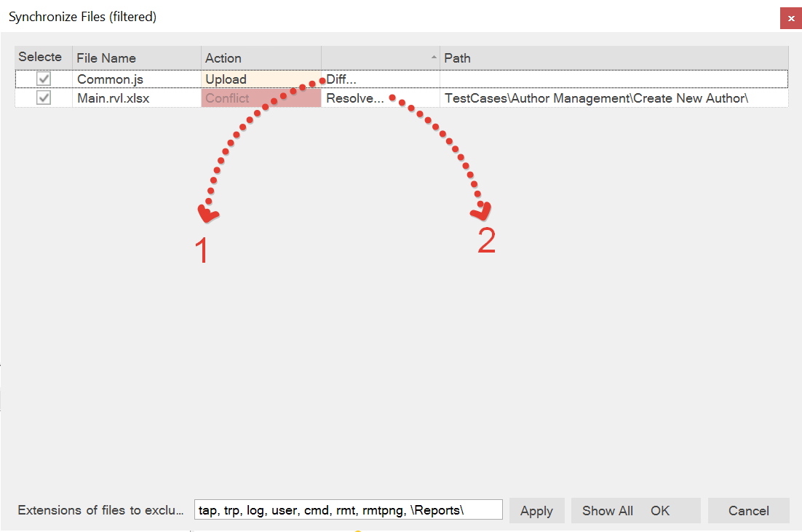
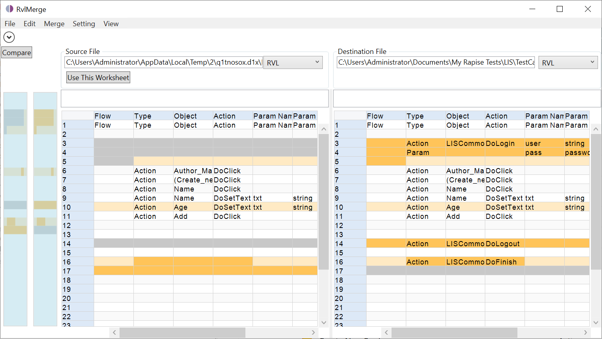

# Diff / Merge Tools

Diff and merge tools serve the purpose of examining modifications and resolving inconsistencies.

Diff tools come in handy when you have made alterations and wish to compare them with the original, unaltered version.

## Rapise Merge

Whenever the [Save to Spira](/Guide/spiratest_integration.md#saving-a-test-to-spiratest) button is pressed in Rapise, the tool will examine which files have been modified.



(1) If a file is accompanied by a "Diff..." button, it indicates that the file has been altered compared to the version currently stored in Spira. Clicking the button will...

(2) If a file displays a "Resolve..." button, it signifies a conflict where the file has been modified both locally and remotely in parallel. Clicking the button will prompt the display of a merge conflict resolution dialog.

## Default Diff Tools

Rapise does not have built-in diff/merge tools, except for two specific cases:

1. *RVLMerge* is used to compare and merge `.xlsx` files, including RVL (`.rvl.xlsx`) files.

2. sstestmerge is used for silent 3-way merging of conflicting `.sstest` files.

For other file types, Rapise relies on the already installed merge tools. There are various options available, both free and paid, and developers often have their preferred choices.

If Rapise recognizes a specific merge tool, it will utilize it. Currently, Rapise is aware of the following tools, as defined in the `MergeTools.yml` configuration file:

```yml
tools:
  TortoiseGitIDiff:
    mdi: false
    autorefresh: false
    text: false
    ext: [bmp, gif, ico, jpg, jpeg, png, tif, tiff]
    diff: ' /left:"%remote%" /right:"%local%"'
    search:
    - '%PATH%TortoiseGitIDiff.exe'
    - '%ProgramFiles%\TortoiseGit\bin\TortoiseGitIDiff.exe'
    - '%ProgramW6432%\TortoiseGit\bin\TortoiseGitIDiff.exe'
    - '%ProgramFiles(x86)%\TortoiseGit\bin\TortoiseGitIDiff.exe'

  TortoiseGitMerge:
    text: true
    diff: '"%remote%" "%local%"'
    merge3: ' /base:"%base%" /theirs:"%remote%" /mine:"%local%" /merged:"%result%"'
    search: 
    - '%PATH%TortoiseGitMerge.exe'
    - '%ProgramFiles%\TortoiseGit\bin\TortoiseGitMerge.exe'
    - '%ProgramW6432%\TortoiseGit\bin\TortoiseGitMerge.exe'
    - '%ProgramFiles(x86)%\TortoiseGit\bin\TortoiseGitMerge.exe'

  BeyondCompare:
    autorefresh: true
    text: true
    diff: '/solo /leftreadonly "%remote%" "%local%"'
    merge3: '/solo "%base%" "%remote%" "%local%" "%result%"'
    ext: [pdf, bmp, gif, ico, jpg, jpeg, png, tif, tiff, rtf]
    search:
    - '%PATH%BCompare.exe'
    - '%ProgramFiles%\Beyond Compare *\BCompare.exe'
    - '%ProgramW6432%\Beyond Compare *\BCompare.exe'
    - '%ProgramFiles(x86)%\Beyond Compare *\BCompare.exe'

  AraxisMerge:
    mdi: true
    autorefresh: true
    text: true
    diff: '"%remote%" "%local%"'
    merge3: '/merge "%base%" "%remote%" "%local%" "%result%"'
    ext: [bmp, dib, emf, gif, jif, j2c, j2k, jp2, jpc, jpeg, jpg, jpx, pbm, pcx, pgm, png, ppm, ras, tif, tiff, tga, wmf]
    search:
    - '%PATH%ConsoleCompare.exe'
    - '%ProgramFiles%\Araxis\Araxis Merge\ConsoleCompare.exe'
    - '%ProgramW6432%\Araxis\Araxis Merge\ConsoleCompare.exe'
    - '%ProgramFiles(x86)%\Araxis\Araxis Merge\ConsoleCompare.exe'
    
  KDiff3:
    mdi: false
    autorefresh: false
    text: true
    diff: '"%remote%" "%local%"'
    merge3: '"%base%" "%local%" "%remote%" -o "%result%"'
    search: 
    - '%PATH%kdiff3.exe'
    - '%ProgramFiles%\KDiff3\kdiff3.exe'
    - '%ProgramW6432%\KDiff3\kdiff3.exe'
    - '%ProgramFiles(x86)%\KDiff3\kdiff3.exe'

  WinMerge:
    mdi: false
    autorefresh: true
    text: true
    notes: |
      * [Command line reference](https://manual.winmerge.org/en/Command_line.html).
      * '/u' Prevents WinMerge from adding paths to the Most Recently Used (MRU) list.
      * '/wl' Opens the left side as read-only.
      * '/dl' and '/dr' Specifies file descriptions in the title bar.
      * '/e' Enables close with a single Esc key press.
    diff: '/u /wl /e "%remote%" "%local%" /dl "REMOTE" /dr "LOCAL"'
    merge3: '-s -wl -wm /ar -dl Base -dm Remote -dr Local "%base%" "%remote%" "%local%" -o "%result%"'
    ext: [bmp, cut, dds, exr, g3, gif, hdr, ico, iff, lbm, j2k, j2c, jng, jp2, jpg, jif, jpeg, jpe, jxr, wdp, hdp, koa, mng, pcd, pcx, pfm, pct, pict, pic, png, pbm, pgm, ppm, psd, ras, sgi, rgb, rgba, bw, tga, targa, tif, tiff, wap, wbmp, wbm, webp, xbm, xpm]
    search: 
    - '%PATH%WinMergeU.exe'
    - '%ProgramFiles%\WinMerge\WinMergeU.exe'
    - '%ProgramW6432%\WinMerge\WinMergeU.exe'
    - '%ProgramFiles(x86)%\WinMerge\WinMergeU.exe'
    - '%LocalAppData%\Programs\WinMerge\WinMergeU.exe'
```

## Built in Tools

### RVL and Spreadsheets

By default, *RVLMerge* is automatically installed. Unless specified otherwise, it will be displayed when you choose to show the diff for an RVL or a spreadsheet.



### Using with Git

You can integrate *RVLMerge* with your current Git diff/merge tool by using its command line interface.

For performing a diff, you can use the following command:

```cmd
C:\Program Files (x86)\Inflectra\RvlMerge\RvlMerge.exe -s <src> -d <dst>
```

Here, `<src>` represents the path to the unmodified (base or remote) version, and `<dst>` represents the path to the final version, which will also be the target for the merge results.

For example, in [TortoiseGit](https://tortoisegit.org/), the diff command would look like this:

```cmd
C:\Program Files (x86)\Inflectra\RvlMerge\RvlMerge.exe -s %base -d %mine
```

Similarly, for performing a merge, you can use the following command:

```cmd
C:\Program Files (x86)\Inflectra\RvlMerge\RvlMerge.exe -s %theirs -d %mine
```

### Sstest

The merging of `.sstest` files is fully automatic (usually it is `Test.sstest` for a Test Case or `Framework.sstest` for a framework root). So once you hit *Merge...*, no UI is shown and the merged file is automatically generated.

## Adding a Custom Diff Tool

You have the option to incorporate additional known diff tools into Rapise. If your team utilizes multiple tools, that's perfectly fine. You can define all of them together, and Rapise will select the first one it finds. To achieve this, you need to create a file named MergeTools.yml in one of two locations:

In the root directory of your testing framework, such as `C:\Users\UserName\Documents\My Rapise Tests\LIS\MergeTools.yml`. When defined in this location, it becomes specific to the testing framework. Loading it from Spira or Git will provide the associated diff definitions.

In the `c:\Users\Public\Documents\Rapise\` directory. When defined here, it applies to all tests and frameworks on the given computer.

If you have a `MergeTools.yml` file in both locations, the one in the framework directory takes precedence.

The `MergeTools.yml` file follows the following format:

```yml
%YAML 1.2
---
#
# Replacement variables
# %base%    - common
# %remote%  - aka 'theirs'
# %local%   - aka 'mine'
# %result%  - destination
#
# diff - show diff only
# merge - way merge for %remote% + %local% => %result%
# merge3 - 3 way merge %base% + %remote% + %local% => %result%
# - If %result% is not used, %local% is assumed to be an output

tools:

  CustomDiff1:
    mdi: false
    autorefresh: false
    text: true
    diff: '"%base%" "%local%"'
    ext: [txt,js]
    search: 
    - '%ProgramFiles%\Path\To My\DiffTool.exe'

  CustomMerge1:
    mdi: false
    autorefresh: false
    text: true
    merge3: '"%base%" "%remote%" "%local%" "%result%"'
    ext: [txt]
    search: 
    - '%ProgramFiles%\Path\To My\MergeTool.exe'

  CustomDiffMerge1:
    mdi: false
    autorefresh: false
    text: true
    diff: '"%base%" "%local%"'
    merge3: '"%base%" "%remote%" "%local%" "%result%"'
    ext: [txt]
    search: 
    - '%ProgramFiles%\Path\To My\DiffMergeTool.exe'
```
