# Testing Frameworks

!!! info
    In different parts of the documentation and in knowledge base articles, we use the term **Framework mode** to refer to this type of framework with built-in support for modules, test cases, and test sets. Requires Rapise 8.0+

A testing framework is a collection of guidelines, libraries, and tools that provide a standard way of organizing and executing tests.

Previous versions of Rapise (pre-8.0) already included all the necessary tools for developing testing frameworks. While these long-available tools allowed for the creation of a variety of frameworks, this very flexibility led to difficulties in choosing the optimal combination of tools.

We analyzed Rapise's best practices for this purpose and tuned the IDE to support the identified practices.

From our point of view, a good testing framework should have the following features:

1.  [Grouping of test cases](#grouping-of-test-cases). Test cases can be organized into subfolders, and each test case can have separate RVL sheets and functions.

2.  [Managing common data](#managing-common-data) - spreadsheets, configurations, functions, parameters, scripts, libraries, object repositories.

3.  [Object repositories](#object-repositories). A repository can be specific to a test case, shared among different test cases, or dedicated to a Page Object.

4.  [Refactoring](#refactoring). Moving, renaming, cloning, importing, and exporting test cases are necessary to easily organize the framework as it grows and develops.

5.  [Cloning of the entire testing framework](#cloning-of-the-entire-testing-framework). The ability to clone and save the framework as a whole, preserving test management settings—test sets and configurations.

6.  [Parametrization](#parametrization), including runtime settings (e.g., intervals, screenshots) and configuration settings (e.g., initial URL, startup paths).

7.  An elaborate [framework development workflow](#framework-development-workflow). As a rule, it's impossible to foresee everything at the beginning of development. Learning all of Rapise's features also takes time. However, the first test cases should be developed as early as possible. A good workflow allows for a quick start without needing to fully explore all features and without sacrificing the future quality of the framework.

8.  A [navigation system](#navigation-system) is necessary to navigate a framework with hundreds or thousands of test cases and dozens of configurations. Furthermore, capabilities for internal documentation of individual test cases, functions, and Page Objects are important.

9.  [Integration with test management](#integration-with-test-management). Test sets, nightly runs, management of flaky tests, and launch history.

10. [Teamwork and distributed development](#collaboration-and-distributed-development). Distributed development and test launches involve participants with varying levels of knowledge and expertise. For example, if you're developing a medical system, one person might have deep medical knowledge while another excels in test automation. It's crucial to ensure harmonious interaction among the different team members.

11. [Maintenance](#maintenance). Testing frameworks are developed for the long term, meaning they require constant maintenance. It's perfectly normal for a test to fail with minimal changes to the application, so the convenience of consistently fixing them becomes paramount.

12. [Mixed Mode Tests](#mixed-mode-tests). Integration tests often interact with several different types of applications. These can include the mobile client, web application, desktop application, and API. And the usability of interacting with all of these applications becomes crucial.

## Testing Framework Features

Here is an overview of the key features provided by the testing frameworks in Rapise.

### Grouping of Test Cases

When creating Test Cases, you have the option to define groups for them:

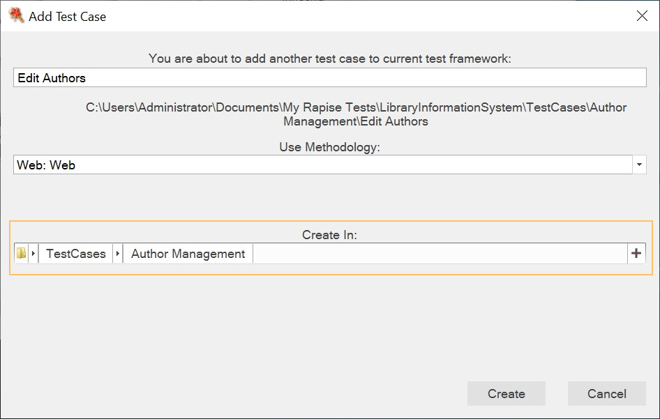

Alternatively, you can move the test case to a different folder later to regroup it:

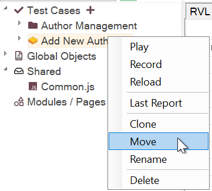

### Managing Common Data

In Rapise, the shared folder plays a vital role in organizing resources that are shared across test cases, modules, and page objects. Typically, the shared folder contains the following:

1.  Input data files in formats such as spreadsheets (`.xlsx`), JSON (`.json`), CSV, or plain text.

2.  `.js` files containing common functions.

3.  The `Object.js` file, which serves as the shared repository for objects.

4.  Definitions for REST/SOAP APIs.

By default, the framework provides a `Common.js` file where you can place all your common functions.

To make any file shared, you can locate it in the [Files View](/Guide/test_files_dialog) tab and tag it as `shared`.

For instance, if you tag a file as `User.js`, it will be automatically loaded when any other test case is started:

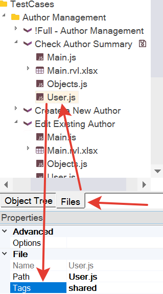

!!! note
    To auto-load a shared file on playback only, set the `shared` tag.

!!! note
    To auto-load a shared file on playback and recording, set the `shared,recorder` tags.

!!! note
    To auto-load a shared file on recording only, set the `shared,recorder,skip` tag.

Furthermore, if you tag any `Objects.js` file with the `shared` tag, all objects defined within it will be accessible in any test case.

### Object Repositories

Objects recorded by the Rapise recorder can be categorized into three types:

1.  Test case-specific objects.

2.  [Page object](pageobjects.md)-specific objects.

3.  Objects that are shared among different parts of the framework.

We recommend avoiding the use of shared objects and instead placing them in a [page object](pageobjects.md).

During object recording, the objects are stored in the respective repository based on the recording context:

1.  When recording a test case, the recognized objects are added to the repository specific to that test case.

    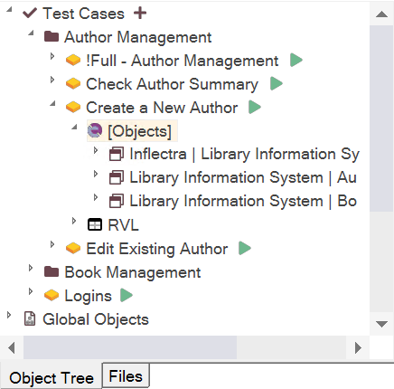

2.  When recording a page object, the recognized objects are added to the repository specific to that [page object](pageobjects.md).

    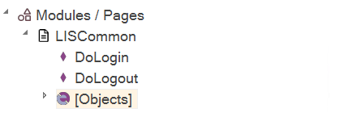

3.  Any of these repositories can be made global by tagging its corresponding `Objects.js` file with the `shared` tag in the [Files View](/Guide/test_files_dialog). For example, if the *AppNavigation* repository is marked as `shared`, any recording or learning performed within it will automatically update the global object repository.

You can utilize the [Object Manager](/Guide/object_manager) to copy objects between different repositories.

### Refactoring

The testing framework offers several features that facilitate refactoring activities:

1.  Renaming a test case.

2.  Moving a test case to a different location.

3.  Renaming an object in the repository.

Additionally, the following operations can be useful for refactoring, especially when combined:

1.  Cloning a test case to create a duplicate.

2.  Cloning an object in the repository to create a copy.

3.  Deleting a test case that is no longer needed.

4.  Deleting an object from the repository.

For example, moving a test case can be a gradual process. First, clone the original test case, allowing both versions to coexist (e.g., for different versions of the application under test). Then, once the old test case becomes irrelevant, delete it. In this way, you can utilize the combination of *clone* and *delete* operations instead of a direct *move*.

### Cloning of the Entire testing framework

A full copy of the entire testing framework might be needed. For example, to separate different test versions for different product versions.

This can also be achieved by maintaining a common unified testing framework with different configurations. Or by using Git branches. These are the methods we recommend. However, these methods require a higher level of test organization, so initially, a full copy of the framework might be the easiest and most efficient solution. Additionally, Spira offers the option to clone the product. If such a product includes a testing framework, cloning it also becomes a logical step.

You can do this using the `File > Save As...` menu. Once you have a copy, you can save it to another product in Spira.

### Parametrization

As the testing framework evolves, the number of configuration parameters typically increases. Initially, you can start without parameters and gradually add them as needed.

The testing framework parameters can be divided into two groups:

1.  Logical parameters of the test, such as application path, initial URL, and path to the test data file.

2.  Runtime environment parameters, such as the web browser profile name (`g_browserProfile`), command interval (`g_commandInterval`), stopping the test at the first error, and capturing screenshots during the test.

The logical test parameters can be configured in the Spira Dashboard on the [parameters](parameters.md) tab.

To set runtime environment parameters, click the button in the `Choose Test Case` to Play selector dialog:

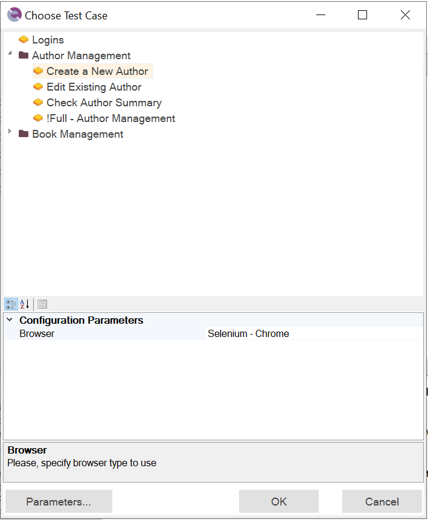

### Framework Development Workflow

When embarking on the creation of your first test framework, it's natural to wonder where to begin. How can you ensure that you plan ahead and leverage the full benefits of test frameworks, such as data and logic separation, page objects, and flexible configurations, without the need for extensive rework?

If you already have experience creating frameworks in Rapise, you likely have a template and an established procedure. However, if you're still learning, we recommend following the workflow outlined below.

#### Step One: Test Cases

Start by creating a new framework and implementing a selection of test cases. It's crucial to choose the right test cases at this stage. Avoid overly complex or time-consuming ones, as some test cases can be as substantial as the framework itself. It's wise to postpone their implementation until later stages. Begin by implementing a set of 2-5 *small* test cases. This approach will yield quick results that you can demonstrate and help you plan your next steps effectively.

#### Step Two: Regular Runs

The sooner you establish regular, automated test runs, the better. You don't need to wait until you have an extensive suite of test cases; even running 1-2 tests regularly, such as nightly runs, is sufficient. By doing so, you can gather valuable statistics about the reliability of your tests right from the start. For instance, you might discover that a particular test case occasionally encounters intermittent issues and fails 1 out of 10 times. Identifying these patterns early and accumulating a history of such occurrences increases the likelihood of pinpointing reliability issues and improving your test case.

Organize regular test runs by saving your framework in Spira and setting up test runs in the [Spira Dashboard](/Guide/spira_dashboard_2).

#### Step Three: Page Objects

Analyze the implemented test cases to identify common patterns or actions that occur repeatedly. You'll likely find scenarios such as:

1.  Launching the application at the start and closing it at the end in multiple test cases.

2.  Logging into the application in several test cases.

3.  Navigating to specific forms or pages within the application in multiple test cases.

4.  Many pages or dialogs in your application have the same type of grid, requiring you to click on rows repeatedly.

These are typical examples, but other recurring patterns may exist in your specific case. If you observe any such patterns, it's time to create a [Page Object](pageobjects.md). This object will encapsulate the necessary steps, such as *DoLaunch*, *DoLogin*, *DoClose*, and *DoClickRow*. You can then modify your test cases to utilize the new [Page Object](pageobjects.md), simplifying their structure and enhancing maintainability.

#### Step Four: Parameters and Configurations

As you continue developing your framework and adding more test cases, pay attention to the need for configurable parameters. In some cases, applications might have different variants that vary in initial URLs or login parameters. To accommodate these variations, consider defining parameters for each test case launch. The [parameters editor](parameters.md) can be used to set these parameters, allowing your framework to become more flexible and adaptable.

#### Step NNNN: What's Next

As your framework grows in complexity, you will encounter new challenges and opportunities for improvement. Here are some additional features that you might find useful:

*   [Dropdowns](/Guide/rvl_editor#param-dropdowns) for more versatile parameter options.

*   [Data Driven Testing](/Guide/data_driven_testing) for executing tests with different input data sets.

*   [Git Integration](/Guide/git_integration) for version control and collaboration.

*   [Parallel Execution](/Guide/spira_dashboard_2#parallel-execution) for faster test execution across multiple environments.

### Navigation System

Test cases can be easily accessed through the [Object Tree](/Guide/object_tree) or the [Spira Dashboard](/Guide/spira_dashboard_2).

Object repositories are organized hierarchically within test cases and Page Objects. If you're looking for a specific object, you can use the [Object Filter](/Guide/object_tree#filtering) to quickly locate it.

To share an object repository, simply assign the `shared` tag to the corresponding `Objects.js` file in the Files Tree.

You can quickly navigate to the definition of any function or Page Object method in RVL or script mode by pressing the ++f12++ key.

Common functions and variables are displayed in the object tree for easy reference:

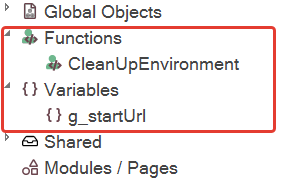

The structure of each RVL file is also visible, allowing you to quickly locate specific lines of code.

Rapise provides global [find and replace](/Guide/find_and_replace_dialog) functionality, accessible through the `Edit > Find in Files` menu or by using the shortcut ++shift+ctrl+f++.

#### Data, Script, and Configuration Files

To easily access data, script, and configuration files, you can find them within the Shared node in the [Object Tree](/Guide/object_tree). Shared `.js` files are automatically loaded when any test case within the framework is launched. This allows you to use functions or variables defined in the shared file throughout the entire framework.

### Integration with Test Management

To streamline your test management process, you can utilize the integration with the [Spira Dashboard](/Guide/spira_dashboard_2). Within the dashboard, you can define test sets and configurations for your tests.

We highly recommend using [Spira](/Guide/spiratest_integration) for comprehensive test management. By leveraging Spira, you can easily deploy your test sets with a single click using the [Sync to Spira](/Guide/spiratest_integration#saving-a-test-to-spiratest) feature. This integration provides you with access to essential test management functionalities, including:

1.  Scheduled or nightly test runs.

2.  Test execution history tracking.

3.  Parallel execution capabilities.

### Collaboration and Distributed Development

When working in a small team of 1-3 members, integrating with [Spira](/Guide/spira_dashboard_2) is an excellent solution. However, for larger teams, a combination of [Spira](/Guide/spira_dashboard_2) and [Git](/Guide/git_integration) might be more suitable.

Since Rapise 8, we've enhanced the integration with [Diff/Merge](diffmerge.md) tools, which greatly facilitates distributed development. This means that even if you and another developer make changes to the same file or test, the outcomes of your work are not lost, and you can easily merge them.

### Maintenance

Rapise provides several features that facilitate quick and convenient support and correction of test case logic:

1.  Re-attaching to the application: If the application is already running, Rapise can attach to it and execute the necessary actions.

2.  Test run report with error location: The test run report includes the specific location where an error occurred, making it easier to identify and troubleshoot issues.

3.  [Stop on error](/Guide/settings_dialog#execution): This option allows you to configure the test to stop at the first encountered error. It enables you to analyze the application's state and determine if any changes are causing the error.

4.  Running individual test cases: You can execute a specific test case independently for focused testing or troubleshooting.

5.  Running individual RVL sheets: You can run a specific RVL sheet within a test case, allowing targeted testing of particular functionality.

6.  Running a specific area in an RVL sheet: You can execute a selected portion of an RVL sheet, enabling precise testing of specific scenarios.

7.  Running a single Page Object action: You have the flexibility to execute a single action within a Page Object, allowing isolated testing and debugging.

8.  Running a part of a Page Object action: Similar to running a specific area in an RVL sheet, this feature enables you to execute a specific part of an action for granular testing.

9.  [Flash](/Guide/object_tree#context-menu-object) and [Relearn](/Guide/object_tree#context-menu-object): These features assist in analyzing and fixing changed or problematic objects in the repository by refreshing their recognition and learning.

10. Web Spy with [maintenance mode](/Guide/web_spy#maintenance-mode): Web Spy provides a maintenance mode that helps efficiently fix multiple objects in the repository simultaneously.

11. Shared object repositories: When a commonly used object's location changes across multiple test cases, it's easier to update it if it's part of a shared repository.

12. [Page Objects](pageobjects.md) with shared actions: By using Page Objects with shared actions, you can make updates to a single Page Object to resolve issues in multiple test cases that utilize it.

### Mixed Mode Tests

Mixed-mode tests, also known as cross-application testing, involve the simultaneous testing of multiple applications or systems. This form of testing focuses on verifying the interactions and interoperability among different software applications.

In mixed-mode tests, the primary objective is to ensure the proper behavior and smooth flow of data among interconnected applications or systems. This type of testing is commonly employed in scenarios where various software components need to communicate and exchange data. Examples include testing web interfaces, desktop interfaces, web services, APIs, and distributed systems.

Rapise provides the capability to connect different [libraries](/Guide/change_the_libraries_being_use#how-to-change-the-libraries) for recording and playing tests. You can record tests that involve different types of applications either all at once or in separate parts.

## Testing Framework Contents

### Test Cases

Each testing framework is a collection of test cases. Each test case may have its own object repository. Each test case may call Page Objects and other test cases via `RVL.DoInvokeTest`. Each test case may have its own Web Service/API calls.

### Page Objects

It is convenient to place logic and objects common to a specific testing framework into [Page Objects](/Guide/Frameworks/pageobjects).

### Shared Files and Repositories

Configuration, data, common functions, objects—multiple [assets](#data-script-and-configuration-files) specific to a testing framework.

### Parameters

[Parameters](/Guide/Frameworks/parameters) and configurations required for framework flexibility.

### Test Sets

[Spira Dashboard](/Guide/spira_dashboard_2) assists with all essential test management activities: managing and executing test sets. Test sets help group test cases using different criteria for various purposes.

## Testing Framework Common Actions

### Creating a New Testing Framework

To create a new testing framework, follow these steps:

1.  Go to *File > Create New > Test Automation Framework*.
2.  Provide a name for your framework in the *Name* field.
3.  Select the folder where you want to create the framework. For now, you can keep it in your working folder. Later, you can link it to Spira (and possibly Git) if needed.
4.  Choose the *primary type of test* for your framework. If your application is web-based, select the Web option. If it is desktop or mobile-based, choose the corresponding option. If your application consists of multiple parts (e.g., web, desktop, mobile, and API), you can choose any option. The primary type selection is for convenience and can be modified later if necessary.

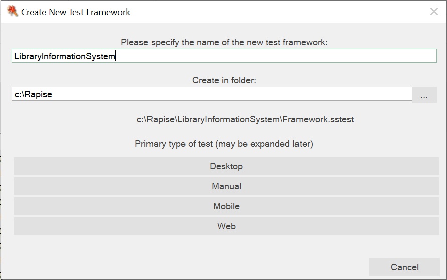

### Creating a Test Case

There are two methods to create a new test case:

1.  Method 1: Use the main menu option *File/Add To Framework/Test Case*.

    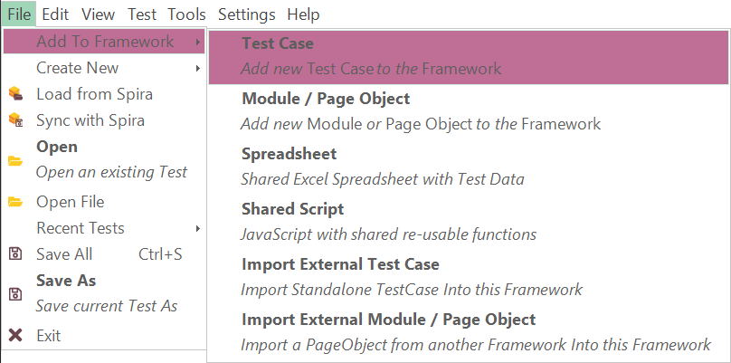

2.  Method 2: Use the context menu by right-clicking on the *Test Cases* root node or a test case folder node.

    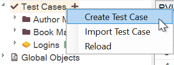

    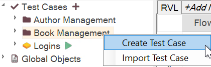

After selecting one of these methods, a *Create New Test Case* dialog will appear where you can specify the name and folder for the test case.

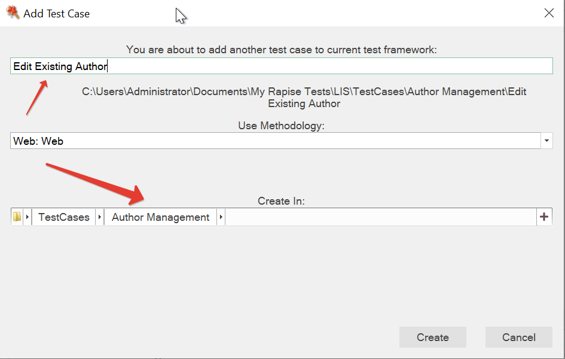

#### Test Case Naming

Test case naming can vary based on personal preference and project requirements. Some people prefer shorter names for test cases and organize them into folders, such as *Modules/Invoices/Create*. Others prefer longer, more descriptive names, like *Modules/Invoices/Create New Invoice With Single Item*.

Rapise supports both approaches, and the chosen naming convention can affect how you refer to test cases within your scripts, specifically when using the `RVL.DoPlayTest` function.

When using the shorter naming convention, you must refer to the test case by its full path:

```javascript
RVL.DoPlayTest('%WORKDIR%/Test Cases/Modules/Invoices/Create/Test.sstest')
```

However, with longer, more descriptive names, you can reference the test case by using only the last part of the name, assuming it is unique:

```javascript
RVL.DoPlayTest('Create New Invoice With Single Item')
```

It's important to note that when dragging and dropping a test case into the RVL editor, the generated call may vary depending on whether the ++Shift++ key is pressed or not.

Without pressing Shift key:

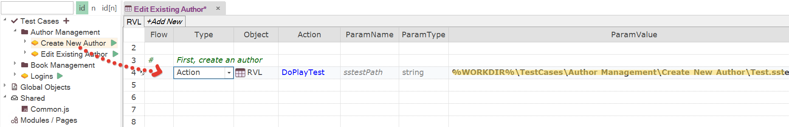

With ++Shift++ key pressed:

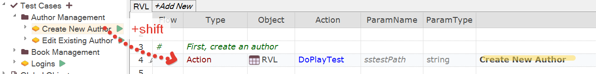

### Renaming Test Cases

To rename a test case in Rapise, use the `Rename` option available for each test case. Simply right-click on the test case and select the `Rename` option.

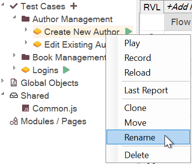

Renaming a test case will affect how it is presented in the Test Cases tree. It will also change the name by which you can reference the test case when calling it by name using `RVL.DoPlayTest`.

It's important to note that renaming a test case does not change any file or folder names. Therefore, you may notice that the paths to the test case remain the same even after renaming:

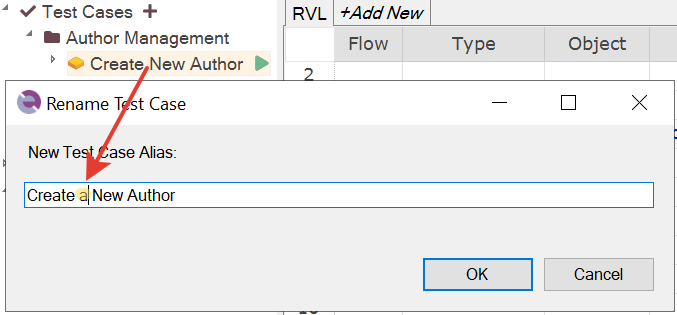

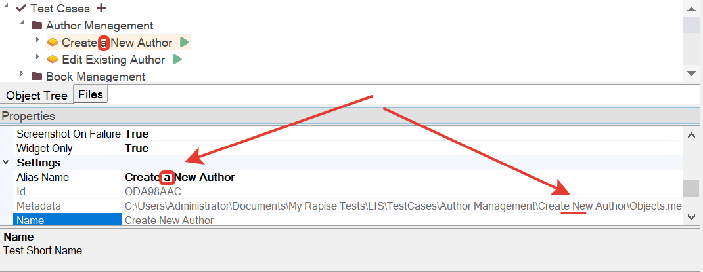

### Moving Test Cases

To move a test case in Rapise, you have the option to move it into an existing folder or into a new folder.

The simplest way to move a test case is by dragging and dropping it. Simply click and hold the test case, then drag it to the desired location in the test case tree.

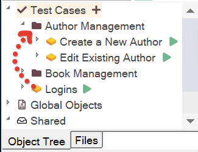

Alternatively, you can use the context menu to move a test case. Right-click on the test case you want to move and select the *Move* option. From there, you can choose an existing folder or create a new folder to move the test case into.

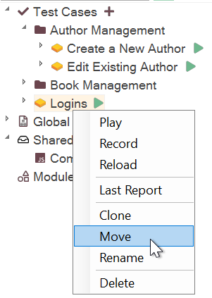

### Importing Test Cases

Importing test cases can be beneficial when you have a standalone test to integrate into your framework or when importing a test case from another framework.

However, keep a limitation in mind. The imported test case should not contain embedded sub-tests or function as a framework itself.

To import a test case, you have two options:

1.  Import into a specific folder: Right-click on the folder where you want to import the test case, then select the "Import Test Case" option from the context menu.

    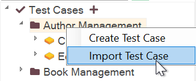

2.  Import into the root: Go to the main menu and navigate to *File > Add to Framework > Import External Test Case*. This imports the test case into the root of your framework.

    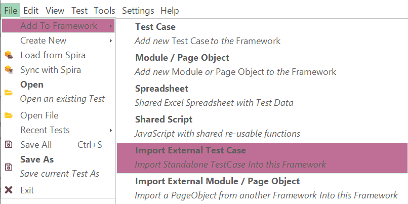

### Importing Page Objects / Modules

Importing a Page Object or module follows a process similar to importing a Test Case. You have two options to import them:

1.  Import from the main menu: Go to *File > Add to Framework > Import External Module / Page Object*. This option allows you to import a Page Object or module into your framework.

2.  Import from the context menu: Right-click on the *Modules / Pages* node in the Object Tree, then select the "Import External Module / Page Object" option. This allows you to import a Page Object or module directly into the designated folder.

### Copying / Moving Repository Objects

There are situations where you might need to transfer repository objects between test cases or from a Test Case to a Page Object. To accomplish this, use the [Object Manager](/Guide/object_manager) feature in Rapise. Here's how:

1.  Right-click on the `[Objects]` node in the Object Tree.

2.  From the context menu, select the option to launch the Object Manager.


The Object Manager provides a convenient interface for copying or moving repository objects between different locations within your framework.

### Defining Global Functions

To make a function or variable globally accessible across multiple test cases or modules, define them in the `Common.js` file or any other `.js` file located in the `Shared` node. These shared functions and variables can be accessed from any part of your framework.

In the object tree, you can find the shared functions and variables under the `Functions` and `Variables` nodes respectively.

### Defining Local Functions

If you need to define a function or variable specific to a particular test case, you can do so in the Test Case `User` file. To access the User file, you can either click *View/User* or use the *User* button on the toolbar:

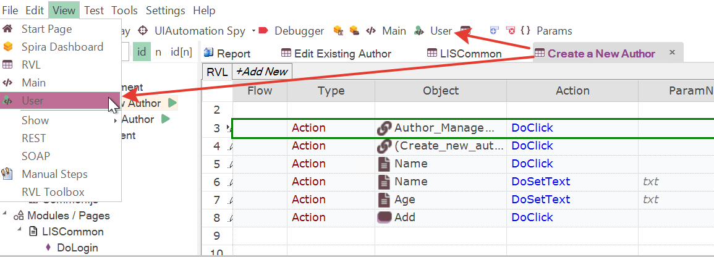

By defining functions locally in the User file, they will be accessible only within that specific test case.

### Global Objects and Test Cases

The contents of the Global Object node can vary depending on the selected test case or Module/Page Object. The available objects might change based on the specific technology or context of the test case.

For example, if you have a test case named `Desktop Calc` that uses desktop technology, and another test case named `Web Calc` that uses web technology, the Global Object node will display different objects depending on which test case you are editing. When editing the desktop test case, you might not see the [Navigator](/Libraries/Navigator) object, but it will be displayed when editing the web test case.

### Recording Test Cases and Page Objects

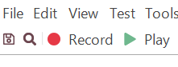

The behavior of the toolbar's *Record* button depends on the currently selected file. Here's how it behaves in different scenarios:

1.  If no file is selected and you click *Record* in the toolbar, it will display the *Select Test Case to Record* dialog. This dialog will list only the test cases available in the framework.

2.  If you are currently editing a test case and click *Record*, the same dialog will appear, but the currently edited test case will be pre-selected.

3.  If you are editing the code of a Page Object and press *Record*, it will show all test cases and the specific Page Object in the dialog. The Page Object will be pre-selected.

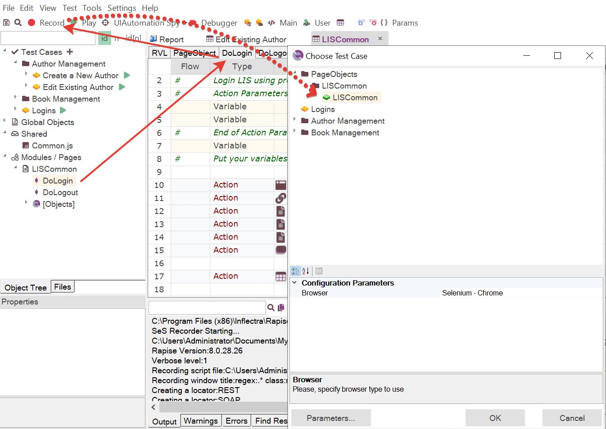

### Running a Specific Test Case

To run an entire test case, you have two options:

1.  Click the *Play* button on the toolbar.

2.  Click the *Play* icon next to the test case.

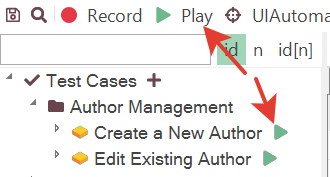

### Running a Batch of Test Cases

There are two ways to run a batch of test cases: locally and test-set based.

For local batch execution, you can create another test case that calls the required test cases one by one using the `RVL.DoPlayTest` function.

In the following example, we have a test case named `!Full - Author Management`. The exclamation mark (!) at the beginning of the name ensures that it is shown first in its folder when sorted. This test case calls other test cases from a specific folder one by one. We have added them to the test case using `Shift`+Drag&Drop, so they are called by their full names instead of their paths.

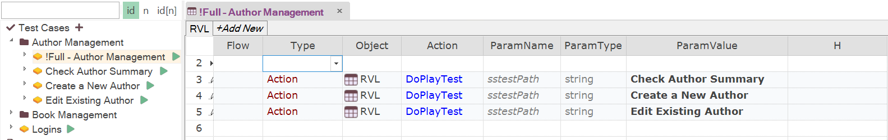

A limitation of this approach is that while the overall status of the `!Full - Author Management` test case is displayed, it doesn't reflect the status of the individual test cases it contains (e.g., `Create New Author`, `Edit Existing Author`). If you require batch execution with detailed status and other test-management related features, it's recommended to consider running test sets using the [Spira Dashboard](/Guide/spira_dashboard_2). This allows for better tracking of individual test case statuses and provides additional test management capabilities.

### Running Test Sets with Spira

Use [Spira Dashboard](/Guide/spira_dashboard_2) to define, configure, schedule, and run test sets and to view execution history.

## Legacy Frameworks

Before the release of Rapise 8, the process of defining a test framework was not as streamlined. You can find more detailed information about it in the [framework](/Intro/framework) topic.