# Page Objects / Modules

The term **Modules** can serve as a synonym for **Page Objects**. The concept and benefits remain consistent: creating modular and reusable components that represent different pages or user interfaces of a web application.

In the context of testing frameworks, a [Page Object](https://www.selenium.dev/documentation/test_practices/encouraged/page_object_models/) is a design pattern used to enhance the maintainability and reusability of automated tests, particularly in web application testing. It provides an object-oriented approach for representing the different pages or user interfaces of a web application.

The main idea behind the **Page Object** pattern is to encapsulate the elements, actions, and behaviors of a web page within a dedicated **module**.

Here are some key aspects and benefits of using **Page Objects**:

1.  Abstraction of Web Elements: The **Page Object** encapsulates the object repository (such as buttons, text fields, dropdowns, etc.) found on a specific page. It provides a layer of abstraction, allowing tests to interact with the elements using intuitive methods rather than directly manipulating individual repository objects or HTML tags.

2.  Reusability and Maintainability: By separating the page-specific logic into **Page Objects**, the code becomes more modular and reusable. Changes in the application's user interface or functionality can be easily handled by updating the relevant **Page Object** class, rather than modifying the tests themselves.

3.  Improved Readability: **Page Objects** provide a higher-level representation of the application, making the tests more readable and easier to understand. Test code can be written in a more concise and declarative manner, enhancing collaboration between testers and developers.

4.  Centralized Locators: The Page Object pattern centralizes the locators or selectors used to identify web elements on a particular page. This reduces duplication and allows for easier maintenance if the locators change, as they can be updated in a single location within the Page Object class.

While the typical usage of **Page Objects** or **modules** in testing frameworks primarily focuses on encapsulating individual web pages or user interfaces, they can also be extended to encapsulate groups of functionality within an application. This allows for a more comprehensive and organized approach to testing, including tasks such as navigation through the application.

In addition to representing a single page or UI element, a **Page Object** or module can be designed to encapsulate a logical grouping of related functionality within the application. This could include a set of pages that are interconnected or share a common purpose, or even a specific workflow or user journey across multiple pages.

For example, consider an e-commerce application that consists of various pages such as a product listing page, product details page, shopping cart page, and checkout page. Instead of creating separate **Page Objects** for each individual page, a **module** could be created to encapsulate the entire shopping flow, including navigating between these pages and performing actions related to the shopping process (e.g., adding items to the cart, updating quantities, and completing the checkout).

By encapsulating a group of related functionalities within a single module, the tests can focus on testing that specific area of the application or a complete workflow. This approach offers several advantages:

1.  Improved Modularity: The encapsulation of related functionality within a module enhances code organization and modularity. It allows for a more cohesive representation of the application's features, making the tests easier to understand and maintain.

2.  Seamless Navigation: The module can provide methods or actions to navigate through different pages or steps within the application. This simplifies the test code by abstracting the navigation logic and making it more readable and intuitive.

3.  Reusability: Since a module encapsulates a group of related functionalities, it can be reused across multiple tests or scenarios that involve the same set of features. This promotes code reusability, reduces duplication, and saves effort in maintaining similar test code in different places.

4.  Clearer Test Scenarios: By encapsulating related functionality within a module, test scenarios can be more clearly defined. It becomes easier to create tests that cover specific user journeys or workflows, making the test cases more meaningful and representative of real-world usage.

In summary, while Page Objects or Modules are commonly associated with encapsulating individual web pages, they can also be extended to encapsulate groups of functionality within an application. This approach enhances code organization, simplifies navigation, promotes reusability, and enables clearer test scenarios for comprehensive testing of various application features or workflows.

## Page Objects vs Test Cases

What are the differences between **Page Objects / Modules** and **Test Cases**?

-   A Test Case typically has a single entry point, while a Page Object may have several action methods.

-   Test Cases may have a single set of input parameters, whereas Page Objects may have a set of input parameters for each action.

-   Page Object actions may return a value.

-   Page Objects can be organized into modules.

## Creating a Page Object / Module

There are two ways of creating a **Page Object (PO)** or **Module**:

1.  Main menu:
    -   Go to **File** > **Add to Framework** > **Page Object / Module**.
    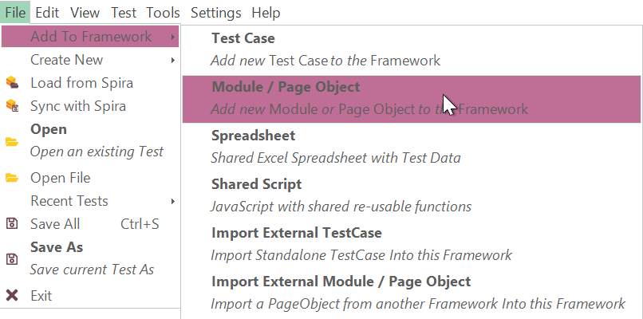

2.  Context menu:
    -   Right-click on the **Page Objects / Modules** node in the [object tree](../object_tree.md).
    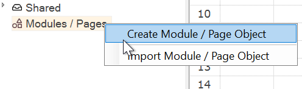

### Naming and Namespaces

A Page Object name should be **alphanumeric**: this means it must consist of letters (A–Z, a–z), numbers (0–9), or underscores (`_`). It cannot contain spaces or special characters such as `-`, `@`, `#`, or `.`. Examples of valid names include `LoginScreen`, `CartPage`, `_AdminPanel1`. Invalid names would be `login screen`, `cart-page`, or `123Main`.

By default, if you create an object called `LoginScreen`, it will be placed in the **root namespace**:

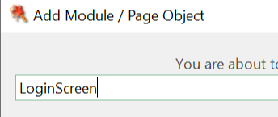

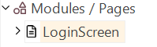

As your project grows, you will need to group and organize Page Objects. This is where **namespaces** come into play.

Namespaces use a dot-separated notation similar to **.NET namespaces** or **Java packages**. You can define them as `group.Module`, `group.subgroup.Module`, etc. For example:

- `crm.leads.Editor`
- `ecommerce.checkout.Cart`
- `mobile.login.Screen`

Package naming rules are the same as for identifiers: lowercase names are often used for groups (`crm`, `ecommerce`, `mobile`), while classes or modules typically use PascalCase (`Editor`, `Cart`, `Screen`). Once a namespace is assigned, it cannot be changed later.

For example, if you define an object as `crm.leads.Editor`:

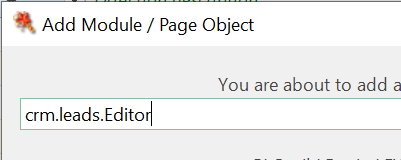

It will appear in a hierarchy under `crm > leads > Editor`:

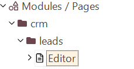

### Accessing Objects with Namespaces

In RVL you may refer to an object using its full namespace:

| Flow | Type   | Object                | Action    | ParamName | ParamType | ParamValue |
| ---- | ------ | --------------------- | --------- | --------- | --------- | ---------- |
|      | Action | **crm.contacts.Editor** | DoRefresh |           |           |           |

In JavaScript:

```js
SeS("crm.contacts.Editor").DoRefresh();
//or
crm.contacts.Editor.DoRefresh();
```

When using [AI commands](../../RVL/AI.md#including-and-excluding-modules--page-objects), you may include or exclude Page Objects by namespace. For example:

```
## #module crm.leads.*
```

This will include everything inside the `crm.leads` namespace.

### Page Object - RVL vs JS

When you create a Page Object, you have two options: RVL mode or JavaScript mode.

RVL is appropriate in most cases when the module primarily covers straightforward scenarios, involving a set of interactions with the application.

JavaScript is particularly useful in two cases:

1.  When you need something where scripting is more appropriate (write loops, use arrays, perform data and string manipulations). Or when you work with JSON data where JavaScript appears to be the most suitable handler.

2.  When you have web service interactions. Web services usually include JSON data as payload/responses, so JavaScript is more useful.

In all other cases, choose RVL.

## Adding Page Object Actions

The method of adding an action to a Page Object varies depending on the chosen language: RVL or JavaScript.

### RVL Mode

When in RVL mode, adding a sheet creates a new action, with the exception of two specific sheets:

1.  The `RVL` sheet, which is the default sheet. It is typically left empty in the Page Object or may contain an internal test that can be executed via the [Play this Sheet](../rvl_editor.md#context-menu) context menu.

2.  The `PageObject` sheet, which is the default sheet within the Page Object. It is intended to include a comment with a detailed description of the action, displayed to the user.

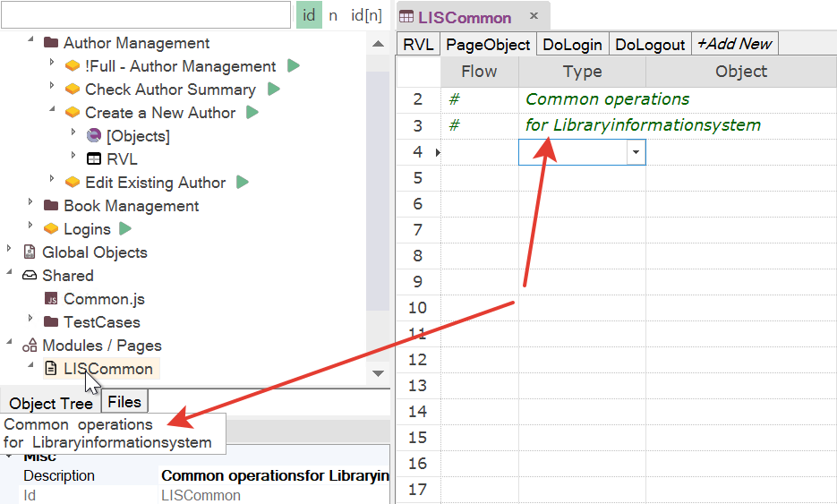

Any other sheet is considered an action. The action name should be alphanumeric, meaning it should not contain spaces and should start with a letter or an underscore.

### RVL Action Parameters

When adding a Page Object action in the RVL editor you may specify **action parameters** directly in the action **signature**. This signature defines the parameter list, their types, and optional default values.  

Supported formats:

- **No parameters**
  ```DoAction```  
  or  
  ```DoAction()```  

- **String parameters**
  ```DoAction(param1, param2)```  

- **Typed parameters**
  ```DoAction(/**string*/strParam, /**number*/numParam)```  
  Types supported:
  - `string` → text values
  - `number` → covers int, float, double
  - `boolean` → true/false values
  - `object` → any other type or complex object

- **Parameters with default values**  
  You may also define defaults. Rapise infers the type from the default:
  ```DoAction(param1 = "default", param2 = 5)```  
  - `"default"` → string  
  - `5` → number  
  - `true` / `false` → boolean  

This way, the signature both documents the parameters and ensures correct typing inside the RVL action.

---

**Examples**

1. **Parameters with defaults in the action call:**

```DoAdd(name=Jim,tel="+1323674",age=41,mail=j@a.co)```

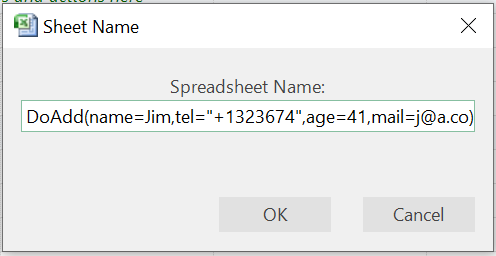

Produces this result:

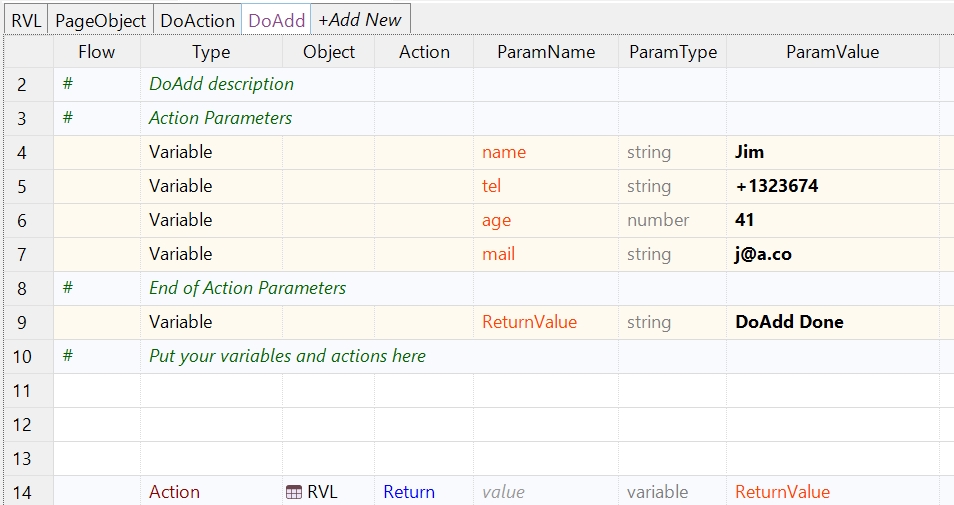

---

2. **Typed parameters in the action signature:**

```DoAdd(/**string*/name,/**string*/tel,/**number*/age)```

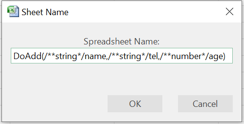

Produces this result:

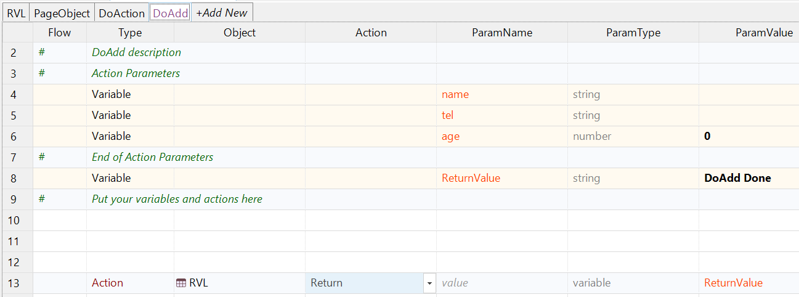

---

In summary:  
- Use plain names when you only need parameter order.  
- Add types via JSDoc-style comments (`/**type*/`) to make them explicit.  
- Provide default values where appropriate to make actions easier to reuse without always specifying inputs.

### JavaScript Mode

In JavaScript mode, a Page Object / Module is equivalent to a [Global Object](../global_objects.md). All the syntax, naming conventions, and documentation information for a global object also apply to a Page Object in JavaScript Mode.

The distinction between a global object and a Page Object lies in their usage and features. Typically, a global object encompasses various functionalities like PDF support, text manipulations, and other utilities. It does not involve an object repository or web services. On the other hand, a Page Object can include an object repository and is often specific to an application, representing its unique characteristics and functionality.

## Action Naming and Reporting

The preferred name for an action is `DoAction`. When this name is used, the result of the action is checked and reflected in the report. Checking the result involves verifying that a return value of 0, `false`, or an empty string indicates a failed action. The inclusion of the `Do` prefix ensures that the result is checked and a line about the action is included in the report.

Alternatively, you can name the action simply `Action`. In this case, the action will not be displayed in the report, although it may have a return value that will not be checked.

It is common to have actions with names like `GetSmth` or `SetSmth`. These actions are meant to update or return a value but are not reflected in the report, similar to the behavior of `Action`.

In certain situations, you may want to call a `DoAction` but ignore its output value and exclude it from the report. To achieve this, you can prefix the action name with an underscore, such as `_DoAction`, resulting in an empty execution report.

## Description, Parameters and Return Values

Defining and documenting parameters and return values in JavaScript mode is straightforward and follows the same format as for [global objects](../global_objects.md#format).

When creating an action in RVL, necessary placeholders are generated:

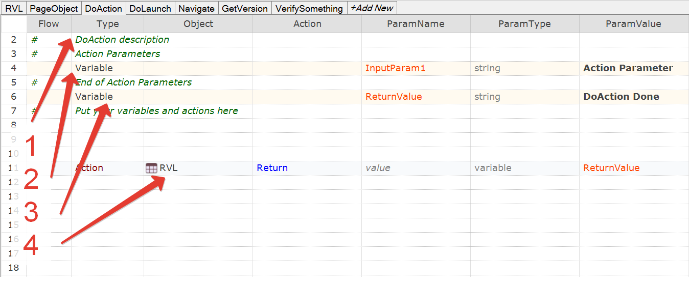

Where:

1.  This is an action description. You can see it when choosing an action:

    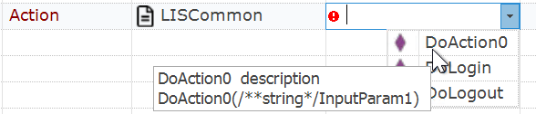

    or when hovering over it in the tree:

    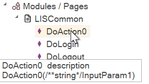

2.  Parameters (zero or more). All variable definitions appearing before the `ReturnValue` variable are assumed to be action parameters. Everything after `ReturnValue` consists of internal variables needed for a given action.

3.  The `ReturnValue` variable. May contain an action result (you can assign it during the action's execution).

## Execution

To call a Page Object, you can use `MyObject.DoAction` directly in both RVL and JavaScript modes.

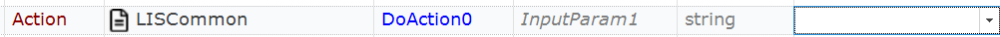
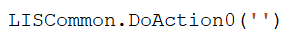

Alternatively, you can invoke a specific action within the Page Object itself by using the context menu and selecting "Invoke *ActionName*()".

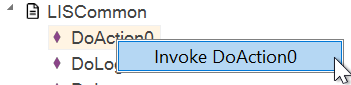

For RVL Modules, you can run any part of the module using standard RVL features such as Play Selection or Play this Sheet.

## Page Object Recording

In RVL mode, you perform [recording](../rvl_editor.md#features) just as you would for a standard RVL test case.

## Page Object and Web Service

When incorporating a Web Service (`.soap` or `.rest`) into your Page Object, it is advisable to use JavaScript instead of RVL (Rapise Visual Language) for creating the Page Object.

When [generating](../rest_definition_editor.md#script-steps) a recorded script, it will be placed in the Page Object's `Main.js` file, which is not executed. Therefore, you will need to manually copy the generated script from `Main.js` and paste it into the appropriate action within the `<PageObjectName>.js` file.

## Importing Page Objects

In Rapise, you can import pre-built Page Objects from other frameworks.

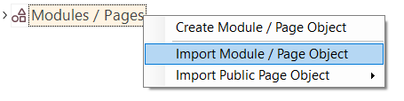{width="364px"}

## Public Page Objects

Additionally, the Rapise team has created a collection of Page Objects that you can download and use.

[Useful Page Objects](https://github.com/Inflectra/rapise-powerpack/tree/master/FWUsefulPageObjects)

Starting with Rapise version 8.2 and later, importing any of these Useful Page Objects is just a few clicks away.

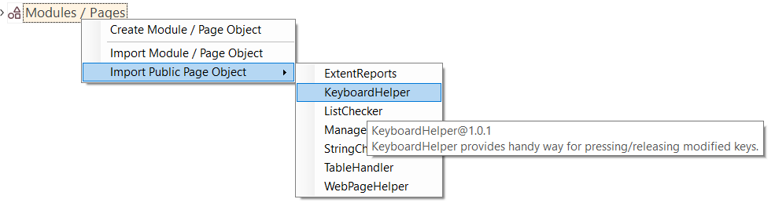{width="788px"}

If you already have one of these Useful Page Objects installed and attempt to install it again, Rapise will check the version and, if a newer one is available on GitHub, it will offer you the option to upgrade.
