# Test Framework Parameters

!!! important
    This section applies to the [new Framework mode](./frameworks.md) introduced in Rapise 8.0.

In test automation projects, it is often necessary to parameterize test cases for various purposes. For instance, this could involve specifying different URLs for running tests in different environments (development, staging, production), or providing user credentials for logging into the system. Additionally, there might be a need to quickly modify playback speed, error handling, and screenshot settings for multiple test cases. In the Rapise 8.0 Framework mode, managing parameters is made simple and convenient, allowing easy creation and management of parameters, including the ability to run the same test case with different input data, such as filling a form with various values to create multiple records in a system database.

In the upcoming sections, you will gain valuable insights into the process of defining parameters and configurations, as well as their application in test cases and test sets. If you're looking for concrete examples of parameter creation and usage, we highly recommend exploring [this knowledge base article](https://www.inflectra.com/Support/KnowledgeBase/KB749.aspx).

## Framework Parameters

To manage framework level parameters and configurations navigate to the Spira Dashboard using main menu `View > Spira Dashboard`. Then switch to `Parameters` page in the dashboard.

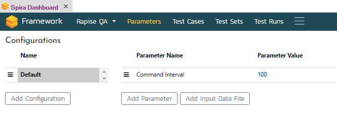

!!! note
    If you do not see `Parameters` link then the test opened in Rapise is not a Framework.

The `Parameters` page contains two tables. One for parameters and another one for configurations. To add a parameter click `Add Parameter` button. It will bring up `Add Parameter` dialog.

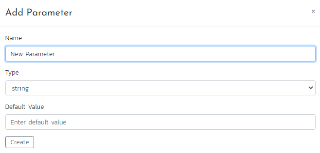

Specify parameter name, type, default value and click `Create`. 

### Supported Parameter Types

- **boolean** - simple boolean value, true or false.
- **number** - numeric value, integer or float.
- **string** - string value, e.g. URL or user name. 
- **password** - masked (******) password string.
- **select** - dropdown with predefined choices.
- **browser** - the list of [global and local browser profiles](../selenium_settings_dialog.md#local-selenium-profiles).
- **mobile** - the list of [global and local mobile profiles](../mobile_settings_dialog.md#local-mobile-profiles).
- **datacolumn** - parameter to bind to a column in the data file.

#### Single Select Parameter

If parameter type is set to `select` define the list of options. For this purpose use the popup menu.

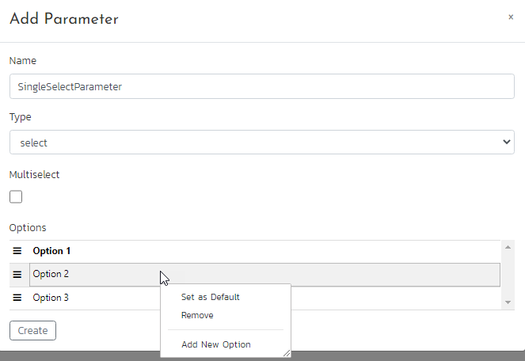

You may add a new option, remove existing one or set specific option as a default one. Also using hamburger icon you may reorder the options.

To make a choice for `Single Select Parameter` double click it in the `Parameters` table and click on the option you need.

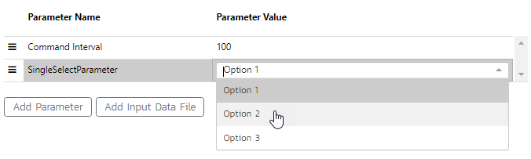

#### Multiselect Parameter

To turn `Single Select Parameter` into a `Multi Select Parameter` just set `Multiselect` checkbox.

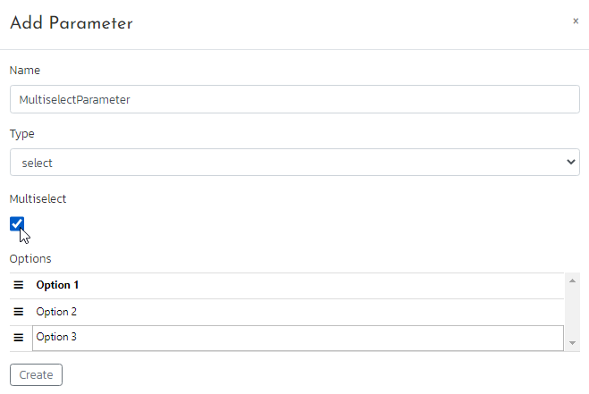

To make choices for `Multiselect Parameter` double click it in the `Parameters` table, select options you need and click `Save` button.

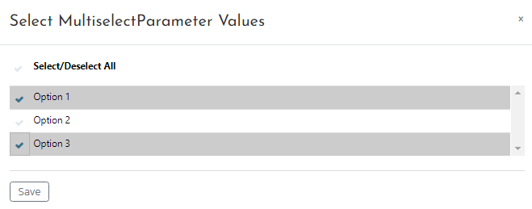

!!! important
    The purpose of multiselect parameters is to run test cases included into a test set with all parameter value combinations. For example, if we have just one multiselect parameter `MP1` with selected options `MP1O1` and `MP1O2` then RapiseLauncher will run a test set twice, first time with `MP1=MP1O1` and second time with `MP1=MP1O2`. Another example. If we have `MP1` with selected values `[MP1O1, MP1O2]` and `MP2` with selected values `[MP2O1, MP2O2]` then RapiseLauncher will run a test set 4 times with values:
    ```
    MP1=MP1O1, MP2=MP1O1
    MP1=MP1O1, MP2=MP1O2
    MP1=MP1O2, MP2=MP1O1
    MP1=MP1O2, MP2=MP1O2
    ``` 

#### Browser Parameter

`Browser` parameter is a select or multiselect parameter with automatically calculated values. It's values are names of global and local browser profiles. If a framework contains a Web test case/module then `Browser` parameter is added automatically once you record anything into the Web test.

To convert `Browser` parameter to a multiselect parameter right click it and choose `Edit Parameter...`. Set `Multiselect` checkbox and click `Update` button.

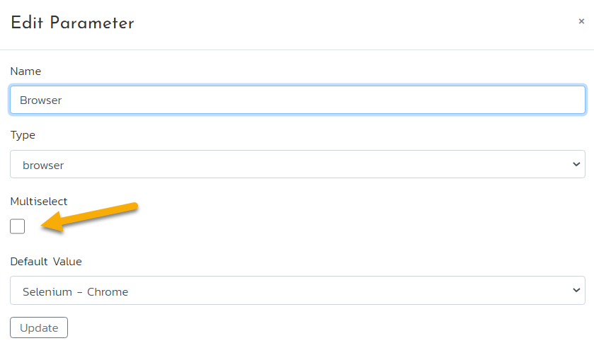{width="671px"}

Explore [this knowledge base article](https://www.inflectra.com/Support/KnowledgeBase/KB750.aspx) to learn how to run a test set on multiple browsers.

#### Mobile Parameter

`Mobile` parameter is a select or multiselect parameter with automatically calculated values. It's values are names of global and local mobile profiles. If a framework contains a Mobile test case/module then `Mobile` parameter is added automatically once you record anything into the Mobile test.

To convert `Mobile` parameter to a multiselect parameter right click it and choose `Edit Parameter...`. Set `Multiselect` checkbox and click `Update` button.

#### Datacolumn Parameter

To define a datacolumn parameter you need to have a [data file](#data-file-parameter). To add one click `Add Input Data File` button under the `Parameters` table.

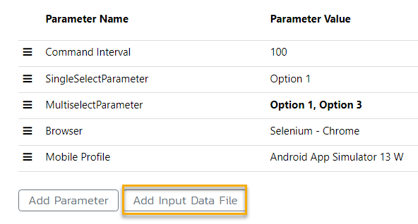{width="474px"}

A `Data.csv` will be added to `Lib\LibFramework` folder of your framework. You may right click it and edit.

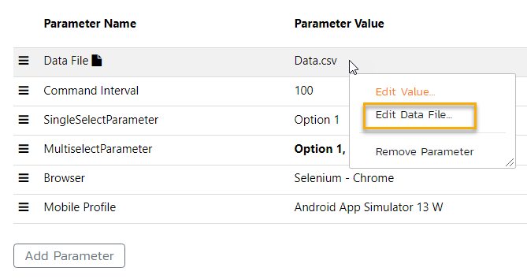{width="535px"}

In the CSV editor you may add and remove columns as well as data rows.

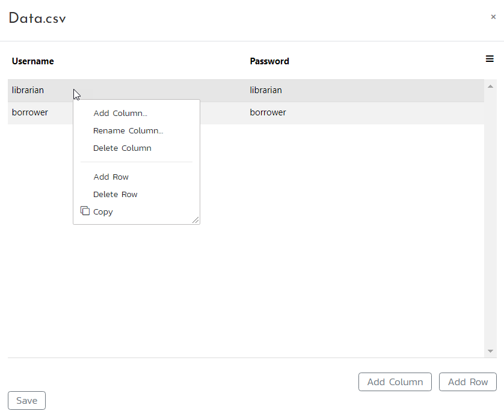{width="670px"}

Let's create a datacolumn parameter with name `Username`.

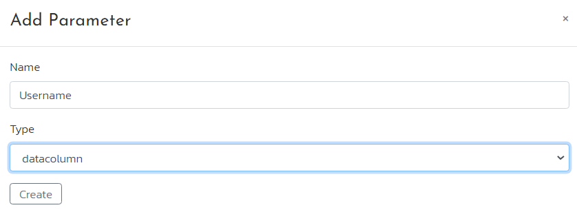{width="670px"}

Double click it's value to choose from data file column names.

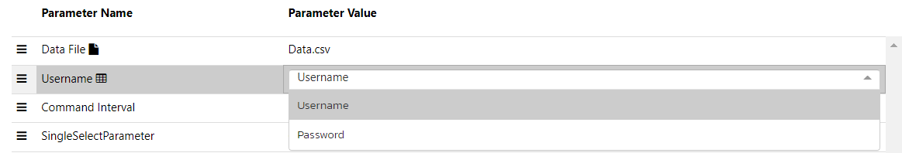{width="930px"}

When a datacolumn parameter is bound to a column in a data file, you may observe a display of the initial data values on the right-hand side.

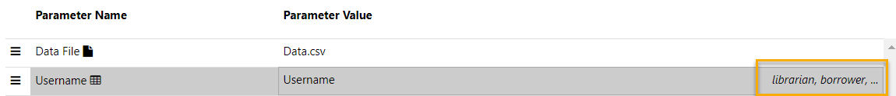{width="920px"}

#### Data File Parameter

A framework may have just one `Data File` parameter. You can add it by clicking the `Add Input Data File` button under the `Parameters` table, and if it is not needed, you can remove it by right-clicking on the `Data File` parameter and selecting the `Remove Parameter` option from the menu.  When you add a `Data File` parameter, a `Data.csv` file is automatically generated in the `Shared` folder of the framework, and you can manually create additional data files in this folder if needed. To select the desired data file, double-click on the `Data File` parameter, and a dropdown menu will appear with all available data file names.

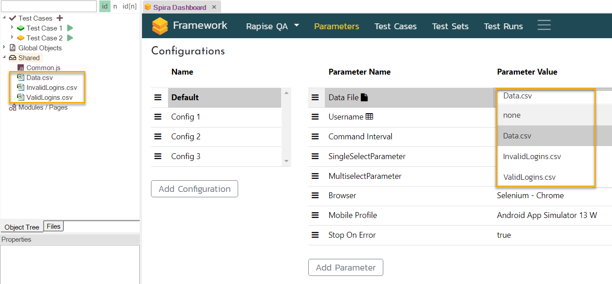{width="1053px"}

The purpose of the `Data File` parameter is to instruct RapiseLauncher to execute a test set multiple times, once for each data row in the selected data file. For instance, if there are two lines of data in the data file, the test set will be executed twice.

!!! important
    It's important to note that the `Data File` parameter can be combined with other parameters such as [multiselect](#multiselect-parameter) and [datacolumn](#datacolumn-parameter) parameters, allowing for more complex test configurations.
    
    Consider the following example. Suppose we have a data file with columns `C1` and `C2`, consisting of two data rows. 
    
    ```title="Data.csv"
    C1      C2
    ------------
    v11     v12
    v21     v22
    ```
    
    Additionally, we have two datacolumn parameters, `DC1` and `DC2`, which are linked to columns `C1` and `C2`, respectively. We also have two multiselect parameters, `MP1` with selected values `[MP1O1, MP1O2]` and `MP2` with selected values `[MP2O1, MP2O2]`. If our test set is configured accordingly, RapiseLauncher will execute it 8 times with the following parameter values:

    ```linenums="1" hl_lines="5-8"
    DC1=v11, DC2=v12, MP1=MP1O1, MP2=MP1O1
    DC1=v11, DC2=v12, MP1=MP1O1, MP2=MP1O2
    DC1=v11, DC2=v12, MP1=MP1O2, MP2=MP1O1
    DC1=v11, DC2=v12, MP1=MP1O2, MP2=MP1O2
    DC1=v21, DC2=v22, MP1=MP1O1, MP2=MP1O1
    DC1=v21, DC2=v22, MP1=MP1O1, MP2=MP1O2
    DC1=v21, DC2=v22, MP1=MP1O2, MP2=MP1O1
    DC1=v21, DC2=v22, MP1=MP1O2, MP2=MP1O2    
    ```

    To explore a practical application of multiselect and datacolumn parameters, please refer to [this knowledge base article](https://www.inflectra.com/Support/KnowledgeBase/KB760.aspx) for a real-life example.

### Builtin Parameters

Additionally, Rapise offers a collection of pre-defined parameters that can be added to the `Parameters` table. To access this feature, click on the `Play` button in the toolbar, and then select the `Parameters` button within the `Choose Test Case` dialog.

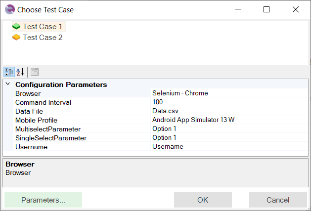{width="503px"}

This action will bring up the `Choose Parameters` dialog.

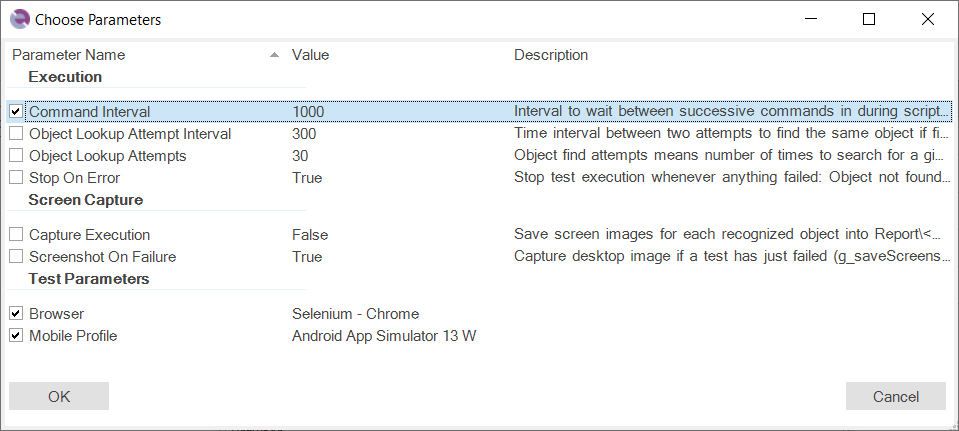{width="767px"}

In the `Choose Parameters` dialog, you can select the checkboxes corresponding to the parameters you wish to include in the `Parameters` table. If there are parameters that you do not require, simply uncheck their respective checkboxes to remove them from the table.

## Configurations

You have the flexibility to define multiple configurations within a framework. Each configuration represents a specific combination of parameter values. When you modify a parameter value in the `Parameters` table, it affects the currently selected configuration. 

For example, on the screenshot we change `Command Interval` parameter value for `Config 2` configuration.

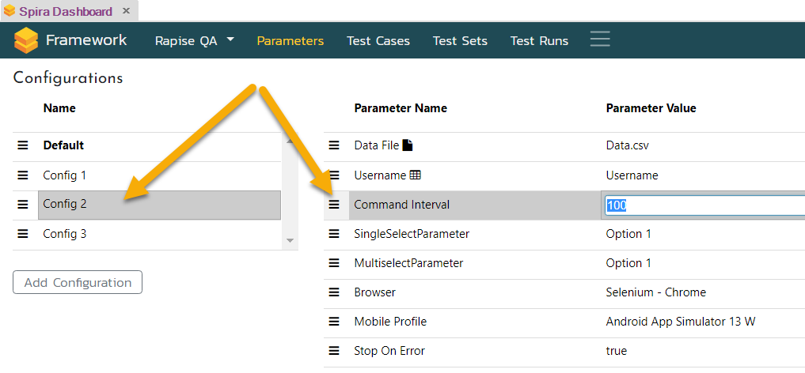{width="814px"}

These configurations can be assigned to a test set on the `Framework` page of the dashboard.

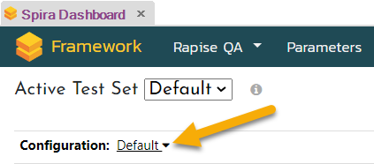{width="338px"}

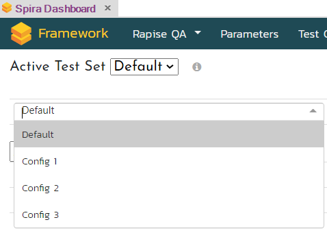{width="382px"}

During the execution of a test set using the RapiseLauncher, all test cases within that set inherit the parameter values defined in the assigned configuration. In cases where a parameter value is not explicitly assigned within a configuration, the default value is utilized during the test set execution.

To easily identify parameter values that differ from the default, they are displayed in bold. This visual cue helps you quickly recognize any deviations from the default values.

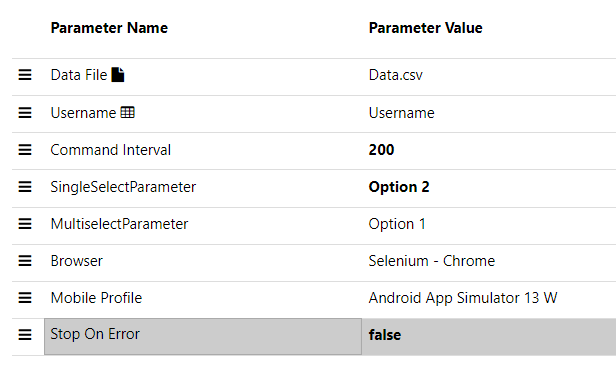{width="493px"}

Dive into [this knowledge base article](https://www.inflectra.com/Support/KnowledgeBase/KB752.aspx) to explore practical scenarios that involve configurations.

## Reading Parameter Values

In RVL just set `ParamType` to `testparam` and select a framework parameter from the dropdown.

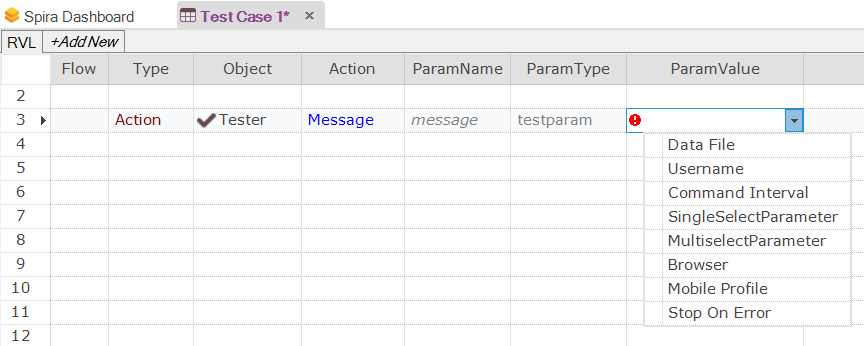{width="691px"}

In JavaScript use [Tester.GetParam](../../Libraries/Tester.md#getparam). Keep in mind that parameter names are case-sensitive.

```javascript
    var username = Tester.GetParam("Username");
    Tester.Message(username);
```

## See Also

- Defining Test Case Parameters
- Passing Parameters
    - Passing Parameters for Test Run
    - Passing Parameters Between Tests
