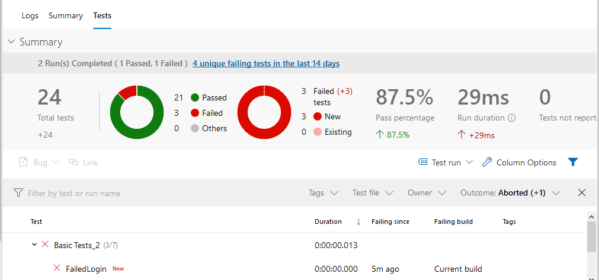

# Azure DevOps Integration v2

!!! tip
    This documentation section is deprecated. There is a new way of integrating Rapise and Azure DevOps. Please refer to [Azure DevOps Integration v3](vstest.md).

From this topic you will learn how to run Rapise tests with [Node-Tap](https://node-tap.org/) and [Azure DevOps](https://azure.microsoft.com/en-us/services/devops/).

## Node-Tap

## Prerequisites

Download and install [Node.js](https://nodejs.org). Open command prompt and run the following commands to make sure you have Node.js and [npm](https://www.npmjs.com) installed:

```bash
C:\Users\inflectra>node --version
v10.16.3

C:\Users\inflectra>npm --version
6.9.0
```
Install `Node-Tap` package with `npm`:

```bash
npm install tap -g
```
Discover the folder where Node-Tap is installed:

```bash
C:\Users\inflectra>npm list tap -g
C:\Users\inflectra\AppData\Roaming\npm
-- tap@14.6.9
```
Configure system variable `NODE_PATH` and set it to `node_modules` subfolder. In our case it is:

```bash
C:\Users\inflectra\AppData\Roaming\npm\node_modules
```


Relaunch Command Prompt and verify the system variable:

```bash
C:\Users\inflectra>echo %NODE_PATH%
C:\Users\inflectra\AppData\Roaming\npm\node_modules
```

## Test Framework

As a starting point you may use [sample framework](https://github.com/Inflectra/rapise-framework-examples/tree/master/AzureDevOpsFriendlyArchhitecture) we published on GitHub.

The root folder of the framework contains:

- `rapise.js` - node.js module capable of running Rapise tests;
- `runtest.cmd` - command file used by `rapise.js`, adjust `SES_ENGINE_HOME` variable in this file if needed;
- `fixunit.js`, `tap2xunit.cmd` - these two files convert execution results from TAP format to XUnit format accepted by Azure DevOps.

Each Rapise test in this framework is a direct subfolder of the root folder:

```
AzureDevOpsFriendlyArchhitecture 
|
|-CreateNewBook
|-FailedLogin
```

`test` folder contains entries for Node-Tap. These are files with predefined content and names equal to names of Rapise tests. 

```
AzureDevOpsFriendlyArchhitecture 
|
|- test
    |
    |-CreateNewBook.js
    |-FailedLogin.js
```

Predefined content of the files is:

```javascript
var rapise = require('../rapise')
var tap = require('tap')
var path = require('path');

var testName = path.basename(__filename);

rapise.run(testName, function(exit_code) {
    tap.ok(exit_code == 0, testName);    
})

```

There is also `tap-parallel-not-ok` in `tests` folder that instructs Node-Tap to run tests sequentially.

## Run Tests with Tap

To run tests on a local machine open command prompt in the root folder of the framework and execute:

```bash
tap
```
You should see tests running:


To pass parameters to a Rapise test specify `--test-arg`. The value is JSON stringified object. Every property of this object will be evaluated by Rapise as a global variable:

```bash
tap --test-arg="{'g_browserLibrary':'Selenium - Chrome'}"
```

<iframe width="560" height="315" src="https://www.youtube.com/embed/QEH5a9vqymw" frameborder="0" allow="accelerometer; autoplay; encrypted-media; gyroscope; picture-in-picture" allowfullscreen></iframe>

## Azure DevOps Pipeline v1

To run tests in Azure DevOps you need to [configure a pipeline](https://docs.microsoft.com/en-us/azure/devops/pipelines/ecosystems/javascript?view=azure-devops). Here is the template to run Rapise tests:

**azure-pipelines.yml**
```yaml
# Starter pipeline
# Start with a minimal pipeline that you can customize to build and deploy your code.
# Add steps that build, run tests, deploy, and more:
# https://aka.ms/yaml

trigger:
- master

pool:
  name: 'default'

steps:

- script: |
    echo Running tests...
    tap --test-arg="{'g_browserLibrary':'Selenium - Chrome'}"
  displayName: 'Execute Tests'
  continueOnError: true

- script: |
    call tap2xunit.cmd
  displayName: "Convert TAP to XUnit"

- script: |
    cscript.exe fixunit.js
  displayName: 'Fix XUnit Reports'
  
- task: CopyFiles@2
  inputs:
    contents: 'reports/**'
    targetFolder: $(Build.ArtifactStagingDirectory)

- task: PublishBuildArtifacts@1
  inputs:
    pathToPublish: $(Build.ArtifactStagingDirectory)
    artifactName: TestRunReports  

- task: PublishTestResults@2
  inputs:
    testResultsFormat: 'JUnit'
    testResultsFiles: 'results/*.xml'
    testRunTitle: 'Basic Tests'
    failTaskOnFailedTests: true
```

The pipeline above assumes that `default` agent pool contains a [Self-hosted Windows Agent](https://docs.microsoft.com/en-us/azure/devops/pipelines/agents/v2-windows) installed on a machine wuth Rapise and Node-Tap (see [Prerequisites](#prerequisites)).

[See the video](https://youtu.be/iPVplfqKj50?t=730) to learn how to install and configure a self-hosted agent.

The pipeline consists of the following steps:

1. Run tests via `tap` command. You can pass parameters if needed.
2. Convert TAP formatted execution results to XUnit formatted reports.
3. Adjust XUnit reports for better processing by Azure DevOps.
4. Gather logs and reports in TAP/TRP formats in `reports` folder for [Publish Build Artifacts task](https://docs.microsoft.com/en-us/azure/devops/pipelines/tasks/utility/publish-build-artifacts?view=azure-devops).
5. Upload test results to Azure with [Publish Test Results task](https://docs.microsoft.com/en-us/azure/devops/pipelines/tasks/test/publish-test-results).

After execution of the pipeline one can review test results:



and reports/logs (.tap, .trp, .log):


> Note: TRP files are standard reports you can view with Rapise.

<iframe width="560" height="315" src="https://www.youtube.com/embed/niRPLRMgenI" frameborder="0" allow="accelerometer; autoplay; encrypted-media; gyroscope; picture-in-picture" allowfullscreen></iframe>

## Azure DevOps Pipeline v2

If you do not want each step of a Rapise test to be reported as test case in Azure DevOps use modified pipeline version:

**azure-pipelines-summary.yml**
```yaml
# Starter pipeline
# Start with a minimal pipeline that you can customize to build and deploy your code.
# Add steps that build, run tests, deploy, and more:
# https://aka.ms/yaml

trigger: none

pool:
  name: 'default'

steps:

- script: |
    echo Running tests...
    tap --no-coverage --test-arg="{'g_browserLibrary':'Chrome HTML'}"
  displayName: 'Execute Tests'
  continueOnError: true

- script: |
    call tap2xunit.cmd
  displayName: "Convert TAP to XUnit"

- script: |
    cscript.exe summarize.js
  displayName: 'Fix XUnit Reports'

- task: CopyFiles@2
  inputs:
    contents: 'reports/**'
    targetFolder: $(Build.ArtifactStagingDirectory)

- task: PublishBuildArtifacts@1
  inputs:
    pathToPublish: $(Build.ArtifactStagingDirectory)
    artifactName: TestRunReports

- task: PublishTestResults@2
  inputs:
    testResultsFormat: 'JUnit'
    testResultsFiles: 'results/*.xml'
    testRunTitle: 'Basic Tests'
    failTaskOnFailedTests: true
 
```
It calls `summarize.js` to adjust XUnit reports. Azure DevOps report for this pipeline looks like:


Detailed logs and reports (.tap, .trp, .log files) are also available for download as a ZIP archive:


> Note: TRP files are standard reports you can view with Rapise.