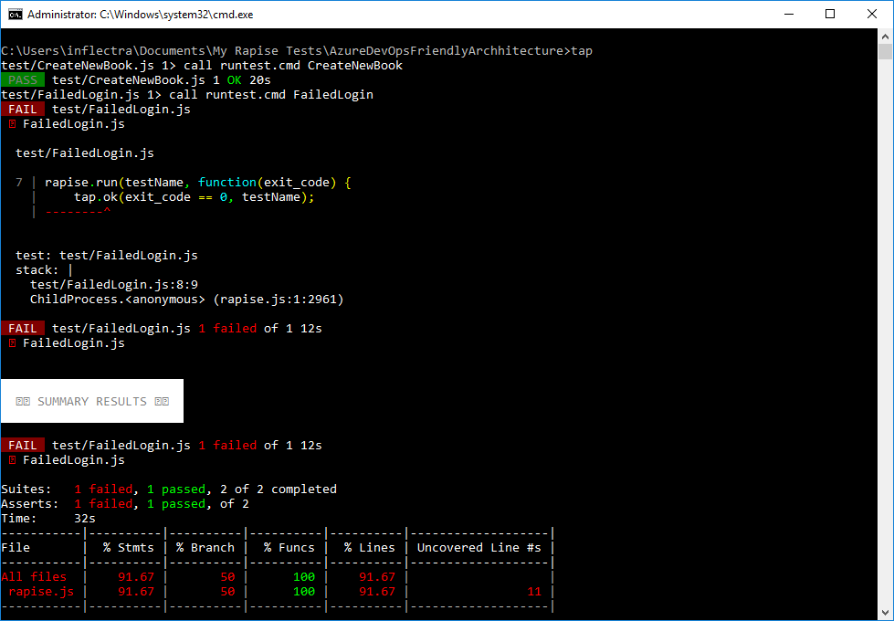

# Azure DevOps Integration

From this topic you will learn how to run Rapise tests with [Node-Tap](https://node-tap.org/) and [Azure DevOps](https://azure.microsoft.com/en-us/services/devops/).

## Node-Tap

## Prerequisites

Download and install [Node.js](https://nodejs.org). Open command prompt and run the following commands to make sure you have Node.js and [npm](https://www.npmjs.com) installed:

```bash
C:\Users\inflectra>node --version
v10.16.3

C:\Users\inflectra>npm --version
6.9.0
```
Install `Node-Tap` package with `npm`:

```bash
npm install tap -g
```
Discover the folder where Node-Tap is installed:

```bash
C:\Users\inflectra>npm list tap -g
C:\Users\inflectra\AppData\Roaming\npm
-- tap@14.6.9
```
Configure system variable `NODE_PATH` and set it to `node_modules` subfolder. In our case it is:

```bash
C:\Users\inflectra\AppData\Roaming\npm\node_modules
```


Relaunch Command Prompt and verify the system variable:

```bash
C:\Users\inflectra>echo %NODE_PATH%
C:\Users\inflectra\AppData\Roaming\npm\node_modules
```

## Test Framework

As a starting point you may use [sample framework](https://github.com/Inflectra/rapise-framework-examples/tree/master/AzureDevOpsFriendlyArchhitecture) we published on GitHub.

The root folder of the framework contains:

- `rapise.js` - node.js module capable of running Rapise tests;
- `runtest.cmd` - command file used by `rapise.js`, adjust `SES_ENGINE_HOME` variable in this file if needed;
- `fixunit.js`, `tap2xunit.cmd` - these two files convert execution results from TAP format to XUnit format accepted by Azure DevOps.

Each Rapise test in this framework is a direct subfolder of the root folder:

```
AzureDevOpsFriendlyArchhitecture 
|
|-CreateNewBook
|-FailedLogin
```

`test` folder contains entries for Node-Tap. These are files with predefined content and names equal to names of Rapise tests.

```
AzureDevOpsFriendlyArchhitecture 
|
|- tests
    |
    |-CreateNewBook.js
    |-FailedLogin.js
```
There is also `tap-parallel-not-ok` in `tests` folder that instructs Node-Tap to run tests sequentially.

## Run Tests with Tap

To run tests on a local machine open command prompt in the root folder of the framework and execute:

```bash
tap
```
You should see tests running:


To pass parameters to a Rapise test specify `--test-arg`. The value is JSON stringified object. Every property of this object will be evaluated by Rapise as a global variable:

```bash
tap --test-arg="{'g_browserLibrary':'Selenium - Chrome'}"
```

## Azure DevOps Pipeline

To run tests in Azure DevOps you need to [configure a pipeline](https://docs.microsoft.com/en-us/azure/devops/pipelines/ecosystems/javascript?view=azure-devops). Here is the template to run Rapise tests:

```yaml
# Starter pipeline
# Start with a minimal pipeline that you can customize to build and deploy your code.
# Add steps that build, run tests, deploy, and more:
# https://aka.ms/yaml

trigger:
- master

pool:
  name: 'default'

steps:

- script: |
    echo Running tests...
    tap --test-arg="{'g_browserLibrary':'Selenium - Chrome'}"
  displayName: 'Execute Tests'
  continueOnError: true

- script: |
    call tap2xunit.cmd
  displayName: "Convert TAP to XUnit"

- script: |
    cscript.exe fixunit.js
  displayName: 'Fix XUnit Reports'

- task: PublishTestResults@2
  inputs:
    testResultsFormat: 'JUnit'
    testResultsFiles: 'results/*.xml'
    testRunTitle: 'Basic Tests'
    failTaskOnFailedTests: true
```