# AI in Rapise

## Overview

We have integrated AI capabilities directly into Rapise, allowing users to harness the power of AI without needing to switch between applications. Everything can be managed within Rapise itself. Moreover, the AI in Rapise is well-versed with Rapise's Global Object API, the currently open testing framework, its modules, and object repositories. This knowledge enables the generation of precise and specialized responses. In its initial release, Rapise’s AI features include RVL and JavaScript code generation, as well as data generation functionalities. Rapise 8.2 supports OpenAI and Azure OpenAI models, including multimodal ones that can accept image input. The AI workflow in Rapise also supports incremental improvements in code generation quality by allowing users to save positive and negative examples for use in subsequent prompts.

A key feature of Rapise 8.2 is the [AI Command](../RVL/AI.md), which translates human-readable test step descriptions into executable code using AI. Once the code is generated for an AI Command, it can be executed independently of AI. If the AI Command text is modified, the code is regenerated accordingly. When generating code for an AI Command, Rapise considers available Global Objects, as well as Modules/Page Objects and objects from the Object Repository associated with the test case containing the AI Command (including objects linked with [Repository command](../RVL/Repository.md)).

When using [AI Commands](../RVL/AI.md), the recommended workflow for test creation is as follows: first, define Page Objects with high-level actions (e.g., Login, Logout, OpenModule, AddRecord, UpdateRecord, DeleteRecord). Then, learn and add test case-specific objects to the Object Repository, and finally, write your test case using AI Commands. The AI will translate these commands into executable JavaScript, which you can review and edit. Once all commands are translated into code, the test case is ready for execution.

Rapise provides two primary interfaces for interacting with AI:

- The **[AI Dashboard](#ai-dashboard)** allows you to configure AI options, chat with the AI, and view your chat history.

- The **[AI Panel](#ai-panel)** is linked to the active RVL document and is used to translate [AI Commands](../RVL/AI.md) into executable JavaScript code.

## AI Dashboard

### How to Open

To open the AI Dashboard, go to the main menu and select `View > AI Dashboard`.

The dashboard comprises three pages:

=== "Screenshot"
    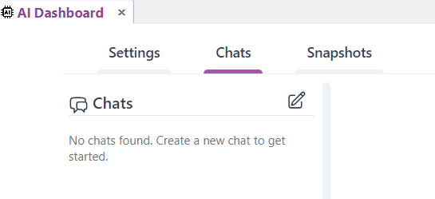{width="436px"}
=== "Transcript"
    AI Dashboard tabs: Settings, Chats, Snapshots.

- **Settings**: Configure your AI API key, select the default model, and set framework-specific options here.
- **Chats**: This page displays the history of AI chats. You can open any chat and continue interacting with the AI.
- **Snapshots**: Starred chats will appear on this page.

### Settings

In its initial release, Rapise supports both OpenAI and Azure OpenAI models. To use OpenAI models, you only need an [OpenAI Api Key](https://help.openai.com/en/articles/4936850-where-do-i-find-my-openai-api-key). For [Azure OpenAI](https://learn.microsoft.com/en-us/azure/api-management/api-management-authenticate-authorize-azure-openai#authenticate-with-api-key), you also need to specify the endpoint URL.


=== "Screenshot"
    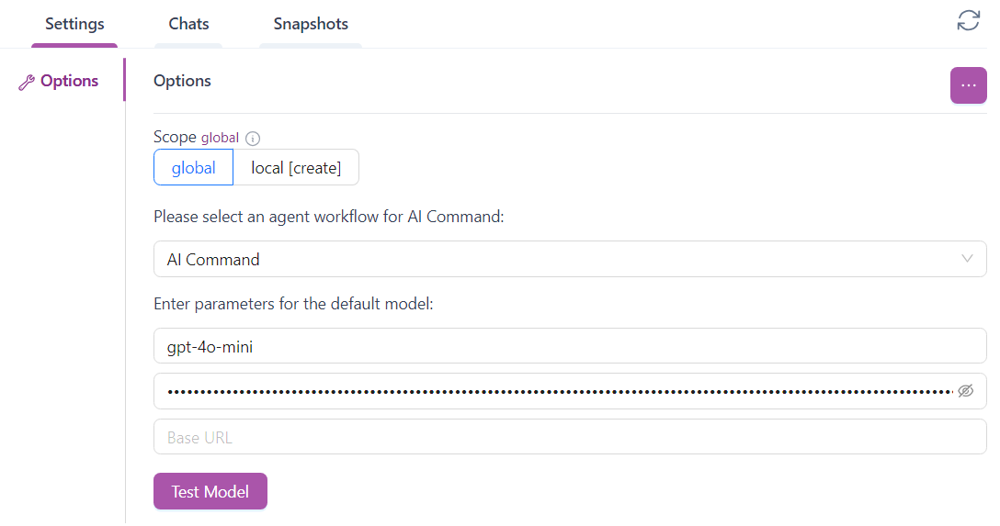{width="900px"}
=== "Transcript"
    **Options Tab**

    - *Scope*: `global` | `local` (Selected: **local**)

    **Default Model**

    - *Provider*: `Amazon Bedrock` | `Azure` | `OpenAI` (Selected: **OpenAI**)
    - *Model Name*: `gpt-4o`
    - *API Key*: *[hidden]*
    - *Proxy*: `http://localhost:8000`

    **Test Model**: [Button]


You can create options that are local to the current testing framework. Simply click the `local[create]` button. If local options exist, Rapise will prioritize them over global ones. To delete local options, click `... > Delete Local`.

#### Amazon Bedrock

Rapise 8.3 adds support for [Amazon Bedrock](https://aws.amazon.com/bedrock). To configure Amazon Bedrock connection specify AWS Region, AWS Access Key and AWS Secret Access Key.

#### Proxy

If you are behind a proxy, specify it's URL in the `Proxy` field (works for all providers).

### Chats

On the Chats page, you can select a previous chat and continue interacting with the AI. You can also start a new chat. When creating a new chat, you’ll be prompted to select a workflow. Supported workflows include:

#### AI Chat

This is a general-purpose chat with an AI model. You can ask questions and receive answers. You can also enhance prompts by adding screenshots and files.

=== "Screenshot"
    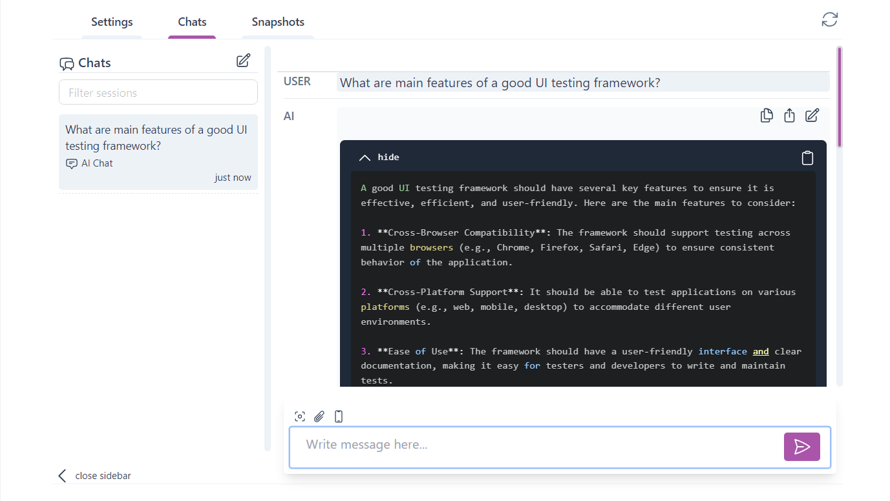{width="1123px"}
=== "Transcript"
    **USER**: What are main features of a good UI testing framework?

    **AI**: A good UI testing framework should have several key features to ensure it is effective, efficient, and user-friendly. Here are the main features to consider:

    1. **Cross-Browser Compatibility**: The framework should support testing across multiple browsers (e.g., Chrome, Firefox, Safari, Edge) to ensure consistent behavior of the application.

    2. **Cross-Platform Support**: It should be able to test applications on various platforms (e.g., web, mobile, desktop) to accommodate different user environments.

    3. **Ease of Use**: The framework should have a user-friendly interface and clear documentation, making it easy for testers and developers to write and maintain tests.

#### AI Command

This chat type is typically generated by Rapise when processing an [AI Command](../RVL/AI.md). The result of prompt processing is JavaScript code. In this chat, you can edit the generated code, copy it to a JavaScript file, or convert it to RVL and apply it to the active RVL sheet.

=== "Screenshot"
    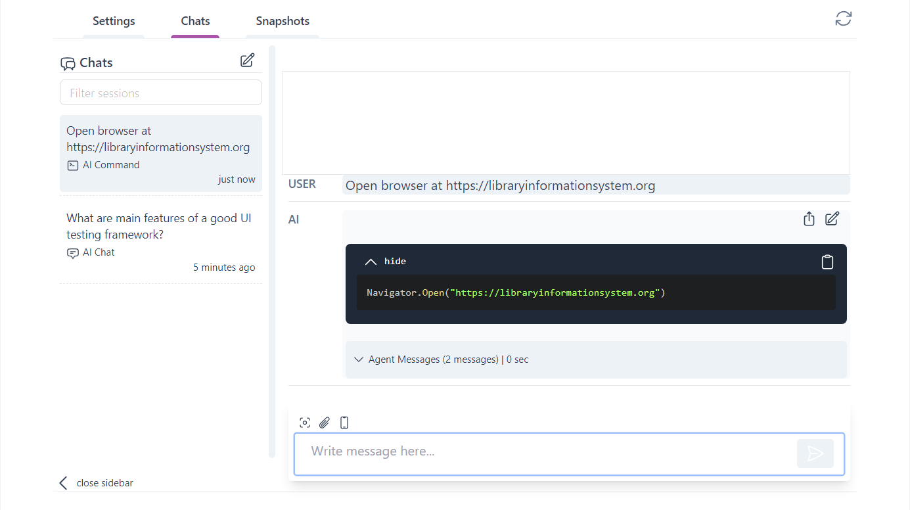{width="1123px"}
=== "Transcript"
    **USER**: Open browser at https://libraryinformationsystem.org

    **AI**: 

    ```javascript
    Navigator.Open("https://libraryinformationsystem.org")
    ```

#### Generate Data List

Generates a list of data values that can be directly inserted into an RVL sheet from the chat.

1. Prompt AI to generate a list of values. E.g.: `Generate 10 fake company names`.

    === "Screenshot"
        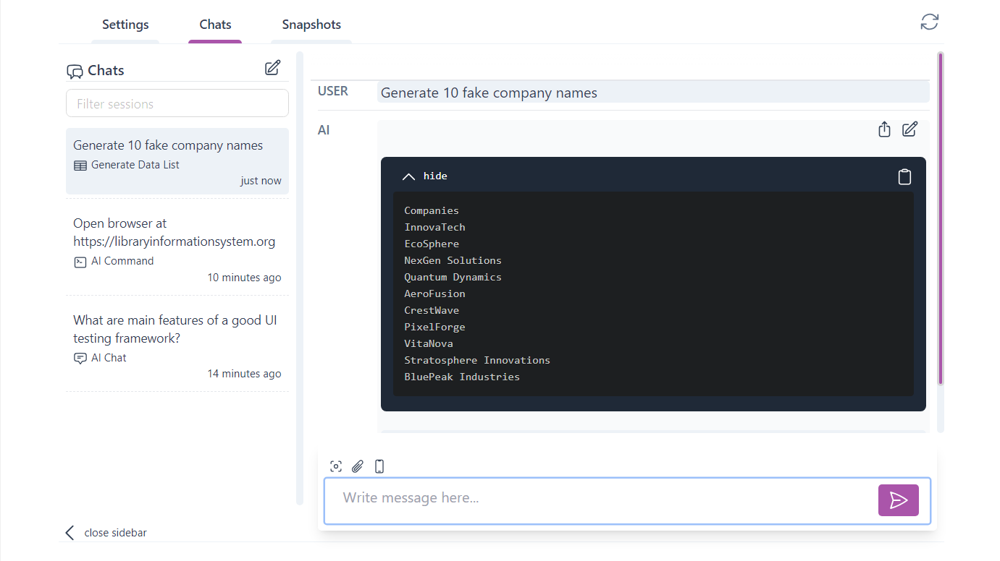{width="1123px"}
    === "Transcript"
        **USER**: Generate 10 fake company names

        **AI**: 
        ```
        Companies
        InnovaTech  
        EcoSphere  
        NexGen Solutions  
        Quantum Dynamics  
        AeroFusion  
        CrestWave  
        PixelForge  
        VitaNova  
        Stratosphere Innovations  
        BluePeak Industries  
        ```


2. Open the RVL file and sheet where you want to insert the result.
3. Return to the AI Dashboard and click Apply <span class="nocolor">:heroicons-outline-arrow-up-on-square:</span>. You can also edit <span class="nocolor">:heroicons-outline-pencil-square:</span> values before inserting them into the RVL.

    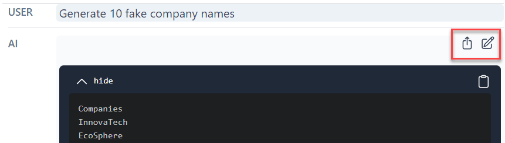{width="689px"}

4. The list will be inserted into the RVL.

    === "Screenshot"
        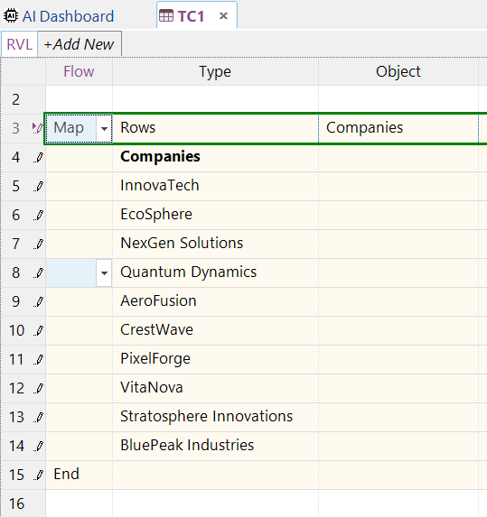{width="431px"}
    === "Transcribe"
        | Flow | Type                     | Object    | Action | ParamName | ParamType | ParamValue |
        | ---- | ------------------------ | --------- | ------ | --------- | --------- | ---------- |
        | Map  | Rows                     | Companies |        |           |           |            |
        |      | Companies                |           |        |           |           |            |
        |      | Innovatech               |           |        |           |           |            |
        |      | EcoSphere                |           |        |           |           |            |
        |      | NexGen Solutions         |           |        |           |           |            |
        |      | Quantum Dynamics         |           |        |           |           |            |
        |      | AeroFusion               |           |        |           |           |            |
        |      | CrestWave                |           |        |           |           |            |
        |      | PixelForge               |           |        |           |           |            |
        |      | VitaNova                 |           |        |           |           |            |
        |      | Stratosphere Innovations |           |        |           |           |            |
        |      | BluePeak Industries      |           |        |           |           |            |
        | End  |                          |           |        |           |           |            |

#### Generate Data Table

Generates a table with columns and rows. The result can be directly inserted into an RVL sheet as a Map. The workflow is similar to generating a Data List.

1. Prompt AI to generate a table of values. E.g.: `Generate a table with 10 records and columns: Zip, City, Street Address`.

    === "Screenshot"
        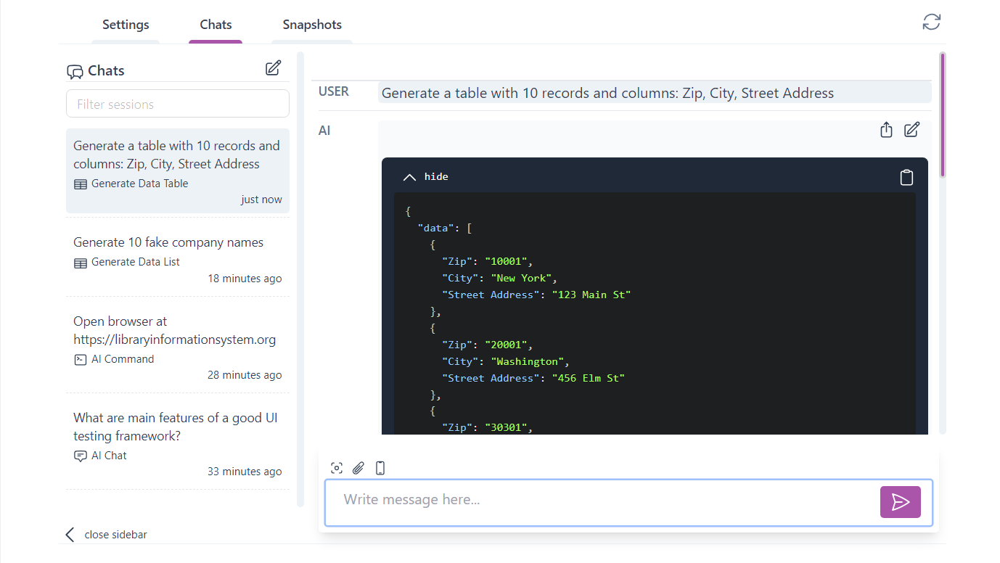{width="1102px"}
    === "Transcribe"
        **USER**: Generate a table with 10 records and columns: Zip, City, Street Address

        **AI**: 
        ```json
        {  
        "data": [  
            {  
            "Zip": "10001",  
            "City": "New York",  
            "Street Address": "123 Main St"  
            },  
            {  
            "Zip": "20001",  
            "City": "Washington",  
            "Street Address": "456 Elm St"  
            },  
            {  
            "Zip": "30301",  
            "City": "Atlanta",  
            "Street Address": "789 Pine St"  
            },  
            {  
            "Zip": "60601",  
            "City": "Chicago",  
            "Street Address": "101 Maple St"  
            },  
            {  
            "Zip": "70112",  
            "City": "New Orleans",  
            "Street Address": "202 Oak St"  
            },  
            {  
            "Zip": "94105",  
            "City": "San Francisco",  
            "Street Address": "303 Cedar St"  
            },  
            {  
            "Zip": "33101",  
            "City": "Miami",  
            "Street Address": "404 Birch St"  
            },  
            {  
            "Zip": "80202",  
            "City": "Denver",  
            "Street Address": "505 Walnut St"  
            },  
            {  
            "Zip": "98101",  
            "City": "Seattle",  
            "Street Address": "606 Spruce St"  
            },  
            {  
            "Zip": "85001",  
            "City": "Phoenix",  
            "Street Address": "707 Palm St"  
            }  
        ]  
        }  
        ```

2. Apply the AI response to get the result.

    === "Screenshot"
        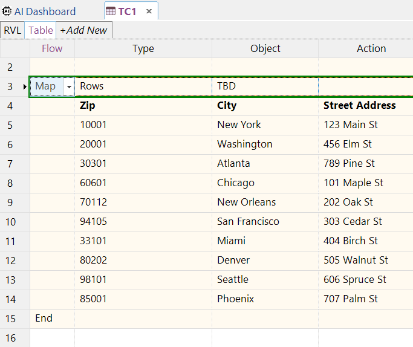{width="546px"}
    === "Transcribe"
        | Flow | Type    | Object        | Action             | ParamName | ParamType | ParamValue |
        | ---- | ------- | ------------- | ------------------ | --------- | --------- | ---------- |
        | Map  | Rows    | TBD           |                    |           |           |            |
        |      | **Zip** | **City**      | **Street Address** |           |           |            |
        |      | 10001   | New York      | 123 Main St        |           |           |            |
        |      | 20001   | Washington    | 456 Elm St         |           |           |            |
        |      | 30301   | Atlanta       | 789 Pine St        |           |           |            |
        |      | 60601   | Chicago       | 101 Maple St       |           |           |            |
        |      | 70112   | New Orleans   | 202 Oak St         |           |           |            |
        |      | 94105   | San Francisco | 303 Cedar St       |           |           |            |
        |      | 33101   | Miami         | 404 Birch St       |           |           |            |
        |      | 80202   | Denver        | 505 Walnut St      |           |           |            |
        |      | 98101   | Seattle       | 606 Spruce St      |           |           |            |
        |      | 85001   | Phoenix       | 707 Palm St        |           |           |            |
        | End  |         |               |                    |           |           |            |

#### Generate More Rows

Use this to generate additional data for an existing table.

1. Select a row in the current RVL table.

    === "Screenshot"
        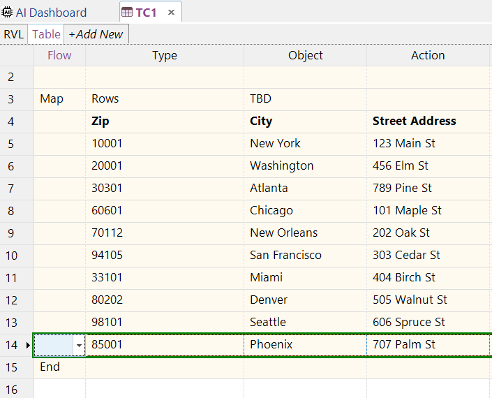{width="564px"}
    === "Transcribe"
        | Flow | Type    | Object        | Action             | ParamName | ParamType | ParamValue |
        | ---- | ------- | ------------- | ------------------ | --------- | --------- | ---------- |
        | Map  | Rows    | TBD           |                    |           |           |            |
        |      | **Zip** | **City**      | **Street Address** |           |           |            |
        |      | 10001   | New York      | 123 Main St        |           |           |            |
        |      | 20001   | Washington    | 456 Elm St         |           |           |            |
        |      | 30301   | Atlanta       | 789 Pine St        |           |           |            |
        |      | 60601   | Chicago       | 101 Maple St       |           |           |            |
        |      | 70112   | New Orleans   | 202 Oak St         |           |           |            |
        |      | 94105   | San Francisco | 303 Cedar St       |           |           |            |
        |      | 33101   | Miami         | 404 Birch St       |           |           |            |
        |      | 80202   | Denver        | 505 Walnut St      |           |           |            |
        |      | 98101   | Seattle       | 606 Spruce St      |           |           |            |
        |      | 85001   | Phoenix       | 707 Palm St        |           |           |            |
        | End  |         |               |                    |           |           |            |

2. In the AI Dashboard, create a "Generate More Rows" chat and send a prompt to the AI. For example: `Generate 10 more records with cities from countries other than USA`.

    === "Screenshot"
        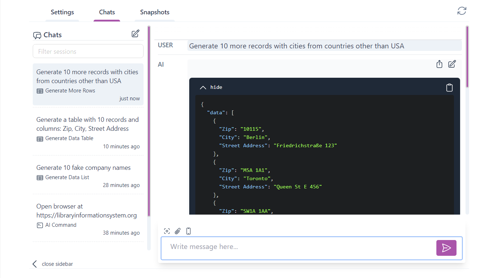{width="1101px"}
    === "Transcribe"
        **USER**: Generate 10 more records with cities from countries other than USA

        **AI**: 
        ```json
        {  
        "data": [  
            {  
            "Zip": "10115",  
            "City": "Berlin",  
            "Street Address": "Friedrichstraße 123"  
            },  
            {  
            "Zip": "M5A 1A1",  
            "City": "Toronto",  
            "Street Address": "Queen St E 456"  
            },  
            {  
            "Zip": "SW1A 1AA",  
            "City": "London",  
            "Street Address": "Buckingham Palace Road 1"  
            },  
            {  
            "Zip": "1000",  
            "City": "Brussels",  
            "Street Address": "Rue de la Loi 10"  
            },  
            {  
            "Zip": "1010",  
            "City": "Vienna",  
            "Street Address": "Karntnerring 5"  
            },  
            {  
            "Zip": "1100",  
            "City": "Athens",  
            "Street Address": "Syntagma Square 2"  
            },  
            {  
            "Zip": "75001",  
            "City": "Paris",  
            "Street Address": "Rue de Rivoli 20"  
            },  
            {  
            "Zip": "2000",  
            "City": "Copenhagen",  
            "Street Address": "Købmagergade 30"  
            },  
            {  
            "Zip": "1010",  
            "City": "Amsterdam",  
            "Street Address": "Damstraat 1"  
            },  
            {  
            "Zip": "1010",  
            "City": "Madrid",  
            "Street Address": "Gran Vía 45"  
            }  
        ]  
        }  
        ```    

3. Apply the generated values to see the result.

    === "Screenshot"
        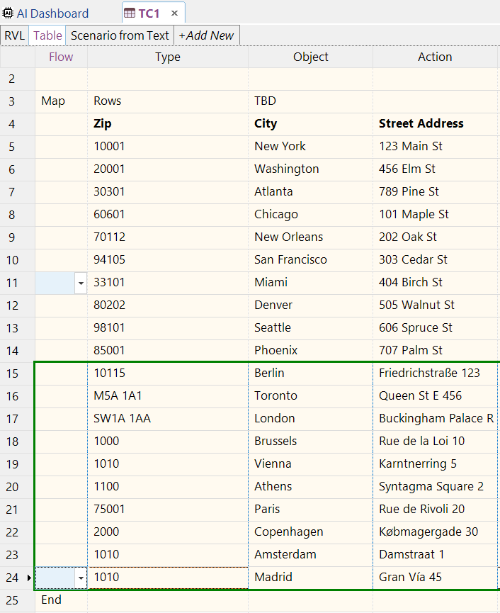{width="565px"}
    === "Transcribe"
        | Flow | Type     | Object        | Action              | ParamName | ParamType | ParamValue |
        | ---- | -------- | ------------- | ------------------- | --------- | --------- | ---------- |
        | Map  | Rows     | TBD           |                     |           |           |            |
        |      | **Zip**  | **City**      | **Street Address**  |           |           |            |
        |      | 10001    | New York      | 123 Main St         |           |           |            |
        |      | 20001    | Washington    | 456 Elm St          |           |           |            |
        |      | 30301    | Atlanta       | 789 Pine St         |           |           |            |
        |      | 60601    | Chicago       | 101 Maple St        |           |           |            |
        |      | 70112    | New Orleans   | 202 Oak St          |           |           |            |
        |      | 94105    | San Francisco | 303 Cedar St        |           |           |            |
        |      | 33101    | Miami         | 404 Birch St        |           |           |            |
        |      | 80202    | Denver        | 505 Walnut St       |           |           |            |
        |      | 98101    | Seattle       | 606 Spruce St       |           |           |            |
        |      | 85001    | Phoenix       | 707 Palm St         |           |           |            |
        |      | 10115    | Berlin        | Friedrichstraße 123 |           |           |            |
        |      | M5A 1A1  | Toronto       | Queen St E 456      |           |           |            |
        |      | SW1A 1AA | London        | Buckingham Palace R |           |           |            |
        |      | 1000     | Brussels      | Rue de la Loi 10    |           |           |            |
        |      | 1010     | Vienna        | Karntnerring 5      |           |           |            |
        |      | 1100     | Athens        | Syntagma Square 2   |           |           |            |
        |      | 75001    | Paris         | Rue de Rivoli 20    |           |           |            |
        |      | 2000     | Copenhagen    | Købmagergade 30     |           |           |            |
        |      | 1010     | Amsterdam     | Damstraat 1         |           |           |            |
        |      | 1010     | Madrid        | Gran Vía 45         |           |           |            |
        | End  |          |               |                     |           |           |            |

#### Test Scenario from Text

Generates a sequence of AI Commands based on a text prompt.

1. Provide a high-level description of the scenario you want to implement. For example: `Generate an end-to-end scenario to create and delete a book in a web based Library Information System`. A step-by-step scenario will be generated.

    === "Screenshot"
        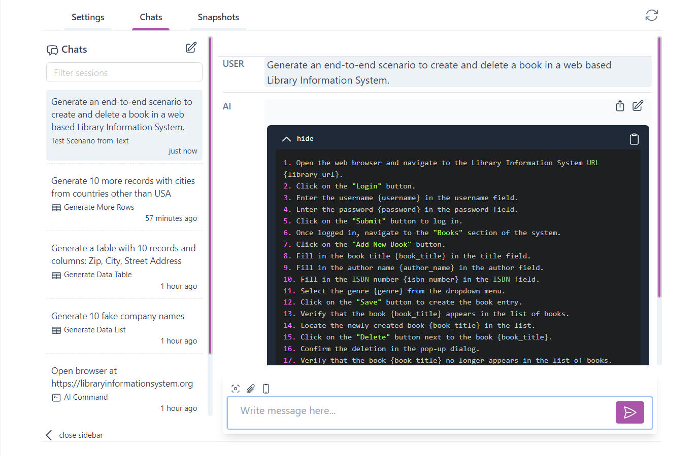{width="1102px"}
    === "Transcribe"
        **USER**: Generate an end-to-end scenario to create and delete a book in a web based Library Information System  

        **AI**:
        ```markdown
        1. Open the web browser and navigate to the Library Information System URL {library_url}.  
        2. Click on the "Login" button.  
        3. Enter the username {username} in the username field.  
        4. Enter the password {password} in the password field.  
        5. Click on the "Submit" button to log in.  
        6. Once logged in, navigate to the "Books" section of the system.  
        7. Click on the "Add New Book" button.  
        8. Fill in the book title {book_title} in the title field.  
        9. Fill in the author name {author_name} in the author field.  
        10. Fill in the ISBN number {isbn_number} in the ISBN field.  
        11. Select the genre {genre} from the dropdown menu.  
        12. Click on the "Save" button to create the book entry.  
        13. Verify that the book {book_title} appears in the list of books.  
        14. Locate the newly created book {book_title} in the list.  
        15. Click on the "Delete" button next to the book {book_title}.  
        16. Confirm the deletion in the pop-up dialog.  
        17. Verify that the book {book_title} no longer appears in the list of books.  
        18. Log out of the Library Information System.
        ```                   

2. Select an RVL sheet for insertion, then return to the AI Dashboard and click the Apply icon. A sequence of AI commands will be inserted into the RVL sheet.

    === "Screenshot"
        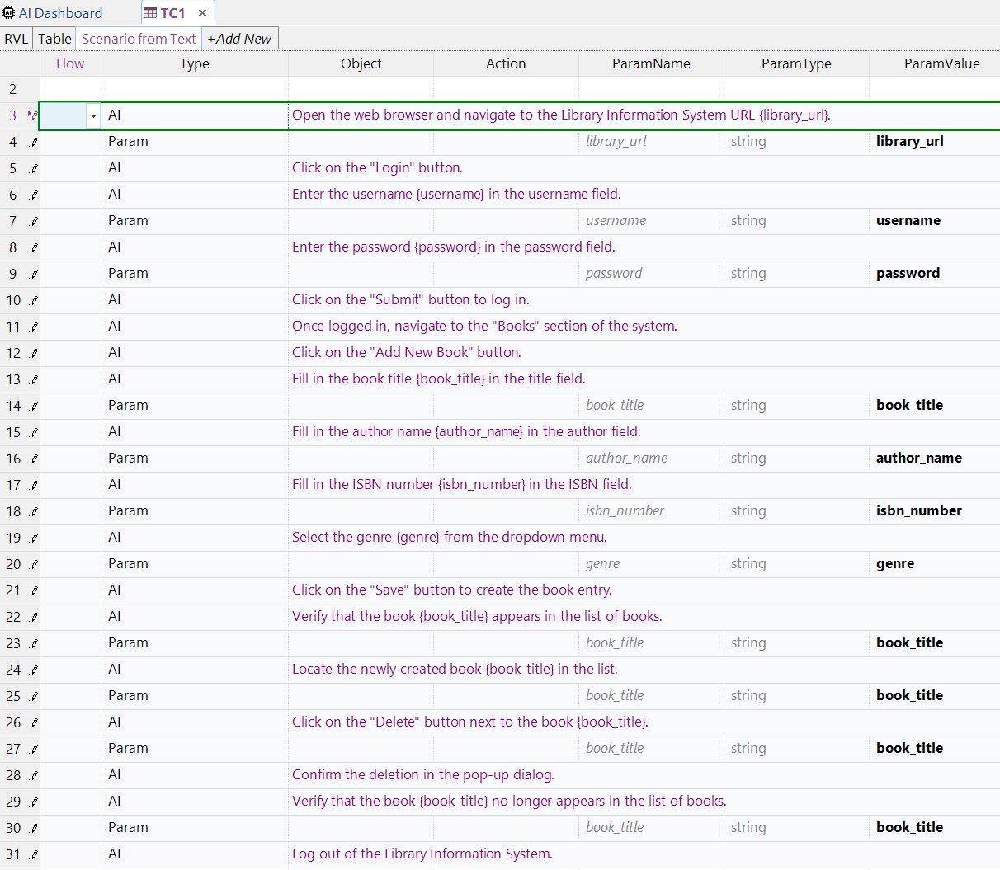{width="970px"}
    === "Transcribe"
        <table>
          <thead>
            <tr>
              <th style="min-width: 0 !important">Flow</th>
              <th>Type</th>
              <th>Object</th>
              <th>Action</th>
              <th>ParamName</th>
              <th>ParamType</th>
              <th>ParamValue</th>
            </tr>
          </thead>
          <tbody>
            <tr>
              <td></td>
              <td>AI</td>
              <td colspan="4">Open the web browser and navigate to the Library Information System URL</td>
              <td></td>
            </tr>
            <tr>
              <td></td>
              <td>Param</td>
              <td></td>
              <td></td>
              <td>library_url</td>
              <td>string</td>
              <td>library_url</td>
            </tr>
            <tr>
              <td></td>
              <td>AI</td>
              <td colspan="4">Click on the "Login" button.</td>
              <td></td>
            </tr>
            <tr>
              <td></td>
              <td>AI</td>
              <td colspan="4">Enter the username {username} in the username field.</td>
              <td></td>
            </tr>
            <tr>
              <td></td>
              <td>Param</td>
              <td></td>
              <td></td>
              <td>username</td>
              <td>string</td>
              <td>username</td>
            </tr>
            <tr>
              <td></td>
              <td>AI</td>
              <td colspan="4">Enter the password {password} in the password field.</td>
              <td></td>
            </tr>
            <tr>
              <td></td>
              <td>Param</td>
              <td></td>
              <td></td>
              <td>password</td>
              <td>string</td>
              <td>password</td>
            </tr>
            <tr>
              <td></td>
              <td>AI</td>
              <td colspan="4">Click on the "Submit" button to log in.</td>
              <td></td>
            </tr>
            <tr>
              <td></td>
              <td>AI</td>
              <td colspan="4">Once logged in, navigate to the "Books" section of the system.</td>
              <td></td>
            </tr>
            <tr>
              <td></td>
              <td>AI</td>
              <td colspan="4">Click on the "Add New Book" button.</td>
              <td></td>
            </tr>
            <tr>
              <td></td>
              <td>AI</td>
              <td colspan="4">Fill in the book title {book_title} in the title field.</td>
              <td></td>
            </tr>
            <tr>
              <td></td>
              <td>Param</td>
              <td></td>
              <td></td>
              <td>book_title</td>
              <td>string</td>
              <td>book_title</td>
            </tr>
            <tr>
              <td></td>
              <td>AI</td>
              <td colspan="4">Fill in the author name {author_name} in the author field.</td>
              <td></td>
            </tr>
            <tr>
              <td></td>
              <td>Param</td>
              <td></td>
              <td></td>
              <td>author_name</td>
              <td>string</td>
              <td>author_name</td>
            </tr>
            <tr>
              <td></td>
              <td>AI</td>
              <td colspan="4">Fill in the ISBN number {isbn_number} in the ISBN field.</td>
              <td></td>
            </tr>
            <tr>
              <td></td>
              <td>Param</td>
              <td></td>
              <td></td>
              <td>isbn_number</td>
              <td>string</td>
              <td>isbn_number</td>
            </tr>
            <tr>
              <td></td>
              <td>AI</td>
              <td colspan="4">Select the genre {genre} from the dropdown menu.</td>
              <td></td>
            </tr>
            <tr>
              <td></td>
              <td>Param</td>
              <td></td>
              <td></td>
              <td>genre</td>
              <td>string</td>
              <td>genre</td>
            </tr>
            <tr>
              <td></td>
              <td>AI</td>
              <td colspan="4">Click on the "Save" button to create the book entry.</td>
              <td></td>
            </tr>
            <tr>
              <td></td>
              <td>AI</td>
              <td colspan="4">Verify that the book {book_title} appears in the list of books.</td>
              <td></td>
            </tr>
            <tr>
              <td></td>
              <td>Param</td>
              <td></td>
              <td></td>
              <td>book_title</td>
              <td>string</td>
              <td>book_title</td>
            </tr>
            <tr>
              <td></td>
              <td>AI</td>
              <td colspan="4">Locate the newly created book {book_title} in the list.</td>
              <td></td>
            </tr>
            <tr>
              <td></td>
              <td>Param</td>
              <td></td>
              <td></td>
              <td>book_title</td>
              <td>string</td>
              <td>book_title</td>
            </tr>
            <tr>
              <td></td>
              <td>AI</td>
              <td colspan="4">Click on the "Delete" button next to the book {book_title}.</td>
              <td></td>
            </tr>
            <tr>
              <td></td>
              <td>Param</td>
              <td></td>
              <td></td>
              <td>book_title</td>
              <td>string</td>
              <td>book_title</td>
            </tr>
            <tr>
              <td></td>
              <td>AI</td>
              <td colspan="4">Confirm the deletion in the pop-up dialog.</td>
              <td></td>
            </tr>
            <tr>
              <td></td>
              <td>AI</td>
              <td colspan="4">Verify that the book {book_title} no longer appears in the list of books.</td>
              <td></td>
            </tr>
            <tr>
              <td></td>
              <td>Param</td>
              <td></td>
              <td></td>
              <td>book_title</td>
              <td>string</td>
              <td>book_title</td>
            </tr>
            <tr>
              <td></td>
              <td>AI</td>
              <td colspan="4">Log out of the Library Information System.</td>
              <td></td>
            </tr>
          </tbody>
        </table>

#### Test Scenario from Image

Generates a sequence of AI Commands from an image and a text prompt.

1. In the AUT, navigate to the screen/page you want to use.

    === "Screenshot"
        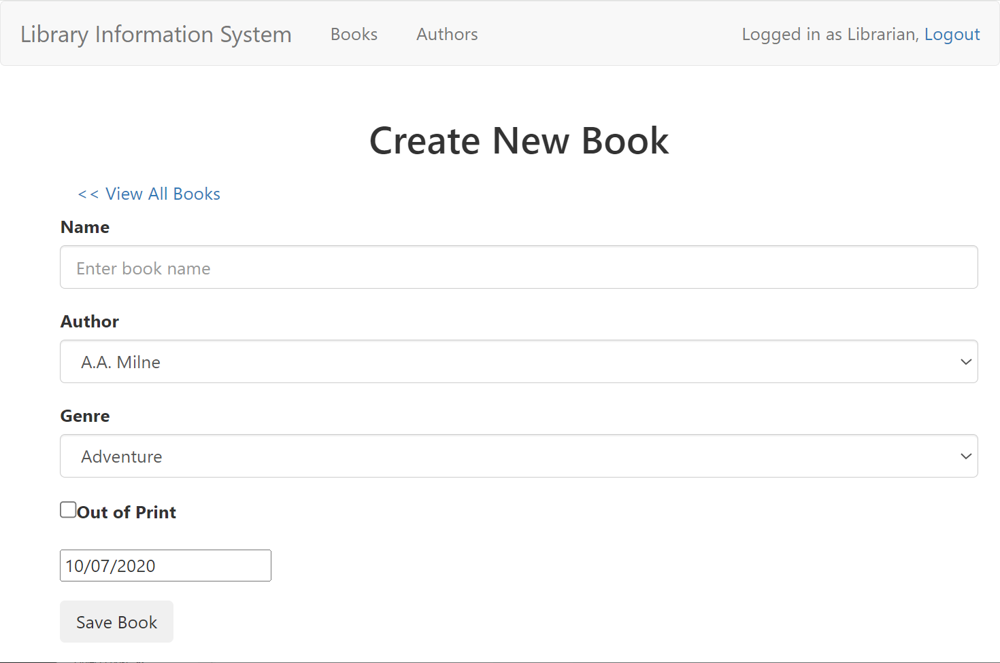{width="600px"}
    === "Transcribe"
        **Library Information System**  
        Logged in as Librarian, **Logout**

        ---

        **Create New Book**

        **Name**  
        _Enter book name_ (text input)

        **Author**  
        _A.A. Milne_ (dropdown selection)

        **Genre**  
        _Adventure_ (dropdown selection)

        **Out of Print**  
        [ ] (checkbox)

        _10/07/2020_ (date picker)

        [Save Book] (button)
  

2. In the AI Dashboard, create a "Test Scenario from Image" chat and provide the image along with a text prompt. For example: `Fill the form`.

    === "Screenshot"
        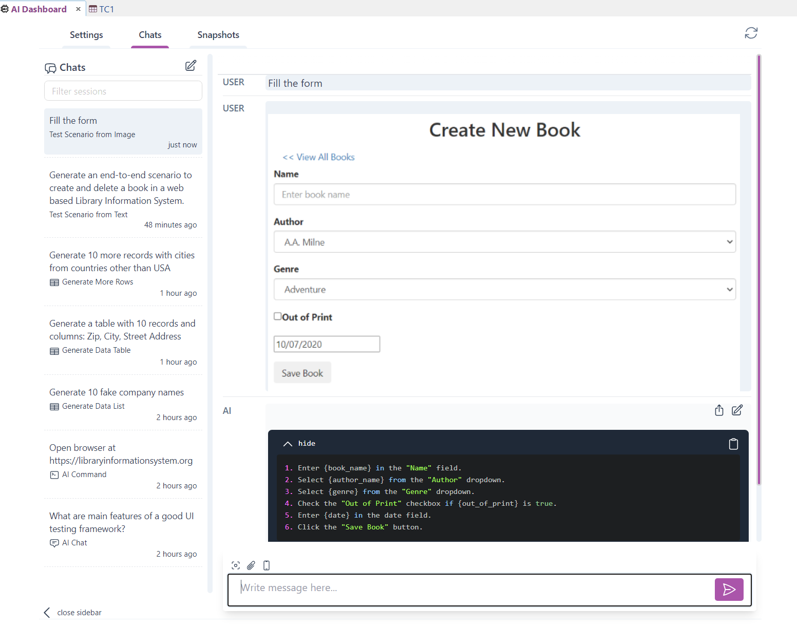{width="1242px"}
    === "Transcribe"
        **USER**: Fill the form (screenshot of the form is attached)

        **AI**:
        ```markdown  
        1. Enter {book_name} in the "Name" field.  
        2. Select {author_name} from the "Author" dropdown.  
        3. Select {genre} from the "Genre" dropdown.  
        4. Check the "Out of Print" checkbox if {out_of_print} is true.  
        5. Enter {date} in the date field.  
        6. Click the "Save Book" button. 
        ``` 

3. Select an RVL sheet for insertion, then return to the AI Dashboard and click the Apply icon. A sequence of AI commands will be inserted into the RVL sheet.

    === "Screenshot"
        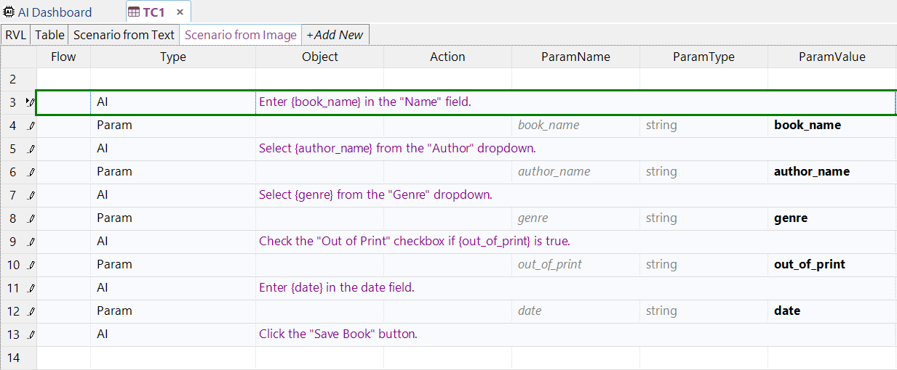{width="986px"}
    === "Transcribe"
        <table>
          <tr>
            <th style="min-width: 0 !important">Flow</th>
            <th>Type</th>
            <th>Object</th>
            <th>Action</th>
            <th>ParamName</th>
            <th>ParamType</th>
            <th>ParamValue</th>
          </tr>
          <tr>
            <td></td>
            <td>AI</td>
            <td colspan="4">Enter {book_name} in the "Name" field.</td>
            <td></td>
          </tr>
          <tr>
            <td></td>
            <td>Param</td>
            <td></td>
            <td></td>
            <td>book_name</td>
            <td>string</td>
            <td>book_name</td>
          </tr>
          <tr>
            <td></td>
            <td>AI</td>
            <td colspan="4">Select {author_name} from the "Author" dropdown.</td>
            <td></td>
          </tr>
          <tr>
            <td></td>
            <td>Param</td>
            <td></td>
            <td></td>
            <td>author_name</td>
            <td>string</td>
            <td>author_name</td>
          </tr>
          <tr>
            <td></td>
            <td>AI</td>
            <td colspan="4">Select {genre} from the "Genre" dropdown.</td>
            <td></td>
          </tr>
          <tr>
            <td></td>
            <td>Param</td>
            <td></td>
            <td></td>
            <td>genre</td>
            <td>string</td>
            <td>genre</td>
          </tr>
          <tr>
            <td></td>
            <td>AI</td>
            <td colspan="4">Check the "Out of Print" checkbox if {out_of_print} is true.</td>
            <td></td>
          </tr>
          <tr>
            <td></td>
            <td>Param</td>
            <td></td>
            <td></td>
            <td>out_of_print</td>
            <td>string</td>
            <td>out_of_print</td>
          </tr>
          <tr>
            <td></td>
            <td>AI</td>
            <td colspan="4">Enter {date} in the date field.</td>
            <td></td>
          </tr>
          <tr>
            <td></td>
            <td>Param</td>
            <td></td>
            <td></td>
            <td>date</td>
            <td>string</td>
            <td>date</td>
          </tr>
          <tr>
            <td></td>
            <td>AI</td>
            <td colspan="4">Click the "Save Book" button.</td>
            <td></td>
          </tr>
        </table>


### Snapshots

On this page, find starred chats. To add a chat to Snapshots, locate it in history, and hover your mouse pointer over its top-right corner to reveal the `...` icon:

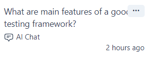{width="249px"}

Click the icon to expand the popup menu and select `Snapshot`.

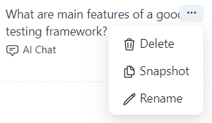{width="246px"}

If you no longer need a chat on the Snapshots page, you can remove it.

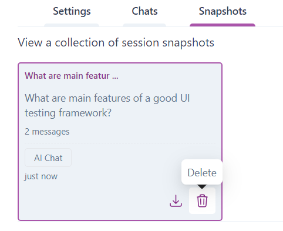{width="386px"}

## AI Panel

AI panel is used to work with [AI Commands](../RVL/AI.md). 

### How to Open

To open the panel, double-click the line number of an AI Command or click the `Show AI Panel` button that appears when you hover your mouse over the corresponding cell.

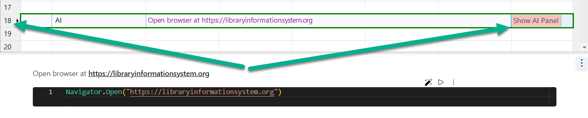{width="1133px"}

It’s also possible to work with multiple AI Commands simultaneously. Simply select a range of commands and click `Show AI Panel`.

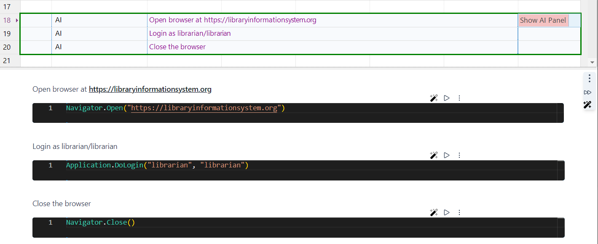{width="1135px"}

There is also a toolbar button that shows all AI Commands on the active RVL sheet.

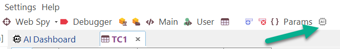{width="530px"}

### Command Menu

You can perform various actions with each command.

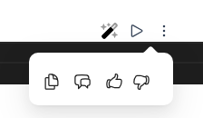{width="179px"}

- :fontawesome-inflectra-generate: - generate or regenerate code for the command.
- <span class="nocolor">:heroicons-outline-play:</span> - run the code for this command.
- <span class="nocolor">:heroicons-outline-document-duplicate:</span> - copy the command ID to the clipboard.
- <span class="nocolor">:heroicons-outline-chat-bubble-left-right:</span> - open the corresponding chat session in the AI Dashboard.
- <span class="nocolor">:heroicons-outline-hand-thumb-up:</span> - like the result of code generation. This will be used as a [positive example](../RVL/AI.md#tuning-with-positive-and-negative-examples) in subsequent AI Command prompts.
- <span class="nocolor">:heroicons-outline-hand-thumb-down:</span> - dislike the result of code generation. This will be used as a [negative example](../RVL/AI.md#tuning-with-positive-and-negative-examples) in subsequent AI Command prompts.

### Panel Menu

The panel also includes a top-level menu.

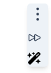{width="58px"}
{width="128px"}

- :fontawesome-inflectra-generateall: - generate or regenerate code for all the commands opened in the AI Panel.
- <span class="nocolor">:heroicons-outline-forward:</span> - run all the commands opened in the AI Panel sequentially.
- <span class="nocolor">:heroicons-outline-window:</span> - undock the panel.
- <span class="nocolor">:heroicons-outline-arrow-right:</span> - dock the panel to the right.
- <span class="nocolor">:heroicons-outline-arrow-down:</span> - dock the panel to the bottom.
- <span class="nocolor">:heroicons-outline-eye-slash:</span> - hide the panel.
- <span class="nocolor">:heroicons-outline-arrow-uturn-up:</span> - open the Workflow selection page.

## Framework Folders

When you work with AI in Rapise, it creates a set of folders in the root framework directory.

- Root Framework Folder
    - **AI** - root folder for AI-related files.
        - **commands** - cache for AI Commands, containing generated JavaScript code. This folder must be stored along with the framework; do not delete it. **[Deprecated]**
        - **messages** - archive of AI chat messages.
        - **sessions** - high-level information about AI chat sessions (name, ID, timestamp).
        - **options.json** - local [options](#settings) that override the global ones stored in `C:\ProgramData\Inflectra\Rapise\AI\options.json`. 
        - **screenshot.base64** - last screenshot taken in [Chats](#chats).
        - **AIExamples.txt** - the list of liked/disliked [examples](../RVL/AI.md#tuning-with-positive-and-negative-examples) of generated code.
        - **AIPrompt.txt** - [text to add to each AI prompt](../RVL/AI.md#shared-instructions) for AI Command processing.
        - **ai.commands.json** - Since Rapise 8.3 command cache is split per Test Case/Page Object folders. For each RVL file that contains AI commands an `ai.commands.json` is created in the same folder as the RVL file.

### Source Control

When you put a framework under source control it is important to add 

  - `options.json`
  - `AIExamples.txt`
  - `AIPrompt.txt`
  - `commands` folder with all the files in it. **[Deprecated]**
  - `ai.commands.json` files  

The following folders are optional (this is just an archive of AI chats)

  - `messages`
  - `sessions`
  

### Rapise 8.3 AI Command Cache Changes

If you have AI tests created with Rapise 8.2, all code generated for AI commands will be still successfully loaded from `AI\commands` folder. If you will regenerate code for a command or generate code for a new command, it will be placed into corresponding `ai.commands.json` file located in the same folder as the RVL file.
