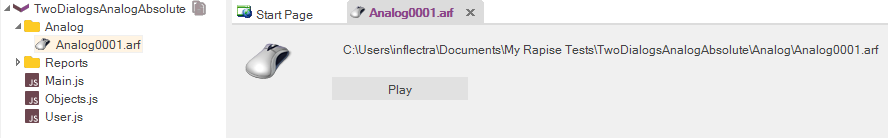
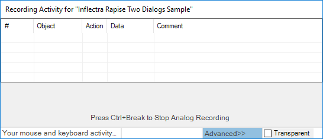

# Analog Recording

## Concept

Sometimes you have to automate the testing of an application that contains some controls or elements that are not standard objects that can be recognized by Rapise. For example you may have a drawing canvas inside an application that allows you to annotate a diagram. You can use the standard Rapise libraries for the rest of the controls but the actual drawing events cannot be captured that way. Analog recording is available to ‘fill in the gaps’ in such scenarios.

During **Analog Recording**, Rapise records mouse movements, keyboard inputs, and clicks and stores them in a special .ARF (Analog Recording File) format file:

There are two types of Analog Recording: **Absolute** and **Relative**.

- [**Absolute**](absolute_analog_learning.md): Mouse coordinates are recorded relative to the top left corner of the screen.
- [**Relative**](relative_analog_learning.md):  Mouse coordinates are recorded relative to the top left corner of the object beneath the mouse cursor.
  
## Usage

When you are [recording your test](recording_activity_dialog.md) using the application you may come to a point where there are user actions that you need to record that don’t have any identifiable objects (for example drawing a signature). You can click on the ‘Analog’ button on the recorder to engage Analog mode:

Now when you use the mouse and keyboard to test the application, Rapise is storing the coordinates of your mouse clicks and keyboard events and storing them in a separate .ARF file that is part of your test project.

Once completed, the entire analog section is included as one step within the complete test script so you can include an analog sequence within a test script that contains other non-analog events. This lets you have the robustness of true object-based recording for 95% of your test and analog when you need it for the remaining 5%. This is the best of both worlds.

## See Also

- [Recording Activity Dialog](recording_activity_dialog.md)
