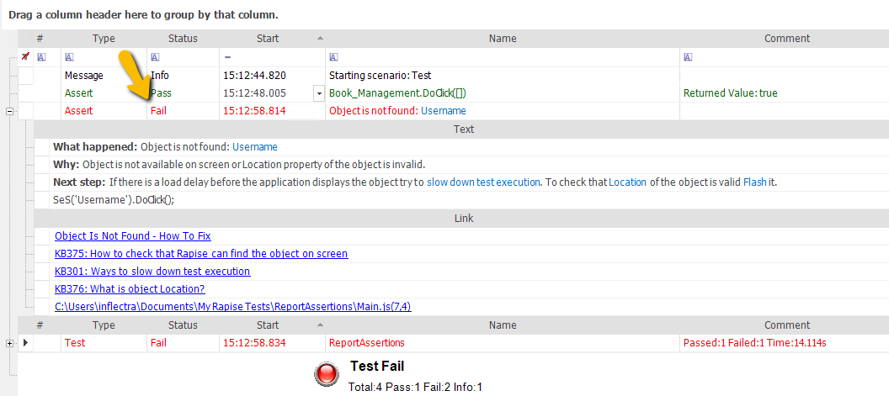
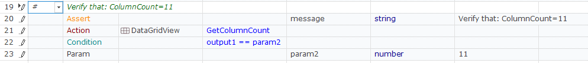

# Assertions

## Purpose

An **assert statement** is a special Boolean condition that represents an assumption about program state at a particular point in test execution. When an assertion is encountered, the condition is evaluated. A value of **False** indicates a program error. In some languages, execution will halt if an assertion evaluates to **False**. In Rapise, the result is logged to the report with failed status, and execution continues or stops depending on the `StopOnError` test option.

There are explicit and implicit assertions (or checkpoints) generated during the script execution and reflected in the report. Each report line is produced by one of the following statements:

*   RVL [Action](../RVL/Actions.md) - includes an implicit assertion as a side effect. Success indicates successful action execution.
    

*   JavaScript [Action](actions.md) - includes an implicit assertion as a side effect. Success indicates successful action execution.
    

*   RVL [Assertion](../RVL/Assertions.md) - explicit comparison (checkpoint)
    

*   Code [Assertion](../Libraries/Tester.md#assert) - explicit comparison (checkpoint)
    

*   Execution Error
    

*   Image Comparison (Checkpoint)
    

## Soft Assertions

By default, an assertion statement stops test execution immediately (unless [StopOnError](settings_dialog.md#execution) is explicitly set to `false`). Sometimes, it is preferable to have more fine-grained control over test execution, allowing it to continue or stop.

This is where *soft* assertions come into play. Soft assertions offer two key features:

1.  If a failure occurs, it is merely reported, and execution does not stop.

2.  It is possible to stop execution based on the results of previous *soft* assertions by calling [Tester.SoftAssertAll](../Libraries/Tester.md#softassertall).

Every `Assert*` method defined for the [Tester](../Libraries/Tester.md) has a corresponding `SoftAssert*` counterpart (e.g., `Tester.AssertEquals` and `Tester.SoftAssertEquals`).

## Create a Checkpoint

To create a [checkpoint](checkpoints.md) using an assertion, you must manually alter the test script (another way is to use the [Verify Object Properties](verify_object_properties.md) dialog during [Recording](recording.md)):

1.  **Select a location** in your script.
2.  **Query for the application state**. For object properties, use `Get<...>` methods. For example:

```javascript
    var xx = SeS("OkButton").GetX(); // X position of the object
    var image = SeS('Customer').GetBitmap(); // Image of the object
```

3.  **Save the state (optional)**. If you are creating an image checkpoint, you might want to save the image to a file.

4.  **Compare**. Use the **ImageWrapper** class to compare images.

5.  **Write an Assert Statement**. Make an appropriate call to one of the `Tester.Assert` methods. In addition to a Boolean condition, pass any additional data to be included in the [Report](writing_to_the_report.md). Read about [Tester.Assert syntax](../Libraries/Tester.md#assert) in the Libraries documentation.

## Example: Simple Property Checkpoint

**JavaScript**

```javascript
Tester.AssertEqual("Verify that: ColumnCount=11", SeS('DataGridView').GetColumnCount(), 11);
```

**RVL**



**Failure Representation in Report**


## Example: Bitmap Checkpoint

**JavaScript**

```javascript
Tester.AssertImage("Compare Customer bitmap to Images\\Checkpoint0001.png",
	SeS('Customer').GetBitmap(), Global.GetFullPath("Images\\Checkpoint0001.png"));
```

**RVL**


**Failure Representation in Report**


## See Also

-   [KB330](https://www.inflectra.com/Support/KnowledgeBase/KB330.aspx) Compare two Spreadsheets in Rapise
-   The [test samples](sample_tests.md) include a **UsingImageCheckpoint** test
-   [Verifying Object Properties](verify_object_properties.md)
-   [Writing to the Report](writing_to_the_report.md)