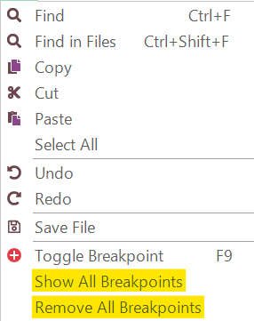

# Breakpoints

## Purpose

**Breakpoints** pause test execution at a specific line in the script. They allow you to investigate the program's state and trace execution flow.

## Usage

To set a **Breakpoint**:

1.  Open the script you want to debug in the [Source Editor](source_editor.md).
2.  Place your cursor on the desired line.
3.  Press **F9** or click the gray strip to the left of the line numbers.
    

## Viewing and Removing Breakpoints

To view all breakpoints, in the [Source Editor](source_editor.md), choose `Edit > Show All Breakpoints`.

To remove all breakpoints, choose `Edit > Remove All Breakpoints`.

## See Also

-   [Internal Debugger](internal_debugger.md)
-   [Debugger Toolbar](menu_and_toolbars.md)
-   [Execution Control](control_execution.md)