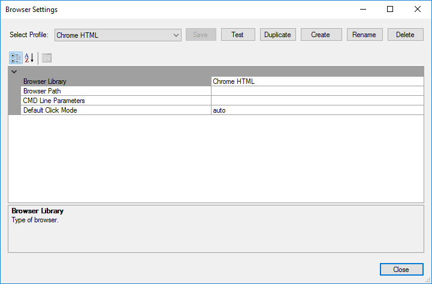

# Browser Settings Dialog

## Web Browser Profile

!!! important
    Since Rapise 7.3, it is recommended to use [Selenium WebDriver](selenium_webdriver.md)-based profiles for all web tests. Web browser profiles are considered outdated and should only be used for legacy tests and backward compatibility.

Use the Browser Settings Dialog to configure `Web Browser Profiles`. A browser profile specifies:

- the type of browser (**IE**, **Chrome**, **Firefox**),
- browser launch parameters,
- and other profile options.
  
Rapise uses the currently [active browser profile](cross_browser_testing.md) for recording and playback.

!!! note
    You may want to create additional browser profiles if you have several different versions of a web browser on the same machine (e.g., Firefox Latest vs. Firefox ESR, or different versions of Chrome portable) or if you want to run a browser with different command-line options (e.g., Chrome normal, Chrome incognito mode, Chrome with a specific screen size).

The Browser Settings Dialog box displays the list of native (not using [Selenium](selenium_settings_dialog.md)) web browsers that have been configured for use by Rapise. It also lets you create a new browser profile, modify an existing profile, or create a new profile based on an existing one.

## How to Open

You can open this dialog box using the main menu (`Settings > Browser`) or by pressing the `...` button in the top-right corner of the Rapise window.

## Toolbar Controls

This dialog box has the following toolbar controls:

-   **Select Profile** - This dropdown list allows you to select a different web browser profile to be displayed in the dialog.
-   **Test** - This button tests the connection from Rapise to the specified browser.
-   **Duplicate** - This button creates a new browser profile based on the currently viewed one.
-   **Create** - This button creates a new, empty browser profile that you can edit.
-   **Rename** - This button changes the name of the current browser profile being edited.
-   **Delete** - This button deletes the currently displayed browser profile. There is no undo, so exercise caution!

## Profile Options

This section has various settings, each of which is described below:

-   **Browser Library** - The type of browser being used. Currently, this can be:
    -   Internet Explorer HTML
    -   Chrome HTML
    -   Firefox HTML
-   **Browser Path** - The path to the web browser executable (e.g., `chrome.exe`, `iexplore.exe`, `firefox.exe`) on the computer.
-   **CMD Line Parameters** - Any command-line parameters to pass to the web browser (e.g., `-extoff` for IE safe mode).
-   **Default Click Mode** - Specifies the default 'click mode' for tests using this web browser profile.
    -   auto - Tries to locate an element on the screen, moves the mouse over it, and then sends the appropriate DOM 'click' event (the default).
    -   event - Sends the DOM click event to the element with no prior mouse movement.
    -   click - Simulates an actual click on the element rather than sending a DOM click event.

## Local Browser Profiles

Rapise version 6.3+ enables the creation of profiles local to a test. It allows storing profiles together with tests (inside a SpiraTest or Git repository) and eliminates the need to configure profiles manually on each execution host.

To create a local profile, simply click `Duplicate` for one of the global profiles and select the `Local` checkbox before clicking `OK`. Global and local profiles may have the same name; in this case, the local profile is used for execution.

If a test contains local browser profiles, they can be seen in the dropdowns.

Local profiles are stored inside the `<Test Root>\Profiles\BrowserProfiles` and `<Test Root>\Profiles\SeleniumProfiles` folders.