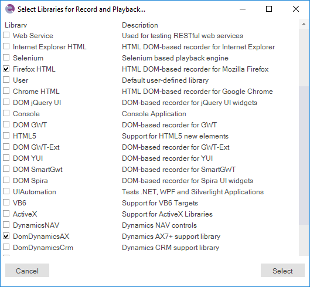

# Change the Libraries Being Used

Sometimes you are recording a test using a [library](recording_library.md) (e.g. Firefox HTML) and you realize that you need to add additional libraries to the test to make the recording more efficient.

For example, you are recording using the Firefox web browser and you need to include the [Microsoft Dynamics 365](dynamics_365.md) libraries so that you can more easily record actions in Dynamics 365 while using Firefox. The additional library will allow Rapise to recognize the grids and treeviews as Dynamics objects rather than just standard HTML tables or DIVs.

## How to Change the Libraries

To change the recording library being used select `Tools > Libraries` in the main application menu.

That will bring up the [Recording selection dialog box](select_an_application_to_record_dialog.md):

Now you can check the boxes of the additional libraries you want to use (or remove any existing ones that you no longer need).

## Keyboard Shortcuts

In addition, there are a couple of shortcuts that you may want to use:

- **Record** - clicking Record on its own will start Rapise recording using the current selected libraries (this is the default action)
- **Shift+Record** - This brings up the library selector (shown above), and is equivalent to clicking the `Tools > Libraries` in the menu before starting recording.
- **CTRL+Record** - This brings up the application selector (see below) and lets you change the application and library being recorded:
  
    

## See Also

- [How-Tos](howtos.md)