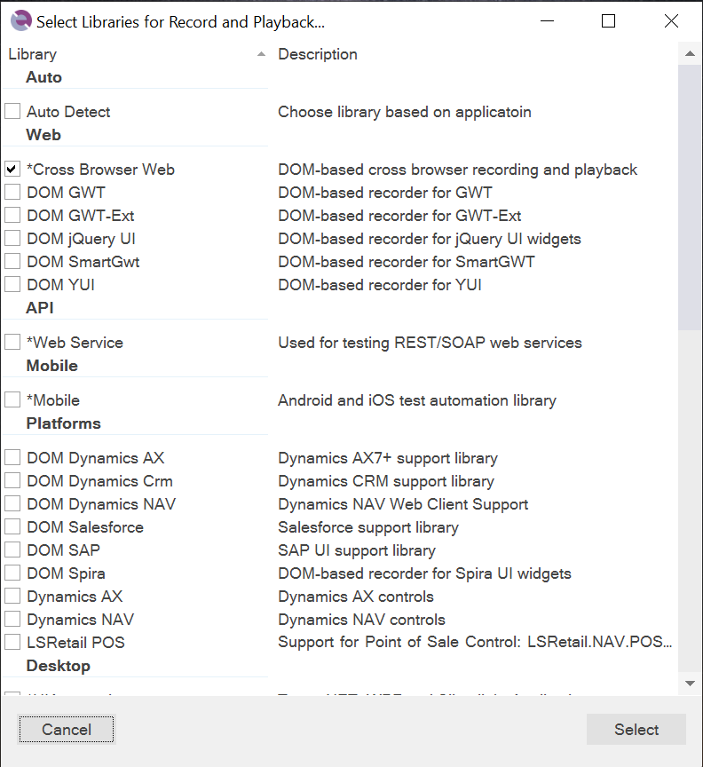

# Change the Libraries Being Used

Sometimes, while recording a test using a [library](recording_library.md) (e.g., **Cross Browser Web**), you might realize you need to add additional libraries to make the recording more efficient.

For example, you might be recording using a web browser and need to include the [Microsoft Dynamics 365](dynamics_365.md) libraries to more easily record actions in Dynamics 365. These additional libraries will allow Rapise to recognize grids and treeviews as Dynamics objects, rather than just standard HTML tables or DIVs.

## How to Change the Libraries

To change the recording library used, select `Tools > Libraries` from the main application menu.

This brings up the **Select Libraries for Record and Playback** dialog:

Now you can check the boxes for the additional libraries you want to use (or remove any existing ones you no longer need).

## Keyboard Shortcuts

In addition, there are a couple of shortcuts you may find useful:

*   **Record** - Simply clicking **Record** will start Rapise recording using the currently selected libraries (this is the default action).
*   ++shift++ + **Record** - This shortcut brings up the library selector (shown above) and is equivalent to selecting `Tools > Libraries` from the menu before starting recording.
*   ++ctrl++ + **Record** - This shortcut brings up the application selector (see below) and lets you change the application and library being recorded:
  
    

## See Also

- [How-Tos](howtos.md)