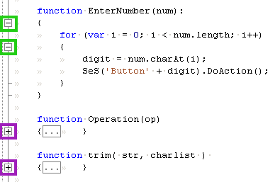

# Code Folding

## Purpose

**Code Folding** allows you to hide or show blocks of code that represent syntactically meaningful units, such as function bodies, class declarations, loops, or comments.

## Usage

Every JavaScript file opened in Rapise will display **hide** and **show** buttons to the top left of each corresponding block. In the following screenshot, hide buttons are highlighted with green boxes; show buttons are highlighted with purple boxes:

## See Also

- [Source Editor](source_editor.md)