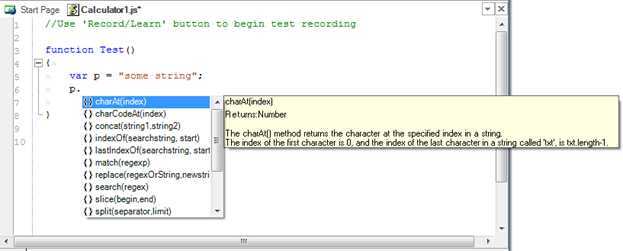
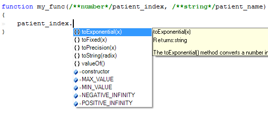

# Code Completion

## Purpose

Rapise provides **Code Completion** for class, method, and field names.

## Usage

Begin typing a class, method, or field name. Press ++ctrl+space++ to open a list of possible completions.


## Advanced

Rapise has built-in code completion logic that suggests available functions for a specific object. However, since JavaScript is fundamentally an untyped language, for code completion to work, there are some tips and tricks you can use.

Rapise scans for variable definitions when you save the `.js` source file. So, if anything goes wrong (e.g., no hints), the first thing to do is save the file.

You can define a variable as simply as:

```javascript
var p;
```

In this example, `p` is just a variable with an undefined type. It may be used as a number, string, or object. So, Rapise has no idea how to deal with it. So, if you type `p` and then a dot, no code completion window appears.

There are several ways to give Rapise a "hint" about the variable type:

## Static Assignment

First is static assignment. Suppose you specify a constant value when defining a variable:

```javascript
var p = "some string";
```

In this case, Rapise knows the type of `p`. So it will assist you when you type `p` and then a dot:



## Using Comments to Suggest the Type

In some cases, a variable's type is not clear from its definition, or its assignments are not static:

```javascript
var v1 = input;
var v2;
```

To deal with such cases, the code should be instrumented. For example, if we know that `input` is a string and `v2` will be used as a number, then we can explain it to Rapise by placing the variable type using a special comment: `/**var_type*/` right next to the variable definition. It should be placed either right between the `var` keyword and the variable name, or immediately after an assignment operation (`=`), if one exists. I.e.:

```javascript
var v1 = /**string*/ input;
var /**number*/ v2;
```

Now, Rapise will be able to display the list of available methods and properties:


Another common case is a function parameter. If you have a function defined as follows:

```javascript
function my_func(patient_index, patient_name)
{
}
```

The types of parameters `patient_index` and `patient_name` are not known, but can be explained in a similar way:

```javascript
function my_func(/**number*/ patient_index, /**string*/ patient_name)
```

This makes it known to Rapise:



Code completion for variable names is useful when you have multiple variables or function parameters, and need to type them quickly. In this case, the ++ctrl+space++ key combination brings up a list of variables and functions starting with the keyword you just typed.

## Code Completion for Objects

If you type

```javascript
SeS("<object ID>").
```

A list of available actions and properties will be suggested for the repository object with the given ID.

Since Rapise 6.4, you can also specify the type of a dynamically created object.

```javascript
var username = /**HTMLObject*/ Navigator.Find("//button[id='username']");
```

Save the edited file to allow Rapise to re-parse it. Then you can type

```javascript
username.
```

and Rapise suggests actions and properties for the [HTMLObject](/Libraries/HTMLObject/) type.

## See Also

- [Source Editor](source_editor.md)