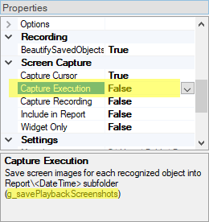

# Command Line

## Purpose

Rapise test scripts can be run from the **command line**. This is useful for integrating Rapise into CI/CD pipelines, scheduling automated test runs, or running tests without opening the Rapise IDE.

## Usage

### Using play.bat

The simplest way to run a single test directly is:

```cmd
"C:\Program Files (x86)\Inflectra\Rapise\Engine\play.bat" <path_to_sstest_file>
```

If you want to pass additional parameters as `JSON`, then:

```cmd
"C:\Program Files (x86)\Inflectra\Rapise\Engine\play.bat" <path_to_sstest_file> -config:LastConfig.json.user
```

In this case, the `LastConfig.json.user` file, stored in the framework root, contains values from the last execution by Rapise itself. It includes framework [parameter](Frameworks/parameters.md) values, such as:

```json
{
  "Browser": "Selenium - Chrome",
  "Mode": "Staging"
}
```

You may customize this `JSON` file and specify it, for example:

```cmd
"C:\Program Files (x86)\Inflectra\Rapise\Engine\play.bat" <path_to_sstest_file> -config:CustomParams.json
```

It is also possible to specify a test case folder rather than a `Test.sstest` file, for example:

```cmd
"C:\Program Files (x86)\Inflectra\Rapise\Engine\play.bat" "TestCases\Author Management\Create New Author" -config:LastConfig.json.user
```

### Using SeSExecutor.js

SeSExecutor is a more powerful command-line tool that can run individual tests, test sets defined in JSON files, or framework-level test sets. It provides detailed execution reports and supports integration with CI/CD systems through JUnit XML output.

#### Basic Syntax

```cmd
%windir%\syswow64\cscript.exe "C:\Program Files (x86)\Inflectra\Rapise\Engine\SeSExecutor.js" <path> [options]
```

Where `<path>` can be:

- Path to a `.sstest` file (runs a single test)
- Path to a `.json` test set file (runs multiple tests)
- Path to a framework folder (when using `-testset:` parameter)

#### Command Line Options

| Option | Description |
|--------|-------------|
| `-config:<path>` | Path to a JSON configuration file containing parameter values |
| `-testset:<name>` | Name of a test set defined in the framework's `Framework.json` (added in Rapise 9.1) |
| `-report:<path>` | Path for JUnit XML report output (added in Rapise 9.1) |
| `-eval:<statements>` | JavaScript statements to execute before the test (e.g., `-eval:g_verboseLevel=2`) |

#### Running a Single Test

```cmd
cscript.exe "C:\Program Files (x86)\Inflectra\Rapise\Engine\SeSExecutor.js" "C:\Tests\MyTest\Test.sstest"
```

With parameters:

```cmd
cscript.exe "C:\Program Files (x86)\Inflectra\Rapise\Engine\SeSExecutor.js" "C:\Tests\MyTest\Test.sstest" -config:params.json
```

#### Running a Test Set from JSON File

Create a test set definition file (e.g., `regression.json`):

```json
{
    "name": "Regression Tests",
    "description": "Full regression test suite",
    "verboseLevel": 1,
    "stopOnError": false,
    "_": [
        "TestCases/Login/Test.sstest",
        "TestCases/Search/Test.sstest",
        {
            "path": "TestCases/Checkout/Test.sstest",
            "params": { "PaymentMethod": "CreditCard" }
        }
    ]
}
```

Run the test set:

```cmd
cscript.exe "C:\Program Files (x86)\Inflectra\Rapise\Engine\SeSExecutor.js" "C:\Tests\regression.json"
```

#### Running a Framework Test Set

!!! note "Added in Rapise 9.1"

Run a test set defined in your framework's `Framework.json`:

```cmd
cscript.exe "C:\Program Files (x86)\Inflectra\Rapise\Engine\SeSExecutor.js" "C:\MyFramework\Framework.sstest" -testset:"Smoke Tests"
```

This reads the test set configuration from `Lib/LibFramework/Framework.json` and applies parameter values from `Lib/LibFramework/Parameters.json`.

!!! warning
    Dynamic test sets (those using filters) are not supported in command-line mode.

#### JUnit XML Report Output

!!! note "Added in Rapise 9.1"

Generate JUnit XML reports for CI/CD integration:

```cmd
cscript.exe "C:\Program Files (x86)\Inflectra\Rapise\Engine\SeSExecutor.js" "C:\Tests\regression.json" -report:results.xml
```

The JUnit XML output includes:

- Test suite name and statistics (total, failures, errors, skipped)
- Individual test case results with execution time
- Failure messages extracted from Rapise `.trp` report files
- Compatible with Jenkins, Azure DevOps, GitLab CI, and other CI/CD tools

Example output:

```xml
<?xml version="1.0" encoding="UTF-8"?>
<testsuites>
  <testsuite name="Regression Tests" tests="3" failures="1" errors="0" skipped="0" time="45.230">
    <testcase name="Login" time="12.450"/>
    <testcase name="Search" time="8.320"/>
    <testcase name="Checkout" time="24.460">
      <failure message="Assert: Payment validation failed">
        <![CDATA[Log Entry: Verify Payment
Type: Assert
Status: Fail
Expected credit card acceptance]]>
      </failure>
    </testcase>
  </testsuite>
</testsuites>
```

#### Disabling Self-Healing

!!! note "Added in Rapise 9.1"

To disable AI-powered self-healing during automated execution, set the `g_saDisableHealing` global variable:

```cmd
cscript.exe "C:\Program Files (x86)\Inflectra\Rapise\Engine\SeSExecutor.js" "C:\Tests\Test.sstest" -eval:g_saDisableHealing=true
```

Or include it in your config JSON file:

```json
{
    "g_saDisableHealing": true
}
```

This is useful when running tests in CI/CD pipelines where you want consistent behavior and don't want tests to automatically adapt to UI changes.

#### Global Variables

You can set global variables using the `-eval:` option. Global variables are prefixed with **g_**. The global variables under the **Execution** and **Recording** headings can be found by clicking on the corresponding option in the [Settings Dialog](settings_dialog.md):



Commonly used variables include:

| Variable | Description |
|----------|-------------|
| `g_verboseLevel` | Logging verbosity (0-4, default: 1) |
| `g_enablePopupMessages` | Enable/disable popup messages (default: false in SeSExecutor) |
| `g_saDisableHealing` | Disable AI self-healing (default: false) |
| `g_saForceHealing` | Force AI self-healing for all objects (default: false) |

#### Exit Codes

| Code | Meaning |
|------|---------|
| 0 | Test passed |
| 1 | Test failed |
| -1 | Execution error (e.g., test not found, configuration error) |

#### Test Set JSON Structure

A test set JSON file supports the following properties:

| Property | Type | Description |
|----------|------|-------------|
| `name` | string | Display name for the test set |
| `description` | string | Optional description |
| `verboseLevel` | number | Logging level (0-4) |
| `stopOnError` | boolean | Stop execution after first failure |
| `testCount` | number | Limit number of tests to run (-1 for all) |
| `reportFileName` | string | Custom name for the `.trp` report file |
| `globals` | object | Global variables passed to all tests |
| `config` | object/string | Configuration object or path to config file |
| `_` | array | List of test paths or test objects |

Test entries in the `_` array can be:

- Simple string paths: `"TestCases/Login/Test.sstest"`
- Objects with parameters:
  ```json
  {
      "path": "TestCases/Login/Test.sstest",
      "name": "Login Test",
      "params": { "Username": "admin" },
      "expected": "PASS",
      "comment": "Tests admin login"
  }
  ```

## See Also

* [Settings Dialog](settings_dialog.md)
* [Test Framework Parameters](Frameworks/parameters.md)
* [Web Self-Healing](web_self_healing.md)
* [KB17](http://www.inflectra.com/Support/KnowledgeBase/KB17.aspx) Running a Rapise script from the command-line on a 64-bit machine