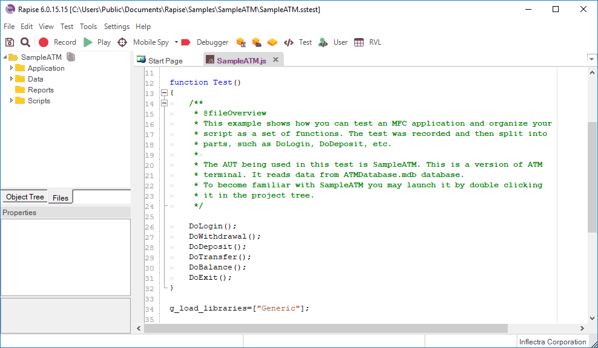

# Content View

## Purpose

This view allows you to view and edit files, including the following types:

*   [RVL](../RVL/Overview.md) (`.rvl.xlsx`) files that open in the [RVL Editor](rvl_editor.md)

*   JavaScript (`.js`) automated test script files that open in the [Source Editor](source_editor.md).

*   Report (`.trp`) files that open in the [Report Viewer](report_viewer.md).

*   Excel (`.xls`) files that can be displayed in the [Spreadsheet Editor](spreadsheet_editor.md)

*   REST (`.rest`) web service definition files that open in the [REST Editor](rest_definition_editor.md).

*   SOAP (`.soap`) web service definition files that open in the [SOAP Editor](soap_definition_editor.md).

*   Analog recording files (`.arf`) that contain mouse clicks and coordinates from [analog testing](analog_recording.md).

*   Manual test steps (`.rmt`) that open in the [Manual Test Editor](manual_test_editor.md).

## How to Open
Files opened using the [Test Files View](test_files_dialog.md) will appear in the **Content View**.