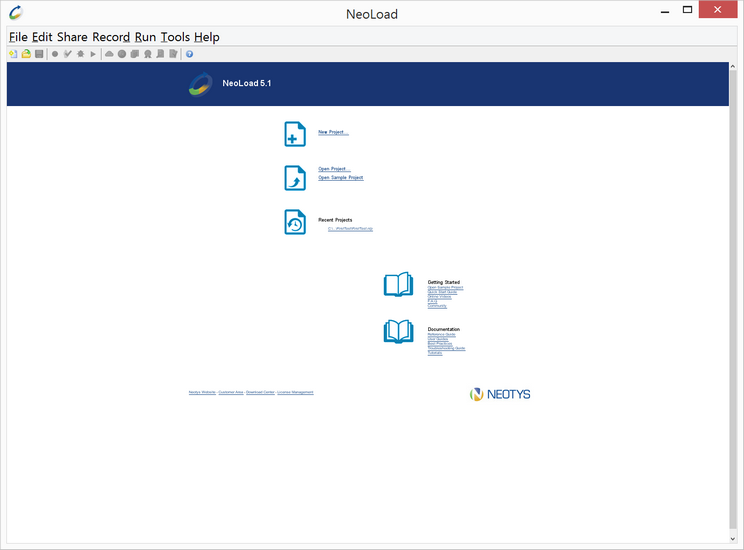
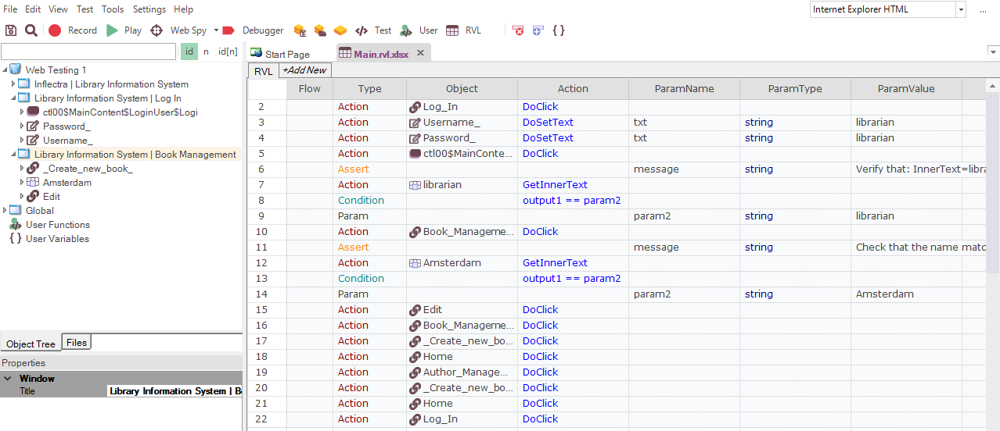
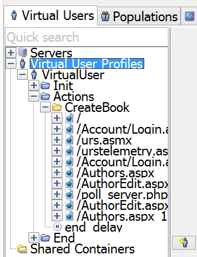
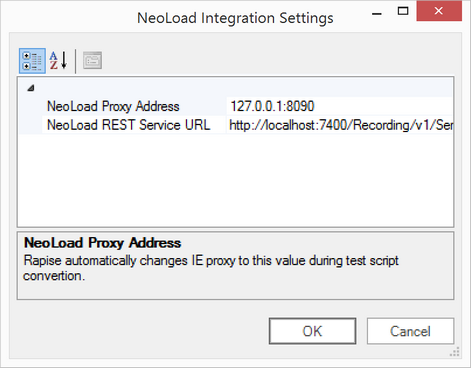

# Convert Functional to Load Test

!!! important
    NeoLoad integration has been removed in Rapise 7.0.

This aspect of the Rapise-NeoLoad integration describes the process for taking an existing test script written in Rapise and converting it seamlessly into a performance scenario in the NeoLoad load testing system. This feature allows you to convert Rapise tests for HTTP/HTTPS based applications into protocol-based NeoLoad scripts that can be executed by a large number of **virtual users (VUs)** that simulate a load on the application being tested.

## Prerequisites

In order to use the integration with NeoLoad, you need to have the following:

- Rapise 5.0 or above
- NeoLoad 5.1 or above

Both tools must be installed on the same Windows host. NeoLoad must have a license with Recording API enabled. The default trial version does not have this capability. The Rapise test needs to be testing an application that uses HTTP/HTTPs or other NeoLoad supported protocols.

## The Steps for Converting a Rapise Test

## Launch NeoLoad

Open NeoLoad via the Start menu or using a command line:

    c:\Program Files (x86)\NeoLoad 5.1\bin\NeoLoadGUI.exe

## Create or Open Existing Load Project

Use menu `File > New` or `File > Open`.

## Open a Test Script in Rapise to be Converted

Inside Rapise, open the script you want to convert. Make sure the application it is testing is a web-based application using the HTTP/HTTPS protocols:

Ensure that the Internet Explorer HTML library is set in the test parameters.

## Open Conversion Dialog

From the main menu select `Tools > Convert to NeoLoad`.

This will display the [NeoLoad convertor dialog](neoload_convertor_dialog.md). On this dialog box, set the following parameters:

**Virtual User**

In this field, you need to enter the name of the virtual user to create in NeoLoad:

- The default value is "VirtualUser"
- If the name is already used, then it is automatically renamed using “_X” suffix, with X an integer incremented.
- If the name has invalid characters then they will be escaped as an underscore (_).

**Base Container**

This specifies the base container  where we want to start the recording (Init / Actions / End).

- The default value is Actions.

**Container/Business Transaction**

This is used to specify the current recording container in NeoLoad. It is just based on a single level. There is no way to specify a tree of containers.

- The default is no container.
- If the name is already used then it will be made unique by adding _1, _2, etc.
- If the name is empty then no container will be used.

**Detect Dynamic Parameters**

When you check this box, Rapise tells NeoLoad to scan the protocol traffic to look for known dynamic parameters (e.g. Session IDs, ASP.NET ViewState) that change on each HTTP request and need to be parameterized by NeoLoad to ensure the performance scripts are robust and well-defined (v.s. having a hardcoded Session ID).

In the NeoLoad tree it looks this way:

## Press Convert Button

After pressing Convert button Rapise will launch the test and NeoLoad will start capturing network traffic. When test playback is finished
you’ll see the dialog:

## Troubleshooting

During conversion you may get a few error messages. This section provides a list of common messages and their solution.

### Unable to connect to the remote server

If you get this message, check that NeoLoad is running. Usually this message means that NeoLoad is not started or another application is using port 7400, preventing NeoLoad binding to it.

### No project is open

If you get this message, check that a project is opened in NeoLoad.

### NeoLoad is not ready for recording

If you get this message, it means that NeoLoad is in the recording state. To fix the issue, you need to stop the existing recording in
NeoLoad.

## NeoLoad Integration Settings

There are a few global options for the Rapise – NeoLoad integration. To reach them use menu `Settings > NeoLoad Integration`.

This is the [NeoLoad Settings](neoload_settings_dialog.md) dialog. Normally there is no any reason to change these settings, but for
completeness they are described below:

- **NeoLoad Data Exchange URL** - this is the URL to the NeoLoad data exchange API
- **NeoLoad Proxy Address** - this is the IP address and prt of the NeoLoad HTTP proxy
- **NeoLoad REST Service URL** - this is the URL to the NeoLoad recording service REST API
