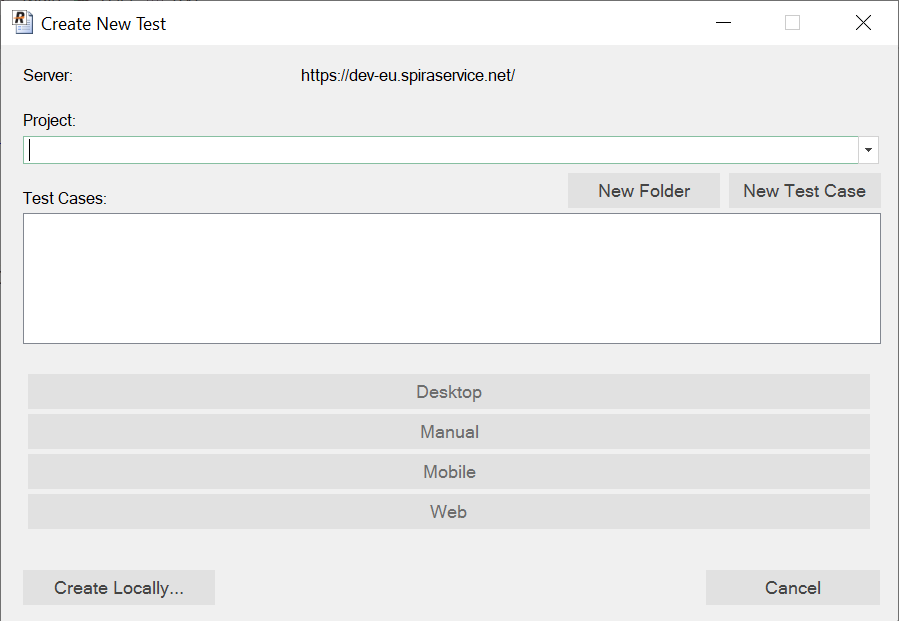
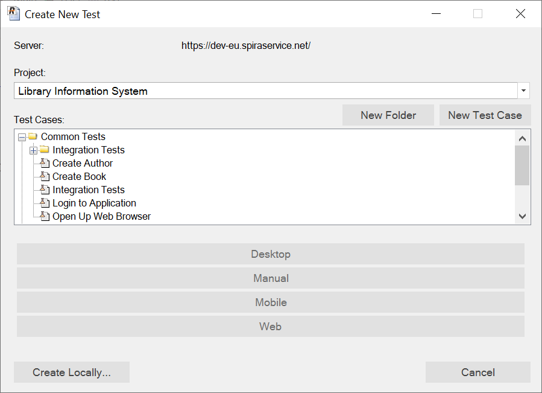
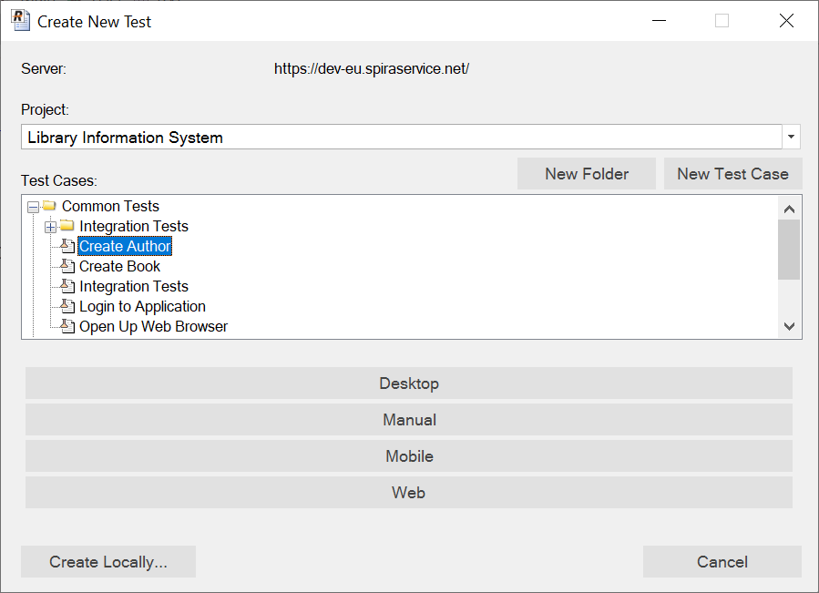
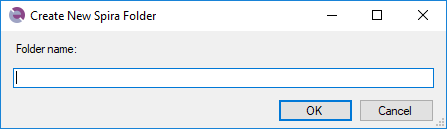
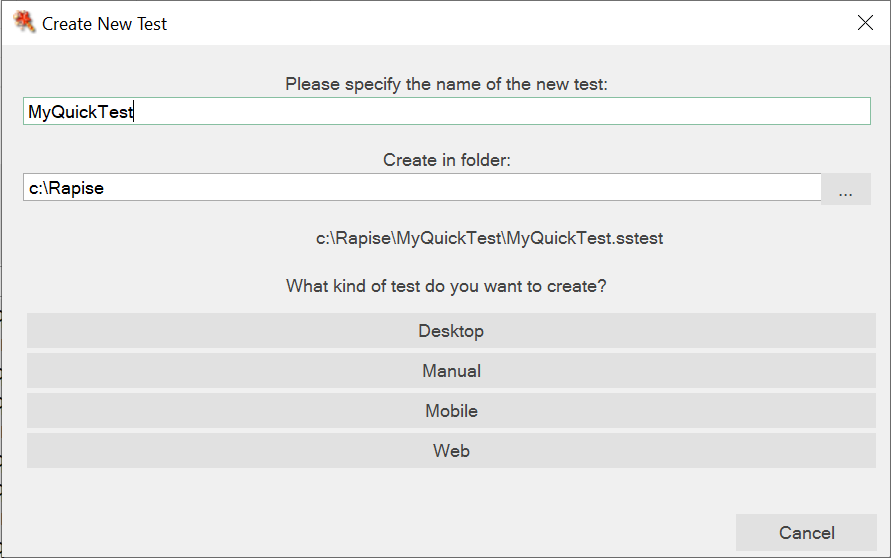

# Create New Test Dialog

## Purpose

The Create New Test Dialog allows you to create a new Rapise [test case](/Guide/Frameworks/frameworks#test-cases), [testing framework](/Guide/Frameworks/frameworks), or standalone test. You can choose to connect to Spira and store the new test in the central test management system, or you can save the test locally.

If the test is intended to be the root of a larger test framework, it is recommended to refer to [KB 371](https://www.inflectra.com/support/knowledgebase/kb371.aspx). for further guidance.

## Framework Mode

### Starting a New Testing Framework

Go to `File > Create New > Test Automation Framework` to [create a new testing framework](Frameworks/frameworks#creating-a-new-testing-framework).

### Adding a Test Case to a Testing Framework

Refer to the section on [Creating a New Test Case](/Guide/Frameworks/frameworks#creating-a-test-case).

## Single Test Mode

In certain situations, such as quickly checking something or conducting proof of concept (POC) experiments, we often require individual tests. If your current test falls into this category, follow these steps to create a new test:

Select `File > Create New > New Test`. This will initiate the creation process for a new test, as described below.

### (a) Creating in Spira

By default Rapise will ask you to save the new test into the [Spira](https://www.inflectra.com/SpiraTest/) test management system:

If you do not plan on using Spira for managing your test scripts (or you are not able to connect when you want to create the test), you can click on the **Create Locally...** to just create the test case [locally](#b-creating-locally). You can always save to Spira later on.

Assuming that you have already [configured the connection to Spira](spiratest_integration.md), first you need to select the project in Spira. That will then display the test case folders and test cases in Spira:

If there is already a test case in Spira that has *not already been linked to Rapise*:

If you want to create a new test case in Spira to use, simply click **New Test Case**:

Then enter the name of the new test case and click **OK**. Once it has been created you can then select it in the test case list and click **Create from Spira**.

Sometimes there is no existing folder inside Spira that makes sense to use. In which case you can first use the **New Folder** button to create an empty folder that new test cases can be created in:

Regardless of which option you choose, you need to select a kind of the test to proceed.

### Test Types

Rapise currently offers four types of tests:

* **Basic**: Use this type for testing desktop applications or any testing that does not involve web browsers or mobile devices.
* **Manual**: Select this type if you are creating or executing manual tests only.
* **Mobile**: Choose this type if you are testing applications running on mobile devices.
* **Web**: Opt for this type if you are testing web applications running in a web browser.

### Scripting Language

Once you have created the test, Rapise will ask you to [choose the Scripting language](scripting_choice_dialog.md) ([RVL](visual_language.md) or [JavaScript](javascript_ide.md)).

### (b) Creating Locally

If you choose the option to **Create Locally** the following dialog box is displayed:

You need to enter the following information:

* **The name of the new test** - please enter the name of the new test that you wish to create.
* **Folder** - please choose the folder on your local computer that you wish to store the Rapise test in.
* **What kind of test do you want to create?** - there are currently four methodologies available in Rapise:
    * **Basic** - this should be used for testing desktop applications or any testing not involving web browsers or mobile devices.
    * **Manual** - this should be selected if you are only going to be creating or executing manual tests
    * **Mobile** - this should be selected if you are going to be testing apps running on mobile devices
    * **Web** - this should be selected if you are going to be testing web applications running in a web browser.

Once you click on the kind of test, Rapise will ask you to [choose the Scripting language](scripting_choice_dialog.md) ([RVL](visual_language.md) or [JavaScript](javascript_ide.md)). Once you have chosen the scripting language, the new test will be created and saved locally.
