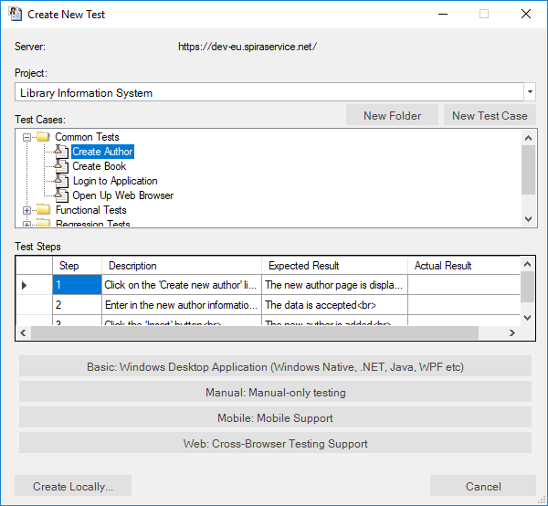
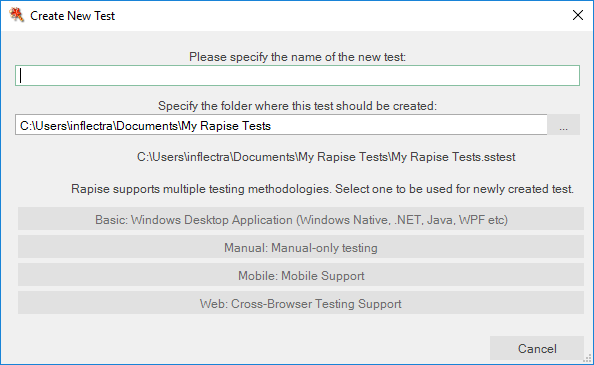

# Create New Test Dialog

## Purpose

Create a new Rapise test. You have the option of either connecting to [Spira](spiratest_integration.md) and storing the new test in our central test management system or simply saving the new test locally.

The test may be a root of the bigger test framework. In this case it is recommended to check [KB 371](https://www.inflectra.com/support/knowledgebase/kb371.aspx).

## How to Open

Simply choose `File > New Test` on the [File menu](menu_and_toolbars.md#file).

## (a) Creating in Spira

By default Rapise will ask you to save the new test into the [Spira](https://www.inflectra.com/SpiraTest/) test management system:

Assuming that you have already [configured the connection to Spira](spiratest_integration.md), first you need to select the project in Spira. That will then display the test case folders and test cases in Spira:

If there is already a test case in Spira that has *not already been linked to Rapise* then you can simply select that test case, which will display any existing manual test steps that exist:

If this is the test case you want to associate the new Rapise test with, then simply click **Create from Spira**.

If you want to create a new test case in Spira to use, simply click **New Test Case**:

Then enter the name of the new test case and click **OK**. Once it has been created you can then select it in the test case list and click **Create from Spira**.

Sometimes there is no existing folder inside Spira that makes sense to use. In which case you can first use the **New Folder** button to create an empty folder that new test cases can be created in:

Regardless of which option you choose, before you click **Create from Spira**, you have the choice of test methodology to use.

Currently there are four methodologies available in Rapise:

* **Basic: Windows Desktop Application (WIndows Native, .NET, Java, WPF etc** - this should be used for testing desktop applications or any testing not involving web browsers or mobile devices.
* **Manual: Manual-only Testing** - this should be selected if you are only going to be creating or executing manual tests
* **Mobile: Mobile Support** - this should be selected if you are going to be testing apps running on mobile devices
* **Web: Cross Browser Testing Support** - this should be selected if you are going to be testing web applications running in a web browser.

If you do not plan on using Spira for managing your test scripts (or you are not able to connect when you want to create the test), you can click on the **Create Locally...** to just create the test case locally (see next section). You can always save to Spira later on.

Once you have created the test, Rapise will ask you to [choose the Scripting language](scripting_choice_dialog.md) ([RVL](visual_language.md) or [JavaScript](javascript_ide.md)).

## (b) Creating Locally

If you choose the option to **Create Locally** the following dialog box is displayed:

You need to enter the following information and click **Create**:

* **The name of the new test** - please enter the name of the new test that you wish to create.
* **Folder** - please choose the folder on your local computer that you wish to store the Rapise test in.
* **Specify methodology** - there are currently four methodologies available in Rapise:
* * **Basic: Windows Desktop Application (WIndows Native, .NET, Java, WPF etc** - this should be used for testing desktop applications or any testing not involving web browsers or mobile devices.
* * **Manual: Manual-only Testing** - this should be selected if you are only going to be creating or executing manual tests
* * **Mobile: Mobile Support** - this should be selected if you are going to be testing apps running on mobile devices
* * **Web: Cross Browser Testing Support** - this should be selected if you are going to be testing web applications running in a web browser.

Once you click **Create**, Rapise will ask you to [choose the Scripting language](scripting_choice_dialog.md) ([RVL](visual_language.md) or [JavaScript](javascript_ide.md)). Once you have chosen the scripting language, the new test will be created and saved locally.
