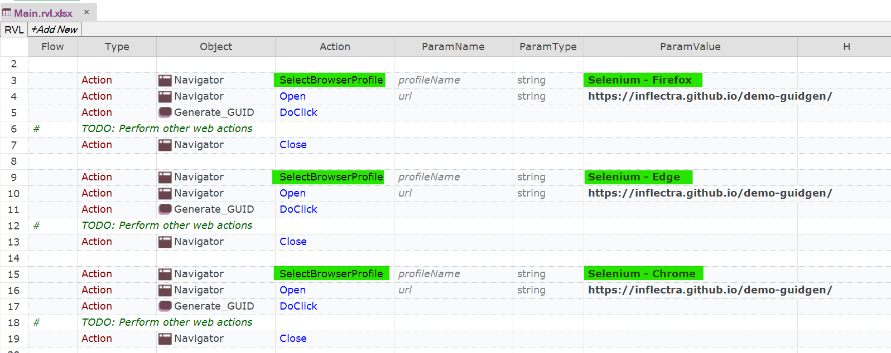
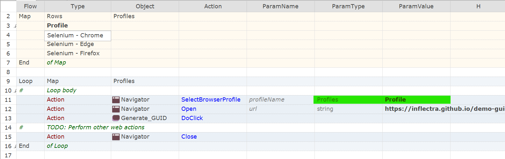

# Cross Browser Testing

## Choosing the Browser When Creating a Test

When you first create a Rapise test with the **Methodology** set to **Web** you will be asked to choose the initial [web browser profile](selenium_settings_dialog.md):

{width="466px"}

You can run your recording in a different browser than the one in which it was recorded.

## Selecting a new Playback Browser

In the right top corner of Rapise window expand the dropdown with available browser.

{width="236px"}

Change the browser to either one of the [Selenium WebDriver](selenium_webdriver.md) based browser profiles, or one of the [native browsers](browser_settings.md) such as Firefox, Internet Explorer or Chrome.

Once you have changed this setting, [Playback](playback.md) the script normally and it will playback in the selected browser.

Changing this setting will effectively set the value of the `g_browserLibrary` global variable.

!!! note
	In Rapise 6.3+ you may define [local profiles](selenium_settings_dialog.md#local-selenium-profiles).

!!! important
 	Since Rapise 7.3 it is recommended to use [Selenium WebDriver](selenium_webdriver.md) based profiles for all web tests.

## Playback in Multiple Browsers

### Using Framework Parameters

!!! important "Rapise 8"
	In Rapise 8 and above the recommended way of multi-browser testing is via [framework parameters](./Frameworks/parameters.md).

	Check out the KB article: [Rapise 8.0: how to run test cases on different browsers](https://www.inflectra.com/Support/KnowledgeBase/KB750.aspx).

### Using Input Data Table

!!! important "Rapise 7"
	In Rapise 7 the recommended way of multi-browser testing is via [Input Data Table](spira_dashboard_2.md#input-data-table).
	
	Check out the webinar: [Parallel Execution of Tests with Rapise & SpiraTest](https://youtu.be/bNoWZjOE3hQ).

### Using SpiraTest and Test Case Parameters

==obsolete==

Executing a test in multiple browsers is slightly more complicated. We recommend that you use **SpiraTest Test Sets** where you may define multiple test cases pointing to the same Test with a different **g_browserLibrary** parameter value.

See the [SpiraTest Integration](spiratest_integration.md#using-parameterized-test-cases) topic for detailed information.

### Changing Browser with SelectBrowserProfile

==obsolete==

You may use `Navigator.SelectBrowserProfile` as follows:

```javascript
Navigator.SelectBrowserProfile("BROWSER PROFILE 1");
Navigator.Open('URL');
...
Navigator.Close();

Navigator.SelectBrowserProfile("BROWSER PROFILE 2");
Navigator.Open('URL');
...
Navigator.Close();
```

!!! important
	`Navigator.Close` is required to switch the browser.

In RVL it will look like:



Or, the same using the Loop:



### Using DoInvokeTest

==obsolete==

To iterate through browsers in Rapise create a new test with **Web** methodology. 

Now add a reference to the Web test you want to run in different browsers. In the `Files` view right click the test node and choose `Add File(s)...`. Provide the path to `*.sstest` file. You will see the reference added to the `Files` view.


Drag the reference to the editor window. Rapise will generate `DoInvokeTest` call.


To execute a test with a given browser profile you need a pair of commands.

```javascript
Navigator.SelectBrowserProfile("BROWSER PROFILE");
Global.DoInvokeTest('PATH TO THE TEST');
```

So to run the test in three different browsers we get the following content of the `Test.js`:

```javascript
function Test(params)
{
	Navigator.SelectBrowserProfile("Selenium - Chrome");
	Global.DoInvokeTest('%WORKDIR%/../Web Testing 2/Web Testing 2.sstest');
	Navigator.SelectBrowserProfile("Selenium - Edge");
	Global.DoInvokeTest('%WORKDIR%/../Web Testing 2/Web Testing 2.sstest');
	Navigator.SelectBrowserProfile("Selenium - Firefox");
	Global.DoInvokeTest('%WORKDIR%/../Web Testing 2/Web Testing 2.sstest');
}

g_load_libraries=["Web"];
```

In RVL it will look like:


