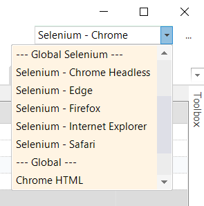

# Cross Browser Testing

## Choosing the Browser When Creating a Test

When you first create a Rapise test with the **Methodology** set to **Web** you will be asked to choose the initial [web browser profile](browser_settings.md):


You can run your recording in a different browser than the one in which it was recorded.

## Selecting a new Playback Browser

In the right top corner of Rapise window expand the dropdown with available browser.



Change the browser to either one of the [native browsers](browser_settings.md) such as **Firefox**, **Internet Explorer** or **Chrome**, or one of the [Selenium WebDriver](selenium_webdriver.md) based browser profiles.

Once you have changed this setting, [Playback](playback.md) the script normally and it will playback in the selected browser.

Changing this setting will effectively set the value of the `g_browserLibrary` global variable.

## Playback in Multiple Browsers - SpiraTest

Executing a test in multiple browsers is slightly more complicated. We recommend that you use **SpiraTest Test Sets** where you may define multiple test cases pointing to the same Test with a different **g_browserLibrary** parameter value.

The separate help document **Using SpiraTest with Rapise** provides specific instructions on using Rapise with SpiraTest to handle the specific case of cross-browser testing as well as more general support for parameterized testing. See the [SpiraTest Integration](spiratest_integration.md) topic for more general information on using Rapise with SpiraTest.

## Playback in Multiple Browsers - DoInvokeTest

To iterate through browsers in Rapise create a new test with **Web** methodology. Open `Main.js` file of the test and modify `g_load_libraries` line as follows:

```javascript
g_load_libraries=["Internet Explorer HTML", "Firefox HTML", "Chrome HTML"];
```

It will ensure that our test will load all browser libraries upon playback.

Now add a reference to the Web test you want to run in different browsers. In the `Files` view right click the test node and choose `Add File(s)...`. Provide the path to `*.sstest` file. You will see the reference added to the `Files` view.


Drag the reference to the editor window. Rapise will generate `DoInvokeTest` call.


To execute a test with a given browser profile you need a pair of commands.

```javascript
Navigator.SelectBrowserProfile("BROWSER PROFILE");
Global.DoInvokeTest('PATH TO THE TEST');
```

So to run the test in three different browsers we get the following content of the `Test.js`:

```javascript
function Test(params)
{
	Navigator.SelectBrowserProfile("Internet Explorer HTML");
	Global.DoInvokeTest('%WORKDIR%/../Web Testing 2/Web Testing 2.sstest');
	Navigator.SelectBrowserProfile("Chrome HTML");
	Global.DoInvokeTest('%WORKDIR%/../Web Testing 2/Web Testing 2.sstest');
	Navigator.SelectBrowserProfile("Firefox HTML");
	Global.DoInvokeTest('%WORKDIR%/../Web Testing 2/Web Testing 2.sstest');
}

g_load_libraries=["Internet Explorer HTML", "Firefox HTML", "Chrome HTML"];
```

In RVL it will look like:


