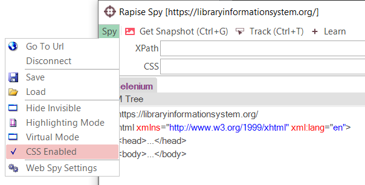

# Web Testing - Using CSS Selectors

## Purpose

When testing web applications you will often want to use Cascading Style Sheets (CSS) selectors to query the browser DOM for elements based on the scenario under test. This section explains how you can use CSS selectors with Rapise to make your browser testing more flexible and adaptive to changes on the screen.

CSS is an alternative to [XPath](xpath.md) that is often better at selecting multiple elements from across different parts of the DOM Tree, unlike XPath which is strictly hierarchical. However since CSS is not always able to uniquely locate an object, when Rapise is used in recording mode, it will learn objects automatically using XPath.

## CSS Fundamentals

In CSS, selectors are patterns used to select the element(s) you want to style. Here are the different operators that you can use in CSS
selectors:

[CSS Selector Reference](https://www.w3schools.com/cssref/css_selectors.asp)

One limitation (as compared to XPath) is that there is not a way to select an element based on its contents. So it would not be possible to locate a cell in a grid (for example) based on the contents of the cell. For that you would need to use XPath.

## Rapise CSS Extensions

Since Rapise uses XPath as its primary means of locating an HTML element, when you **Learn** an object using CSS, Rapise will prefix the
Locator (listed under the XPath property for that object in the [Object Tree](object_tree.md)) with `css=` to let Rapise know that the locator is actually using a CSS selector.

```nohighlight
css=html > body > form#ctl01 > div:nth-of-type(3) > div:first-of-type > div:first-of-type
```

There are several different ways to use CSS selectors in Rapise.

## Using Web Spy

To most easily use CSS selectors in Rapise, we recommend using the Web Spy tool. Make sure that CSS edit is enabled:



If you enter in the CSS selector at the top, when you click **Test** 


it will display all of the DOM elements that match the selector:


You can now refine the query to only find the items you want to test.

## Learning Objects

When you have created the query in the Web Spy that returns the HTML elements that you were expecting, you can click on the **Learn** button to learn that object. What this will do is create a new Rapise object in the [Object Tree](object_tree.md) that
maps to this specific CSS. That means that the "object" in Rapise is effectively a pointer to this specific CSS selector.

For example, if you want to find a specific book in a grid of books by its CSS `class, style, ID` or other attribute, you can search using the appropriate CSS selector, then learn this object as **Book_1** so that you can access it in your code as `SeS("Book_1")`. Every time you call a function on **Book_1**, Rapise will use the learned CSS selector and use that to evaluate which HTML element in the web page to access.

## Dynamic Queries

In addition to learning objects based on specific CSS selector, there are a set of general functions that can be used to query for objects in the web page:

```javascript
SeS('Book_Management').DoDOMQueryCss('tr td[data=book1]');
```

Will dynamically query for any HTML element that is a child of the learned **Book Management** object that matches the CSS selector. In this example it will look for any table cell in a table row that has the attribute `data="book1"`.
