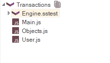

# Customizable Engine

## Purpose

The source for most of the Rapise implementation is available for you to read and modify.  You may find it useful to look at if you decide to create a [library](custom_libraries.md) customized for your application.

## Usage

Unless you specified otherwise, Rapise will be installed at

    C:\Program Files (x86)\Inflectra\Rapise\

The source code is in the **Engine** directory.  You'll find the [recording](recording.md)/[learning](object_learning.md) libraries in **Engine\\Lib**.  The core logic is in four files: **SeSAction.js**; **SeSBehavior.js**; **SeSCommon.js**; **SeSConfig.js**.

> **Note:** If you plan to make changes to the Rapise Engine, we recommend you use a version control system capable of reconciling code conflicts, as we do not support user customizations.  However, let us know if you feel that your customizations are generally useful; if we decide to integrate them into Rapise, we will support them.

To add Engine to any of your tests use ++ctrl+shift+e++ shortcut.

## See Also

•   [Custom Libraries](custom_libraries.md)
•   [Scripting](scripting.md)
