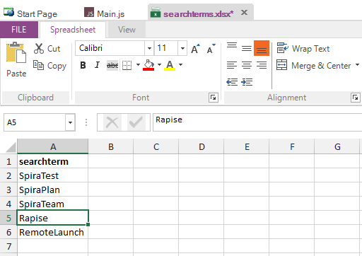

# Data-Driven Testing (JavaScript)

## Purpose

**Data Driven Testing** is an automated testing technique in which test case data is separated from test case logic.  Each set of test case data consists of input values and a set of expected output values.  The actual output values are compared to the expected output values to determine whether the test passed.

You can perform data-driven testing either using an MS-Excel [spreadsheet](/Libraries/spreadsheet/) as the datasource or a relational [database](/Libraries/database/).

## Using an MS-Excel Spreadsheet

The [**Spreadsheet**](/Libraries/spreadsheet/) object is useful for implementing data-driven tests. It allows you to connect to, query, and read an excel spreadsheet from your test script.  To create a data-driven test, you will:

### 1. Record a Test

The exact inputs you use for the recording will not matter as much as your interactions with the objects.  The following excerpt was recorded using [www.google.com](http://www.google.com):

```javascript
    function Test()
    {
        //Set Text Inflectra in q
        SeS('Obj1').DoSetText("Inflectra");
        //Click on btnG
        SeS('Obj2').DoClick();
    }
```
The actions recorded were: (1) Type **Inflectra** into the search box. (2) Press the **Google Search** button.

### 2. Parameterize the Test() Function

The `Test()` function has all of the procedural logic for the test.  Replace input values with variables.  Encapsulate the logic in a nested function with one parameter for each variable you created.  As an example, we will parameterize the `Test()` function we created in step one:

```javascript
function Test()
{
    function Logic(searchterm)
    {
        //our new function encapsulates the test logic
        //Set Text using searchterm
        SeS('Obj1').DoSetText(searchterm) //here we changed a hard-coded value into a variable
        //Click on btnG
        SeS('Obj2').DoClick()
    }
    Logic("Inflectra") //don't forget to call your new function
}
```

### 3. Create the Test Case Data

Create a spreadsheet with name **searchterms.xlsx**. For this right click the test node and choose `Create > Spreadsheet...`.


Enter the name and click `Create` button.


In the spreadsheet create a column for every variable in step two.  Add columns for any expected output values you wish to verify. Each row is a test case. In our google example, we only have one input value (`searchterm`) and we're not comparing any expected output values, so we will only need one column in our spreadsheet.



### 4. Attach Spreadsheet Object to searchterms.xlsx

Drag the **searchterms.xlsx** from files tree into appropriate place in your test source:


### 5. Use Spreadsheet to Access the Test Case Data

In our example, we use a [**Spreadsheet**](/Libraries/spreadsheet/) object and run the test logic once for every row.

```javascript
function Test()
{
    function Logic(searchterm)
    {
        //Set Text searchterm in q
        SeS('Obj1').DoSetText(searchterm)
        //Click on btnG
        SeS('Obj2').DoClick()
    }

    Spreadsheet.DoAttach('%WORKDIR%/searchterms.xlsx');

    // Go through all rows
    while(Spreadsheet.DoSequential())
    {
        // Read cell value from column 0
        var term = Spreadsheet.GetCell(0);
        // Pass it into Logic function
        Logic(term);
    }
}
```

## Using a Relational Database

Rapise comes with the [Database](/Libraries/database/) query global object that allows you to send SQL queries to a database and then iterate through the results. The process for creating such a data-driven test is as follows:

### 1. Record a Test

The exact inputs you use for the recording will not matter as much as your interactions with the objects.  The following excerpt was recorded using [www.google.com](http://www.google.com):

```javascript
    function Test()
    {
        //Set Text Inflectra in q
        SeS('Obj1').DoSetText("Inflectra");
        //Click on btnG
        SeS('Obj2').DoClick();
    }
```
The actions recorded were: (1) Type **Inflectra** into the search box. (2) Press the **Google Search** button.

### 2. Parameterize the Test() Function

The `Test()` function has all of the procedural logic for the test.  Replace input values with variables.  Encapsulate the logic in a nested function with one parameter for each variable you created.  As an example, we will parameterize  the `Test()` function we created in step one:

```javascript
function Test()
{
    function Logic(searchterm)
    {
        //our new function encapsulates the test logic
        //Set Text using searchterm
        SeS('Obj1').DoSetText(searchterm) //here we changed a hard-coded value into a variable
        //Click on btnG
        SeS('Obj2').DoClick()
    }
    Logic("Inflectra") //don't forget to call your new function
}
```

### 3. Use Database to Connect the Test Case Data.

This assumes that you already have an **ODBC** or **OLE DB** compatible relational database that contains the necessary test data. You drag the `Database` global object into the script editor:


and then use:

- **Database.DoAttach()** - to make the database connection and specify the SQL query
- **Database.GetRowCount()** - to verify that there is data
- **Database.DoSequential()** - to loop through the data set row by row
- **Database.GetValue()** - to get that row's data

Here is an example of the code needed to loop through a list of records (taken from the SpiraTest database as an example) and call our `Logic()` parameterized function with the appropriate test data:

```javascript
var success = Database.DoAttach('Provider=SQLOLEDB.1;Integrated Security=SSPI;Persist Security Info=False;Initial Catalog=SpiraTest;Data Source=.' , 'SELECT * FROM TST_PROJECT' );
Tester.Assert('Successfully Connected', success);

var count = Database.GetRowCount();
Tester.Message(count);

//Loop through the rows
while(Database.DoSequential())
{
    var projectId = Database.GetValue("PROJECT_ID" );
    var name = Database.GetValue( "NAME");
    var description = Database.GetValue("DESCRIPTION" );
    Logic(name);
}
```

## See Also

- [KB357](https://www.inflectra.com/Support/KnowledgeBase/KB357.aspx) Data-driven testing with spreadsheets and RVL
- [KB317](https://www.inflectra.com/Support/KnowledgeBase/KB317.aspx) Read external Excel spreadsheet in RVL
- [The Connection Strings Reference](https://www.connectionstrings.com/)
