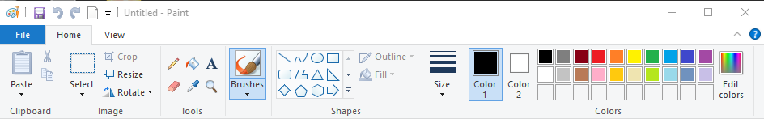

# Deal with a Simulated Object

## Sample Application

The color box of Microsoft's Paint utility is a compound object that contains color tiles surrounded by a containing box. To understand this completely, start `mspaint.exe` from Rapise.

Steps:

1. Open a new test in Rapise.
2. Press the `Record` button on the application bar.
3. When the **Select an Application to Record** dialog appears, select the Run Application tab. Enter `mspaint` in the **Full path to application** edit box. Press the `Run` button.

    > If you are unfamiliar with MS Paint, take a few minutes to play with it. In particular, notice the color selection box that appears on the upper-right of the application window.

    

4. Press `Ctrl+5` to spy on the UI. Then, press ++ctrl+g++ to spy on the Paint application. Notice the following behaviors of the MS Paint application under the Object Spy:
      1. As you move the mouse inside the color box, the entire surrounding box will display a red highlight but the individual color tiles will not.
      2. Properties of the color box control do not provide clues for finding a particular color.

This combination makes it impossible for Rapise to identify and learn colors as integral objects.

Rapise can be _taught_ to interact with the color box by "simulating" it.

In fact, Rapise will recognize these non-objects without you needing to take any specific action. Let's explore what this means:

1. Open a new test in Rapise and name it `MSPaint`.
2. Press the `Record` button on the application bar.
3. When the **Select an Application to Record** dialog appears, clear all selection boxes in the library list. You may need to scroll this section of the dialog box to ensure all selections are cleared. We are choosing not to load any libraries so that Rapise cannot "cheat" by automatically recognizing objects on the screen.
4. Select the Run Application tab. In the **Full path to application** edit box, enter `mspaint`. Then, press the `Run` button.
    > **Note:** Applications that reside in `C:\windows\system32` can be started by their names because `C:\windows\system32` are typically included in the system path.
5. When the **Recording Activity** dialog appears, press **Learn** (++ctrl+2++).
6. Perform a few simple actions in Paint. For example:
     1. Click the red color in the palette.
     2. Click the green color in the palette.
     3. Click the blue color in the palette.
7. Examine the **Recording Activity** dialog grid. It should resemble the following:

    

    > Notice that the three clicks within the color box were recorded as **simulated** objects.

8. Press ++ctrl+3++ to end the recording.

## See Also

- [How-Tos](howtos.md)