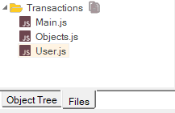

# Defining Functions

## Purpose

The Rapise test script is in JavaScript. You may define as many JavaScript functions as you would like to call from your test script.

## Usage

There are two ways to maintain additional functions: (1) Inside your test script and (2) in an external file.

## Inside your Test Script

### In User.js

It is recommended to put all user functions into `User.js` file available in any test from its creation.



This file is automatically attached into every script. All variables and functions defined in it may be used in the test. User-defined functions are also available under the **User Functions** node in the Object Tree:


## In an External File

You can define your function in another file and include it.
>  
For example:

```Javascript
function Test()
{
    // Withdraw is defined inside the "Test" function
    function Withdraw(amount)
    {
        Log("Start Withdraw of:"+amount);
       // Withdraw logic is here
    }

    Withdraw(12.34);

    // Include "UtilityFunctions.js" to get at function Deposit()
    eval(File.Include("UtilityFunctions.js"));

    // Deposit is defined in "UtilityFunctions.js"
    Deposit(56.78);
}
```

## See Also

- To learn more about what the Script Recorder will change in your test script, see [Multiple Recordings](multiple_recordings.md).
