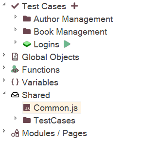
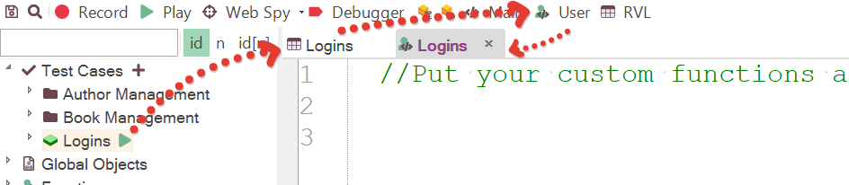
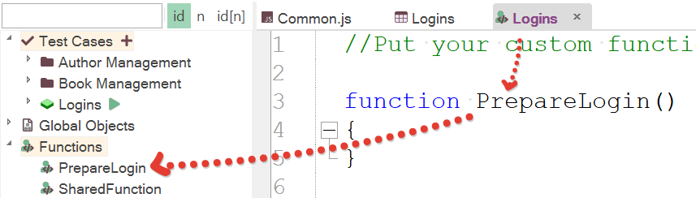
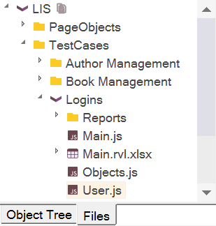

# Defining Functions

## Purpose

The Rapise test script is in JavaScript. You may define as many JavaScript functions as you would like to call from your test script.

## Usage

There are three ways to maintain additional functions: (1) In `Common.js` (2) Inside your test script and (3) in an external file.

## Inside your Test Script

### In Common.js

Preferred way is to have a [testing framework](Frameworks/frameworks.md#managing-common-data) and with shared file. Its default name `Common.js` although you may have other files marked with `shared` tag and thus being automatically loaded during playback and shown in the shared node.



### In User.js

It is recommended to put test case specific functions into `User.js` file available in any test from its creation (in most cases it is not needed and `Common.js` is preferred:



This file is automatically attached into every script. All variables and functions defined in it may be used in the test. User-defined functions are also available under the **Functions** node in the Object Tree:



You may also open `User.js` from the [Files Tree](/Guide/test_files_dialog.md):



## In an External File

You can define your function in another file and include it. Although more common is to include external files into `Common.js` or into `User.js`:
>  
For example:

```javascript

External.js:

// Withdraw is defined inside the "Test" function
function Withdraw(amount)
{
    Log("Start Withdraw of:"+amount);
    // Withdraw logic is here
}

Main.js:

function Test()
{

    eval(File.Include('External.js'));

    Withdraw(12.34);
    // Deposit is defined in "UtilityFunctions.js"
    Deposit(56.78);
}
```

## See Also

- To learn more about what the Script Recorder will change in your test script, see [Multiple Recordings](multiple_recordings.md).
