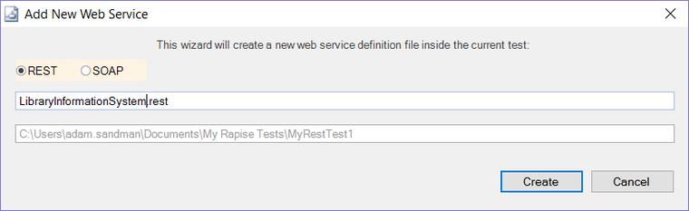
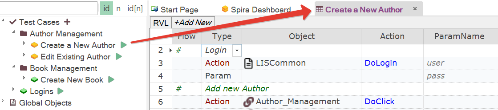
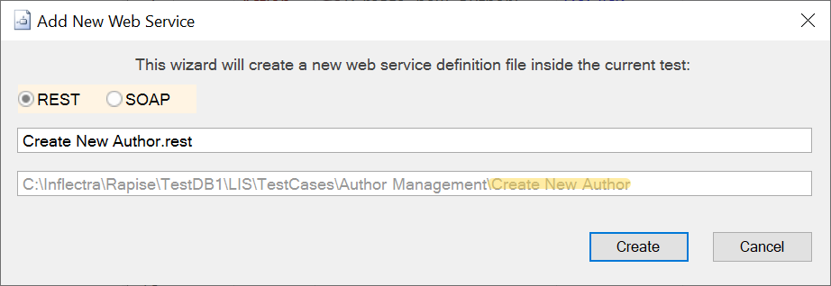
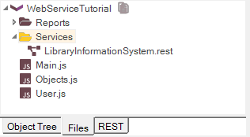
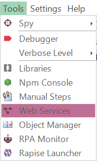

# Add New Web Service Dialog

## Screenshot

{width="608px"}

## Purpose

### Framework Mode

You can add a REST or SOAP web service to the currently active Test Case or Module/Page Object in the editor. The term "current" refers to the item that is currently selected or being edited.

The corresponding images are shown below:

When you access *Tools > Web Services*, the correct path will be displayed:

{width="615px"}

Once the service is created, it will be available under the Services node:

{width="223px"}

!!! note
    If there is no currently active Test Case or Page Object, the endpoint will be added to the root of the framework. In such cases, it is recommended to make it [shared](./Frameworks/frameworks.md#managing-common-data) for reusability.

### Single Test Mode

Adds a new REST or SOAP web service to your Rapise test. It adds the web service as a `.rest` or `.soap` file to the **Services** folder within the **Files** section:

## How to Open

Click the `Tools > Web Services` menu item.

{width="133px"}