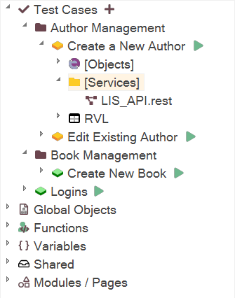

# Add New Web Service Dialog

## Screenshot

## Purpose

### Framework Mode

You have the option to add a REST or SOAP web service to the currently active Test Case or Module/Page Object in the editor. The term "current" refers to the item that is currently selected or being edited.

Here are the corresponding images:

When you access *Tools / Web Services*, it will display the correct path:

Once the service is created, it will be available under the Services node:

> Note: If there is no currently active Test Case or Page Object, the endpoint will be added to the root of the framework. In such cases, it is recommended to make it [shared](/Guide/Frameworks/frameworks#managing-common-data) for reusability.

### Single Test Mode

Adds a new REST or SOAP web service to your Rapise test. It adds the web service as a `.rest` or `.soap` file that is added to the **Services** folder of the **Files** section:

## How to Open

Click on the `Tools > Web Services` menu item.

