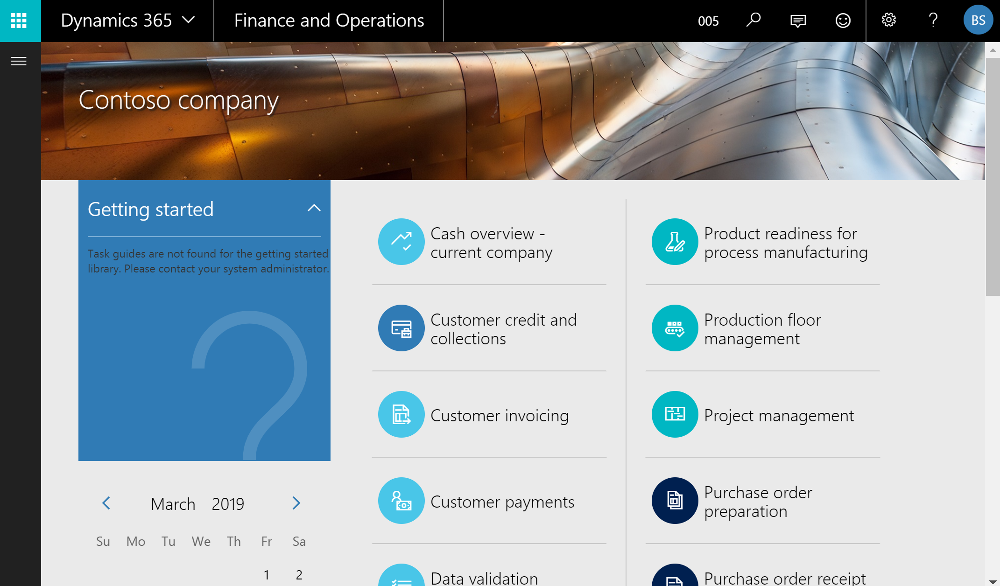
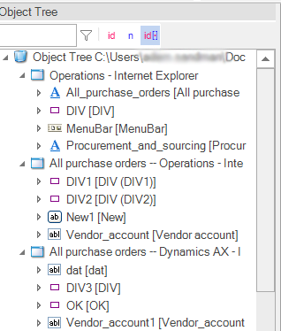
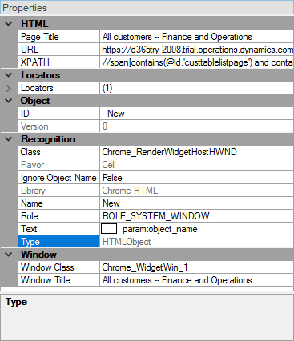
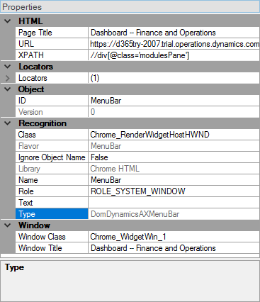
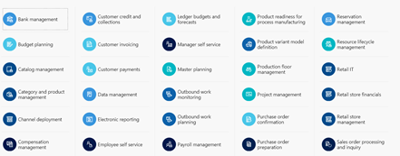
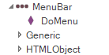
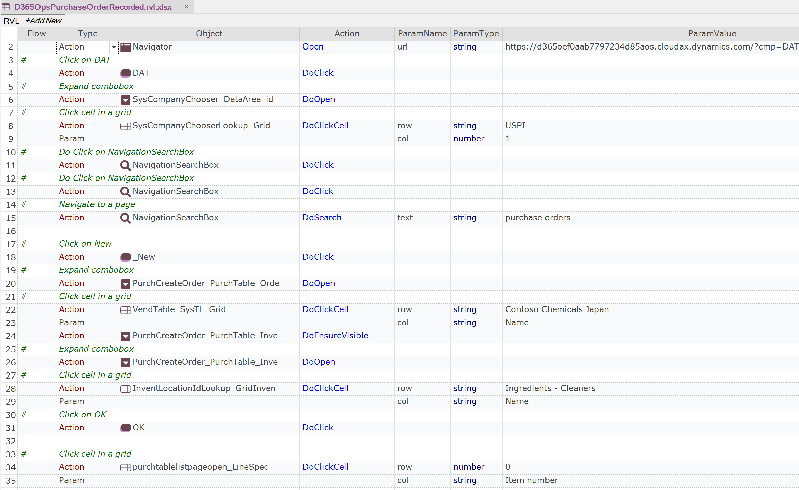

# Dynamics 365 for Finance and Operations

## Overview

Microsoft has created a new cloud-based SaaS-only combined ERP/CRM solution called **Microsoft Dynamics 365**. This provides a new web-based version of [Dynamics AX](dynamics_ax.md) (renamed Dynamics 365 for Finance and Operations) and an updated Microsoft Dynamics CRM Online.

This new integrated, ERP/CRM is provided solely through Microsoft Azure and is completely web-based. There are two main modules that Rapise has specialized support for:

1. **Dynamics 365 for Finance and Operations** – this is the subject of this section, please read on if you are testing these modules.
2. **Dynamics 365 for Sales** – this is a rebrand of [Dynamics CRM](dynamics_crm.md) and is covered in [corresponding section](dynamics_crm.md).



## Recording a Test

Dynamics 365 for Finance and Operations is completely web-based (unlike Dynamics AX) and you use a web browser to access the user interface. Therefore when recording a test using Rapise, you use the same web browser libraries that you use to record other web tests:

- Most of the Dynamics 365 user interface will be tested using the [standard browser library](/Libraries/HTMLObject/) for your web browser of choice (e.g.  Internet Explorer HTML, Firefox HTML, and Chrome HTML).
- In addition, there are special controls inside Dynamics 365 that Rapise has specialized support for. For that reason you'll also see the [DomDynamicsAx](/Libraries/ses_lib_dynamics365/) library added to your test as well as the browser one. This **DomDynamicsAx** library adds additional rules that identify certain Dynamics 365 objects to make testing easier.

When you record your first test, you'll see the following library selection code generated automatically by Rapise:

```javascript
g_load_libraries=["%g_browserLibrary:Internet Explorer HTML%", "DomDynamicsAx"];
```

If you don’t see the **DomDynamicsAx** library listed in your test, then you will need to [manually add it](change_the_libraries_being_use.md).

## Recording and Learning Objects

During recording while you interact with Dynamics 365, Rapise captures objects and displays them in the [object tree](object_learning.md):



Some of these objects will be standard HTML DOM objects (e.g. button):



and others will be specific to Dynamics 365:



## Tips for Interacting with Objects

One of the most important UI elements inside Dynamics 365 is the multi-level menu bar:



The Dynamics 365 menu bar is used to quickly and easily navigate between different parts of the application and it is very common to need to interact with it in test scripts.

[Learn](object_learning.md) the menu using **CTRL+2** on the menu open button:


Rapise will learn the [DomDynamicsAXMenuBar](/Libraries/DomDynamicsAXMenuBar/) object:



In additional to the standard HTML object methods and properties, you have [the special functions that you can perform on the menu](/Libraries/DomDynamicsAXMenuBar/):

- **DoMenu(path, separator)** – selects the menu entries in specified path, using the specified separator (or semicolon if none specified).

Here is a sample test that was recorded using Dynamics 365 for Finance and Operations and Rapise.

**RVL**



**JavaScript**

```javascript
function Test(params)
{
    Navigator.Open("https://d365oef0aab7797234d85aos.cloudax.dynamics.com/?cmp=DAT&mi=DefaultDashboard");
    SeS('DAT').DoClick();
    SeS('SysCompanyChooser_DataArea_id').DoOpen();
    SeS('SysCompanyChooserLookup_Grid').DoClickCell("USPI", 1);
    SeS('NavigationSearchBox').DoClick();
    SeS('NavigationSearchBox').DoClick();
    SeS('NavigationSearchBox').DoSearch("purchase orders");
    SeS('_New').DoClick();
    SeS('PurchCreateOrder_PurchTable_Orde').DoOpen();
    SeS('VendTable_SysTL_Grid').DoClickCell("Contoso Chemicals Japan", "Name");
    SeS('PurchCreateOrder_PurchTable_Inve').DoEnsureVisible();
    SeS('PurchCreateOrder_PurchTable_Inve').DoOpen();
    SeS('InventLocationIdLookup_GridInven').DoClickCell("Ingredients - Cleaners", "Name");
    SeS('OK').DoClick();
    SeS('purchtablelistpageopen_LineSpec').DoClickCell(0, "Item number");
    SeS('InventItemIdLookupPurchase_Grid').DoClickCell("SodiumHydroxide", "Search name");
    SeS('purchtablelistpageopen_LineSpec').DoClickCell(0, "Unit");
    SeS('UnitOfMeasureLookup_GridConverti').DoClickCell("kilogram", "Translated description");
    SeS('purchtablelistpageopen_LineSpec').DoClickCell(0, "Quantity");
    SeS('purchtablelistpageopen_LineSpec').DoSetText("5");
    SeS('Add_line').DoEnsureVisible();
    SeS('Add_line').DoClick();
    SeS('purchtablelistpageopen_LineSpec').DoClickCell(1, "Item number");
    SeS('InventItemIdLookupPurchase_Grid').DoClickCell("OleicAcid", "Search name");
    SeS('purchtablelistpageopen_LineSpec').DoClickCell(1, "Quantity");
    SeS('purchtablelistpageopen_LineSpec').DoSetText("3");
    SeS('Save').DoClick();
}

g_load_libraries=["%g_browserLibrary:Chrome HTML%", "DomDynamicsAX"];
```

## See Also

- [Microsoft Dynamics](microsoft_dynamics.md)
- [Demo: How to Create a PO in Microsoft Dynamics 365 for Operations](https://youtu.be/NKE1Lg5OgoQ)
- [Webinar: Testing Microsoft Dynamics 365 for Operations with Rapise](https://youtu.be/YMhT0GLNwUE)