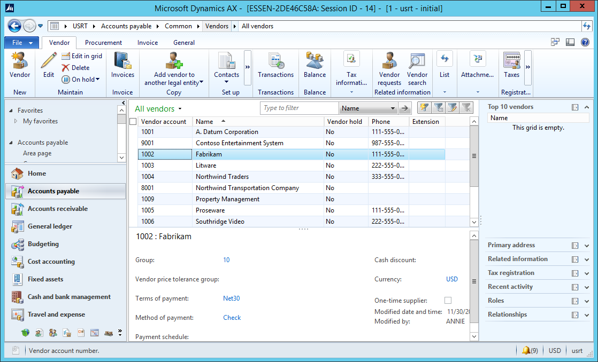
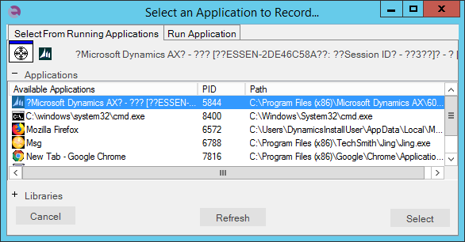
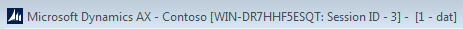
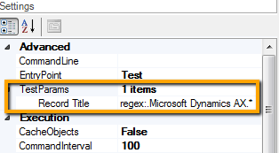
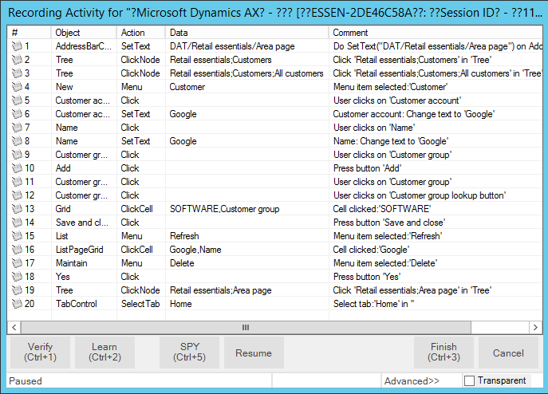
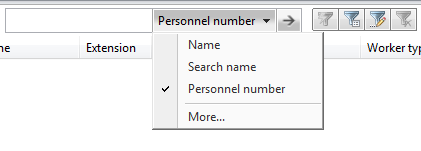
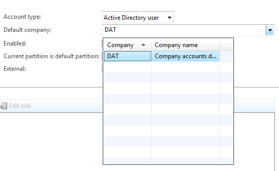
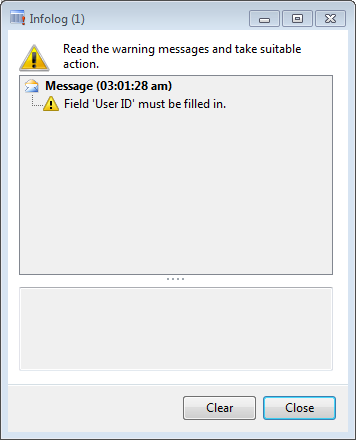
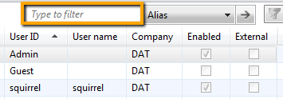
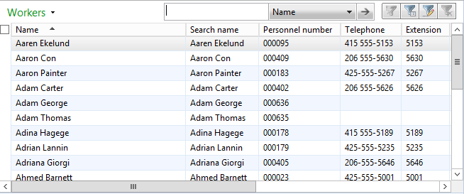

# Dynamics AX

## Overview

**Microsoft Dynamics AX** (usually referred to as just "AX") - is an ERP system for mid-size to large enterprises. It is the most robust,
scalable, and functionally rich enterprise resource planning system in the Microsoft Dynamics family of products. The system was originally known as Axapta, owned by the Danish software company Damgaard.

Dynamics AX consists of a client-server architecture with a thick-client ERP interface for entering/adding data in the system:



Rapise includes specialized libraries for testing Dynamics AX applications that are built-upon the standard [Microsoft Windows](windows_applications.md) **UIAutomation** library with special extensions for handling unique AX controls such as tree views, the navigation explorer and the various grids used to edit data. In addition Rapise can test the following extensions to Dynamics AX:

- **Dynamics AX Management Reporter** - Rapise can test this extension using its **Generic** [Windows library](windows_applications.md).
- **Dynamics AX Web Portals** - Rapise can test the various web portals using its [web browser libraries](web_testing.md).

## Start Recording a New Test

First you need to create a new Basic test and start recording session. Choose Dynamics AX from the list of applications:



Then press `Select` button to start recording. Rapise will automatically plug the UIAutomation and DynamicsAX libraries.

- **Microsoft UI Automation** is the new accessibility framework for Microsoft Windows, available on all operating systems that support Windows Presentation Foundation (WPF). UI Automation provides programmatic access to most user interface (UI) elements on the desktop, enabling assistive technology products such as screen readers to provide information about the UI to end users and to manipulate the UI by means other than standard input. UI Automation also allows automated test scripts to interact with the UI. 

- **DynamicsAX** library supports set of controls specific to Microsoft Dynamics AX 2012 application. 

When recording is completed you can see attached libraries in the code of `test.js` file:

```javascript
    g_load_libraries=["UIAutomation", "DynamicsAX"];
```

## Automatic Adjustment of `Window Title` Object Property

Main window title of Dynamics AX is dynamic by nature.



It contains not only application name but also domain and AOS information and session Id. So it can be different at the time of test recording and test playback. To cope with this problem Rapise automatically replaces actual window title with a regular expression in object properties. Here it is:
    
        regex:.Microsoft Dynamics AX.*

So recorded object properties automatically adjusted as


Also Rapise automatically sets `Record Title` in test settings to the same regular expression so you do not need to choose the Dynamics AX main window during subsequent recording sessions.



## Titles of Child Windows

Child windows of Dynamics AX also may have dynamic titles. Rapise does not know all the available patterns, so for child windows you need to write regular expressions yourself. But the good news is you need to do this for one object only in every such window. For further learned objects Rapise will change the `window title` property automatically. In other words when Rapise learns a new object and it's `window title` is matched by a regular expression of a previously learned object then the title property is automatically replaced by this regular expression.

## Object Location

Object location property has the form of

        id1/id2/id3...

where ids refer to parent objects along the path to the top window object. Sometimes such ids also can be dynamic, e.g.:

        Dimensions display (1 - k13) - Sales order: S30014323, CE15P, Sales order: S30014323/InventDimParmFixed/Pane/View/Style

In this case change dynamic parts by corresponding regular expressions. In the above example updated location looks like:

        regex:Dimensions display.*/InventDimParmFixed/Pane/View/Style

Here is updated location in the property grid:


## How to Launch Dynamics AX Client

If in your test you want to check that Dynamics AX application is installed and running use the code:

```javascript
	var fso = new ActiveXObject("Scripting.FileSystemObject"); 

	var pfFolder = Global.GetSpecialFolderPath("ProgramFilesX86");
	var dynamicsPath = pfFolder + "\\Microsoft Dynamics AX\\60\\Client\\Bin\\Ax32.exe"
	if(!fso.FileExists(dynamicsPath))
	{
		Tester.Message("Dynamics AX Client is not installed on this computer");
		return;
	}
	
	var windows = g_util.FindWindows("regex:.Microsoft Dynamics AX.*", "AxMainFrame");
	if (windows.length == 0)
	{
		Tester.Message("Dynamics AX Client is not started. Please start it manually and re-run the test.");
		return;
	}
```

To start the application use

```javascript
    Global.DoLaunch(dynamicsPath);
```

## Recording Actions and Learning Objects

During recording while you interact with Dynamics AX controls Rapise captures actions and displays them in the recording dialog.



After this recording session corresponding UI area looks as follows:


When recording is finished Rapise automatically generates the test code:

```javascript
        function Test()
        {
            //User clicks at: 28, 30 in 'Hire new worker'
            SeS('Hire_new_worker').DoLClick(28, 30);
            //User clicks at: 20, 8 in 'First name'
            SeS('First_name').DoLClick(20, 8);
            //Do SetText("John") on First name
            SeS('First_name').DoSetText("John");
            //User clicks at: 26, 11 in 'Middle name'
            SeS('Middle_name').DoLClick(26, 11);
            //Do SetText("A") on Middle name
            SeS('Middle_name').DoSetText("A");
            //User clicks at: 22, 10 in 'Last name'
            SeS('Last_name').DoLClick(22, 10);
            //Do SetText("Smith") on Last name
            SeS('Last_name').DoSetText("Smith");
            //Item selected:'CTO'
            SeS('Job').DoSelectItem("CTO");
        }
```

If Rapise does not capture any interaction or captures it wrongly then try to learn the object. In this case Rapise will add it to the object tree but will not capture the action and you'll add the code to the test manually later. To learn an object during recording session place mouse cursor over it and press `Ctrl-2` shortcut. It makes sense to pause recording before learning objects. This will prevent Rapise from intersecting mouse and keyboard and attempting to record interactions you do. `Pause/Resume` button is located at the right side of the Recording dialog.

## Tips for Interacting with Objects

### Text Box

To allow Rapise to capture the entered text interact with a text box in two steps:

1. Click into the edit box
2. Type text using keyboard

### ComboBox

Dynamics AX has several types of combo boxes.

- Standard combo box like `Job` in the `Hire New Worker` example above. Rapise treats such combo boxes as atomic objects. To set a value in such a combo use `DoSelectItem` action:

```javascript
     SeS('Job').DoSelectItem("CTO");
```

- Table filter combo is recognized as a pair of objects: `MenuItem` and `DropDown`. The `MenuItem` is used to open the `DropDown`.



```javascript
    // Here is the code generated on recording:

    //User clicks at: 115, 7 in 'Scope'
    SeS('Scope').DoLClick(115, 7);
    //DropDown item selected:'Personnel number'
    SeS('DropDown').DoSelectItem("Personnel number");
```

- Lookup field consists of an edit box, open button and a dropdown table. This is the case when Rapise can record edit box interaction only. To make a choice from the table learn open button and then learn the table.



```javascript
    // This is the code to lookup a value:

    // Press open button
    SeS('Default_company_lookup_button').DoClick();
    // In the first column select a cell with value 'DAT'
    SeS('Grid').DoClickCell("DAT", 0);

    // Or alternatively select the first row in the first column
    SeS('Grid').DoClickCell(0, 0);
```

### Address Bar

Learn the address bar control using `Ctrl-2` shortcut.


Set the path using `DoSetText` action in your code:

```javascript
    SeS('AddressBarContainer').DoSetText('DAT/Retail essentials/Employees/Users');
```

### Menu

Rapise supports both recording and learning of the main menu. When recording make sure you click on every component along the path. E.g. you want to navigate to `File > View > Modules > General ledger`. During recording click on `File`, `View`, `Modules` and `General ledger`. Generated code looks like:

```javascript
    //Menu item selected:'General ledger'
    SeS('File').DoMenu("File;View;Modules;General ledger");
```

Rapise captures menu as top level object (`File` in the example above). Notice that menu path components are separated with `;`. If you want for example to open menu `File > Tools > Telephone list` then write:

```javascript
    SeS('File').DoMenu("File;Tools;Telephone list");
```

### Table

To work with a table/grid learn it first and then write the code.


```javascript
    // To click on the cell at first column and first row
    // First column contains checkboxes. First row is 'Administrator' record.
    SeS('Grid').DoClickCell(0, 0);

    // To click on 'contoso.com' in 'Network domain' column
    SeS('Grid').DoClickCell("contoso.com", "Network domain");

    // Get column name by index (returns 'Network domain')
    var columnName = Ses('Grid').GetColumnName(3);

    // Click on column header (clicks on the checkbox to select all rows in the table)
    SeS('Grid').DoClickColumn(0);
```

### Infolog

In some case Dynamics AX can report an error using Infolog window.



To obtain text of the messages in this window learn the Tree object - place cursor over the error text and press `Ctrl-2` shortcut. In the case of infolog tree - all tree nodes are immediate children of the root. So in the example shown on the image above the tree contains two child nodes of the tree node.

```javascript
    // Get the number of messages in the infolog, 0 - means the root node.
    // For the presented example it returns 2. 
    var messageCount = SeS('Tree').GetChildrenCount(0);

    // Get second message text, returns "Field 'User ID' must be filled in."
    var messageText = SeS('Tree').GetChildAt(0, 1);

```

### Type to filter Field

Almost each standard grid in Dynamics AX has a text field for filtering grid data.



When you learn this field it has a name `Type to filter`.


However when this field gets focus it's name changes to `Text box`. To enable Rapise to find this field during playback set `Ignore Object Name` property of the object to `True`.


## Dynamics AX Cook Book

### Maximize/Minimize/Restore Window

You can maximize a window using any object inside it as a starting point.

```javascript
    SeS('AddressBarContainer').getDesktopWindow().Maximized = true;
```

To minimize use

```javascript
    SeS('AddressBarContainer').getDesktopWindow().Maximized = false;
    // or
    SeS('AddressBarContainer').getDesktopWindow().Iconic = true;
```

For restoring (to go back to a smaller window from maximized or minimized state) use

```javascript
    SeS('AddressBarContainer').getDesktopWindow().Iconic = false;
```

### Scroll to the Bottom of a Grid

If your grid looks like this and you want to scroll to the last record of it learn the `Last Record` button and click on it during test playback.


```javascript
    SeS('Last_Record').DoAction();
    // or
    SeS('Last_Record').DoClick();
```

### Scroll and Click on a Cell in a Grid

If you know the value of a cell in a grid then Rapise will automatically scroll the grid before click.

  

Assume that you want to click on a cell with value `W9 W9` in a column `Search name`. This cell is not visible on the picture and requires scrolling to show up. The following code performs the click:

```javascript
    SeS('Grid').DoClickCell("W9 W9", "Search name");
```

If you do not know the value of a cell you can get it this way

```javascript
    var cellValue = SeS('Grid').GetCell(9, "Search name");
```

Where 9 is row number.

## See Also

- [Microsoft Dynamics](microsoft_dynamics.md)
- [KB: If recording of actions in Dynamics AX or Dynamics NAV does not work](https://www.inflectra.com/Support/KnowledgeBase/KB411.aspx)
- [KB: Creating a Purchase Order in Dynamics AX](https://www.inflectra.com/Support/KnowledgeBase/KB391.aspx)
- [KB: Rapise Tips, Tricks & Workarounds when Testing Dynamics AX 2012](https://www.inflectra.com/Support/KnowledgeBase/KB273.aspx)
- [KB: How to ensure that a Fast Tab is expanded and scrolled into view in Dynamics AX](https://www.inflectra.com/Support/KnowledgeBase/KB412.aspx)
- [Webinar: Testing Microsoft Dynamics AX with Rapise](https://youtu.be/KH1-WVqHZ5k)
- [Webinar: Test Automation & RPA for Dynamics AX with Rapise](https://youtu.be/L_2ibVvPTJA)
