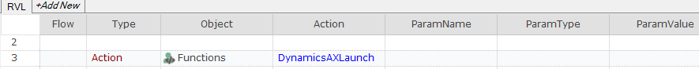
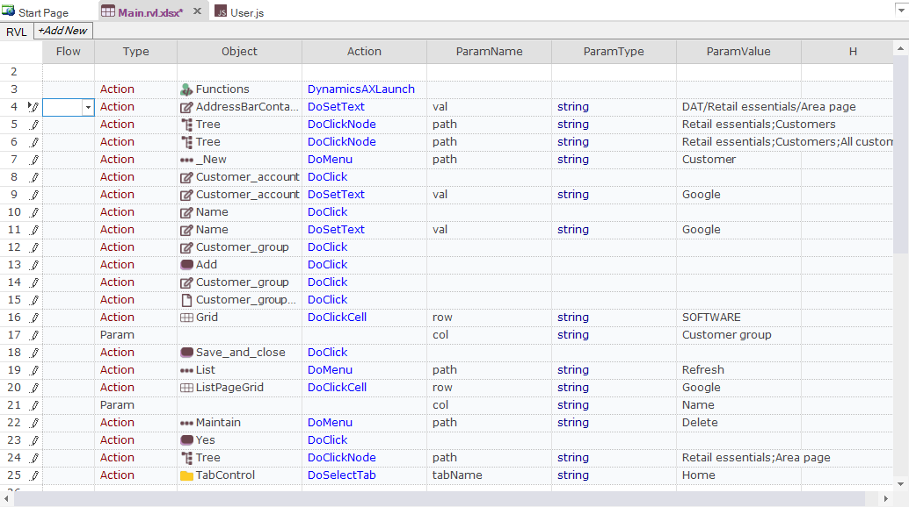
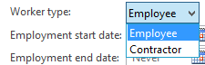
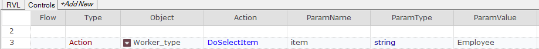
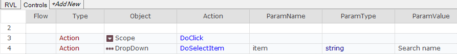
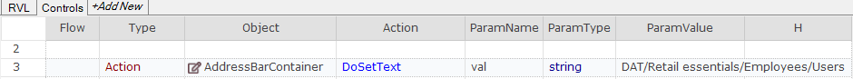
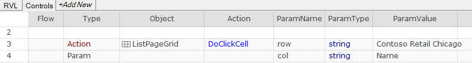
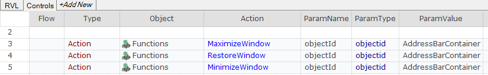
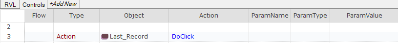
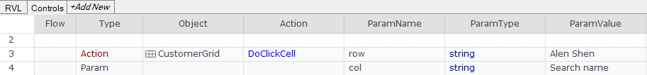

# Dynamics AX

## Overview

**Microsoft Dynamics AX** (usually referred to as just **AX**) is an ERP system for mid-size to large enterprises. It is the most robust, scalable, and functionally rich enterprise resource planning system in the Microsoft Dynamics family of products. The system was originally known as Axapta, owned by the Danish software company Damgaard.

Dynamics AX consists of a client-server architecture with a thick-client ERP interface for entering and adding data in the system:


Rapise includes specialized libraries for testing Dynamics AX applications that are built upon the standard [Microsoft Windows](windows_applications.md) **UIAutomation** library with special extensions for handling [unique AX controls](/Libraries/ses_lib_dynamicsax/) such as tree views, the navigation explorer, and the various grids used to edit data. In addition, Rapise can test the following extensions to Dynamics AX:

- **Dynamics AX Management Reporter** - Rapise can test this extension using its **Generic** [Windows library](windows_applications.md).
- **Dynamics AX Web Portals** - Rapise can test the various web portals using its [web browser libraries](web_testing.md).

## Start Recording a New Test

To start recording a new test, first create a new Basic test and begin a recording session. Choose Dynamics AX from the list of applications:


Then press the `Select` button to start recording. Rapise will automatically load the UIAutomation and DynamicsAX libraries.

- **Microsoft UI Automation** is the new accessibility framework for Microsoft Windows, available on all operating systems that support Windows Presentation Foundation (WPF). UI Automation provides programmatic access to most user interface (UI) elements on the desktop, enabling assistive technology products such as screen readers to provide information about the UI to end users and to manipulate the UI by means other than standard input. UI Automation also allows automated test scripts to interact with the UI. 

- **DynamicsAX** library supports a set of controls specific to the Microsoft Dynamics AX 2012 application. 

Once recording is complete, you can see the attached libraries in the code of `Main.js` file:

```javascript
g_load_libraries=["UIAutomation", "DynamicsAX"];
```

## Automatic Adjustment of `Window Title` Object Property

The main window title of Dynamics AX is dynamic in nature.


It contains not only the application name, but also domain and AOS information, and the session ID. Therefore, it may differ between test recording and test playback. To address this problem, Rapise automatically replaces the actual window title with a regular expression in object properties. Here it is:
    
        regex:.Microsoft Dynamics AX.*

So recorded object properties are automatically adjusted as:


Rapise also automatically sets the `Record Title` in test settings to the same regular expression, so you do not need to choose the Dynamics AX main window during subsequent recording sessions.


## Titles of Child Windows

Child windows in Dynamics AX may also have dynamic titles. Rapise does not know all available patterns, so for child windows, you need to write regular expressions yourself. The good news is that you only need to do this for one object in each such window. For subsequent learned objects, Rapise will automatically change the `window title` property. In other words, when Rapise learns a new object and its `window title` is matched by a regular expression of a previously learned object, the title property is automatically replaced by this regular expression.

## Object Location

The object's location property has the form:

        id1/id2/id3...

where IDs refer to parent objects along the path to the top window object. Sometimes, such IDs can also be dynamic, for example:

        Dimensions display (1 - k13) - Sales order: S30014323, CE15P, Sales order: S30014323/InventDimParmFixed/Pane/View/Style

In this case, change dynamic parts to corresponding regular expressions. In the example above, the updated location looks like:

        regex:Dimensions display.*/InventDimParmFixed/Pane/View/Style

Here is the updated location in the property grid:


## How to Launch the Dynamics AX Client

If you want to check if the Dynamics AX application is installed and running in your test, place this function into `User.js`:

```javascript
function DynamicsAXLaunch()
{
    function _DaxIsRunning()
    {
        var windows = g_util.FindWindows("regex:.Microsoft Dynamics AX.*", "AxMainFrame");
        return windows.length > 0;
    }

    if (_DaxIsRunning())
    {
        Tester.Message("Dynamics AX Client is already running");
        return true;
    }

    var fso = new ActiveXObject("Scripting.FileSystemObject"); 

    var pfFolder = Global.GetSpecialFolderPath("ProgramFilesX86");
    var dynamicsPath = pfFolder + "\\Microsoft Dynamics AX\\60\\Client\\Bin\\Ax32.exe"
    if(!fso.FileExists(dynamicsPath))
    {
        Tester.Message("Dynamics AX Client is not installed on this computer");
        return false;
    }

    Global.DoLaunch(dynamicsPath);

    for(var i = 0; i < 60; i++)
    {
        if (_DaxIsRunning())
        {
            Tester.Message("Dynamics AX Client started successfully");
            return true;
        }
        Global.DoSleep(1000);
    }

    Tester.Message("Dynamics AX Client did not start");
    return false;
}
```

You can now use this function in RVL:



and in JavaScript:

```javascript
DynamicsAXLaunch();
```

## Recording Actions and Learning Objects

During recording, as you interact with Dynamics AX controls, Rapise captures actions and displays them in the recording dialog.


Once recording is finished, Rapise automatically generates the test.

In [Rapise Visual Language (RVL)](/RVL/Overview/), it looks like:



In JavaScript:

```javascript
function Test(params)
{
    DynamicsAXLaunch();
    SeS('AddressBarContainer').DoSetText("DAT/Retail essentials/Area page");
    SeS('Tree').DoClickNode("Retail essentials;Customers");
    SeS('Tree').DoClickNode("Retail essentials;Customers;All customers");
    SeS('_New').DoMenu("Customer");
    SeS('Customer_account').DoClick();
    SeS('Customer_account').DoSetText("Google");
    SeS('Name').DoClick();
    SeS('Name').DoSetText("Google");
    SeS('Customer_group').DoClick();
    SeS('Add').DoClick();
    SeS('Customer_group').DoClick();
    SeS('Customer_group_lookup_button').DoClick();
    SeS('Grid').DoClickCell("SOFTWARE", "Customer group");
    SeS('Save_and_close').DoClick();
    SeS('List').DoMenu("Refresh");
    SeS('ListPageGrid').DoClickCell("Google", "Name");
    SeS('Maintain').DoMenu("Delete");
    SeS('Yes').DoClick();
    SeS('Tree').DoClickNode("Retail essentials;Area page");
    SeS('TabControl').DoSelectTab("Home");
}
```

If Rapise does not capture an interaction or captures it incorrectly, then try to [learn](object_learning.md) the object. In this case, Rapise will add it to the object tree but will not capture the action, requiring you to add the code to the test manually later. To learn an object during a recording session, place the mouse cursor over it and press the ++ctrl+2++ shortcut. It is advisable to pause recording before learning objects. This will prevent Rapise from intercepting mouse and keyboard input and attempting to record your interactions. The `Pause/Resume` button is located on the right side of the [Recording Activity dialog](recording_activity_dialog.md).

## Tips for Interacting with Objects

## Text Box

To allow Rapise to capture the entered text, interact with a text box in two steps:

1. Click into the edit box
2. Type text using keyboard

## ComboBox

Dynamics AX has several types of combo boxes.

### Standard Combo Box

Standard combo boxes, like `Worker type` in the `Hire New Worker` form.
  


Rapise treats such combo boxes as atomic objects and records them as [DynamicsAXComboBox](/Libraries/ses_lib_dynamicsax/DynamicsAXComboBox.js). To record interaction with the combo box:

1. Click on the combo box to expand the dropdown with choices
2. Select a value from the list

The generated script step looks like:

**RVL**



**JavaScript**

```javascript
SeS('Worker_type').DoSelectItem("Employee");
```

### Table Filter Combo

A table filter combo is recognized as a pair of objects: `Scope` and `DropDown`. The `Scope` object is of type [DynamicsAXMenuItem](/Libraries/ses_lib_dynamicsax/DynamicsAXMenuItem.js) and is used to open the `DropDown` object of type [DynamicsAXMenuDropDownList](/Libraries/ses_lib_dynamicsax/DynamicsAXMenuDropDownList.js).


The recorded steps look like:

**RVL**



**JavaScript**

```javascript
//User clicks 'Scope'
SeS('Scope').DoClick();
//DropDown item selected:'Search name'
SeS('DropDown').DoSelectItem("Search name");
```

### Lookup Field

A lookup field consists of an edit box, an open button, and a dropdown table. Record lookup interactions in three steps:

1. Click the edit field. Recorded as [DynamicsAXTextBox](/Libraries/ses_lib_dynamicsax/DynamicsAXTextBox.js).
2. Click the open button. Recorded as [UIAObject](/Libraries/ses_lib_dynamicsax/UIAObject.js).
3. Click the value in the dropdown grid. Recorded as [DynamicsAXTable](/Libraries/ses_lib_dynamicsax/DynamicsAXTable.js).


**RVL**


**JavaScript**

```javascript
// Click on the edit box
SeS('Customer_group').DoClick();
// Click open button
SeS('Customer_group_lookup_button').DoClick();
// Select value from the dropdown grid using column name (Customer group) and value (SOFTWARE)
SeS('Grid').DoClickCell("SOFTWARE", "Customer group");
```

## Address Bar

Click in an empty area of the address bar and enter the address to which you want to navigate. Rapise will capture the [DynamicsAXAddressBar](/Libraries/ses_lib_dynamicsax/DynamicsAXAddressBar.js) object and record the `DoSetText` action.


**RVL**



**JavaScript**

```javascript
SeS('AddressBarContainer').DoSetText('DAT/Retail essentials/Employees/Users');
```

## Menu

Rapise supports both recording and learning for the main menu. When recording, make sure you click on every component along the path. For example, if you want to navigate to `File > View > Modules > General ledger`. During recording, click on `File`, `View`, `Modules`, and `General ledger`. The captured menu object has the type [DynamicsAXMenu](/Libraries/ses_lib_dynamicsax/DynamicsAXMenu.js). The generated script looks like:

**RVL**


**JavaScript**

```javascript
//Menu item selected:'General ledger'
SeS('File').DoMenu("File;View;Modules;General ledger");
```

Rapise captures the menu as a top-level object (`File` in the example above). Notice that menu path components are separated by `;`. For example, if you want to open the menu `File > Tools > Telephone list`, then use `File;Tools;Telephone list` as the `path` parameter.

## Table

Rapise recognizes Dynamics AX grids as a [DynamicsAXTable](/Libraries/ses_lib_dynamicsax/DynamicsAXTable.js).


When you click on a cell in a table, Rapise records the column name and value in the cell. The generated click step looks like:

**RVL**



**JavaScript**

```javascript
SeS('ListPageGrid').DoClickCell("Contoso Retail Chicago", "Name");
```

Rapise can click cells based on column name and value, as well as using column and row indexes. Rapise can also read column names, column count, and row count. Check [DynamicsAXTable](/Libraries/ses_lib_dynamicsax/DynamicsAXTable.js) for more details.

## Infolog

In some cases, Dynamics AX can report an error using the Infolog window.


To obtain the text of the messages in this window, learn the Tree object by placing the cursor over the error text and pressing the ++ctrl+2++ shortcut. The object is learned as a [UIATree](/Libraries/ses_lib_dynamicsax/UIATree.js). In the case of the Infolog tree, all nodes are immediate children of the root. So, in the example shown in the image above, the tree contains two child nodes of the tree node. To get the number of messages and read individual messages, use the `GetChildrenCount` and `GetChildAt` actions of [UIATree](/Libraries/ses_lib_dynamicsax/UIATree.js).

**RVL**


**JavaScript**

```javascript
// Get the number of messages in the infolog.
// For the presented example it returns 2.
var messageCount = SeS('InfologTree').GetChildrenCount();

// Get second message text, returns "Field 'User ID' must be filled in."
var messageText = SeS('Tree').GetChildAt(0, 1);
```

## Type to filter Field

Almost every standard grid in Dynamics AX has a text field for filtering grid data.


When you learn this field, it has the name `Type to filter`.


However, when this field gets focus, its name changes to `Text box`. To enable Rapise to find this field during playback, set the `Ignore Object Name` property of the object to `True`.


## Dynamics AX Cookbook

## Maximize/Minimize/Restore Window

You can maximize a window using any object inside it as a starting point. In the examples below, we will use the object with the ID `AddressBarContainer`.

First, place the following code into your `User.js`:

```javascript
function MaximizeWindow(/**objectId*/ objectId)
{
    SeS(objectId).getDesktopWindow().Maximized = true;
}

function MinimizeWindow(/**objectId*/ objectId)
{
    SeS(objectId).getDesktopWindow().Maximized = false;
}

function RestoreWindow(/**objectId*/ objectId)
{
    SeS(objectId).getDesktopWindow().Iconic = false;
}
```

Now you can use these functions in RVL and JavaScript.

**RVL**



**JavaScript**

```javascript
MaximizeWindow("AddressBarContainer");
RestoreWindow("AddressBarContainer");
MinimizeWindow("AddressBarContainer");
```

## Scroll to the Bottom of a Grid

If your grid looks like this and you want to scroll to its last record, learn the `Last Record` button and click on it during test playback.


**RVL**



**JavaScript**

```javascript
SeS('Last_Record').DoClick();
```

## Scroll and Click on a Cell in a Grid

If you know the value of a cell in a grid, Rapise will automatically scroll the grid before clicking.

  

Assume that you want to click on a cell with the value `Alen Shen` in the `Search name` column. This cell is not visible in the picture and requires scrolling to become visible. The following script performs the click:

**RVL**



**JavaScript**

```javascript
SeS('CustomerGrid').DoClickCell("Alen Shen", "Search name");
```

If you do not know the value of a cell, you can retrieve it this way:

**RVL**


**JavaScript**

```javascript
var cellValue = SeS('CustomerGrid').GetCell(9, "Search name");
Tester.Message(cellValue);
```

Where `9` is the row number.

## See Also

- [Microsoft Dynamics](microsoft_dynamics.md)
- [Get the framework for testing Dynamics AX (github)](https://github.com/Inflectra/rapise-dynamics-ax)
- [KB: If recording of actions in Dynamics AX or Dynamics NAV does not work](https://www.inflectra.com/Support/KnowledgeBase/KB411.aspx)
- [KB: Creating a Purchase Order in Dynamics AX](https://www.inflectra.com/Support/KnowledgeBase/KB391.aspx)
- [KB: Rapise Tips, Tricks & Workarounds when Testing Dynamics AX 2012](https://www.inflectra.com/Support/KnowledgeBase/KB273.aspx)
- [KB: How to ensure that a Fast Tab is expanded and scrolled into view in Dynamics AX](https://www.inflectra.com/Support/KnowledgeBase/KB412.aspx)
- [KB378 RPA - importing data into Dynamics AX](https://www.inflectra.com/Support/KnowledgeBase/KB378.aspx)
- [Webinar: Testing Microsoft Dynamics AX with Rapise](https://youtu.be/KH1-WVqHZ5k)
- [Webinar: Test Automation & RPA for Dynamics AX with Rapise](https://youtu.be/L_2ibVvPTJA)
- [Dynamics AX Sample Tests with source and recording/playback video links](https://github.com/Inflectra/rapise-dynamics-samples)