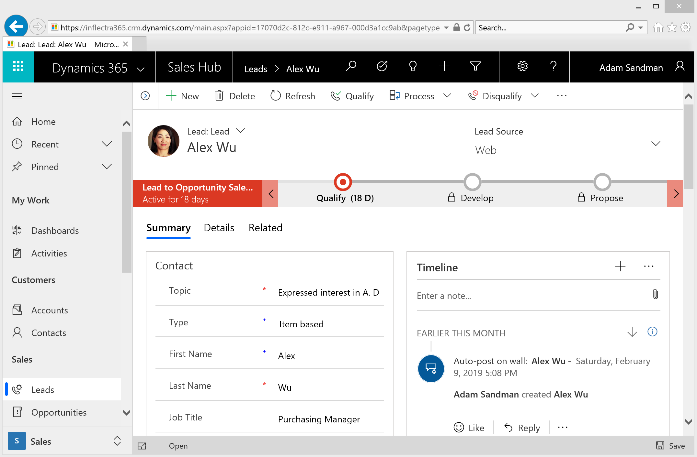
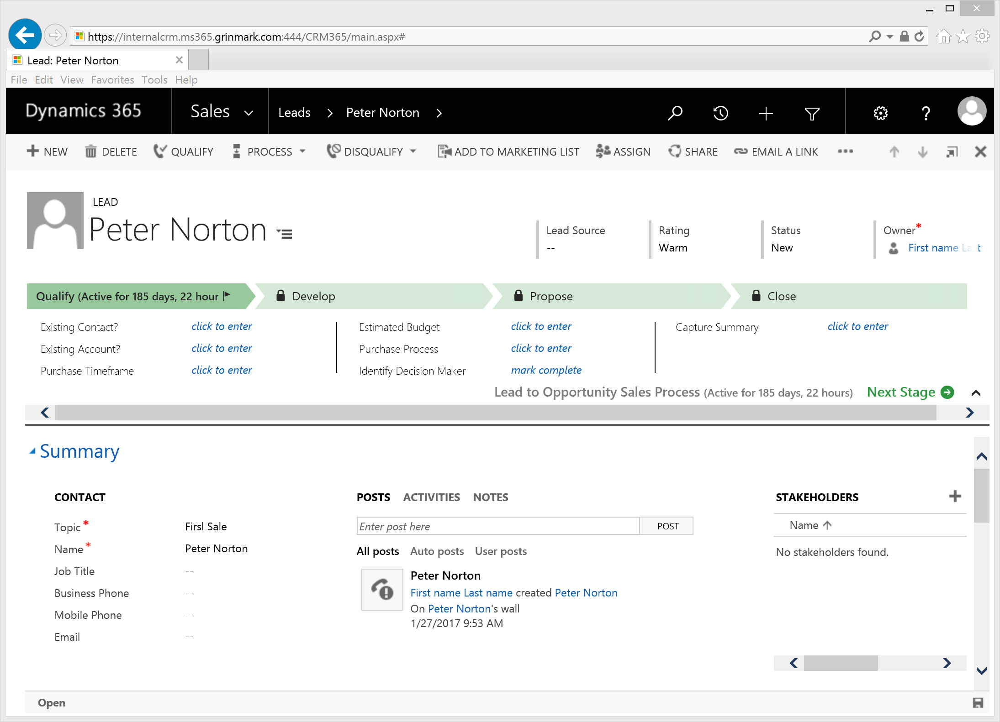
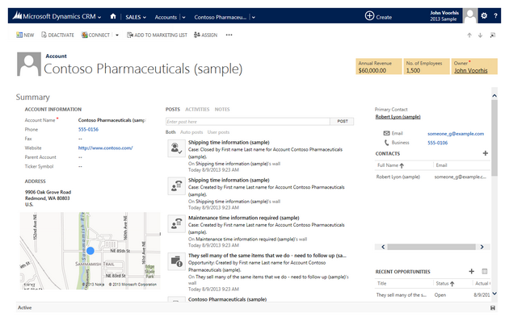
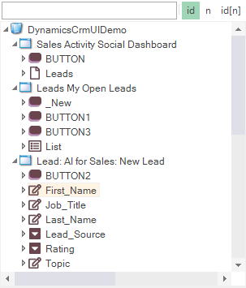
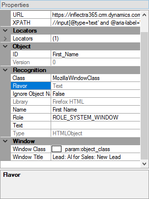
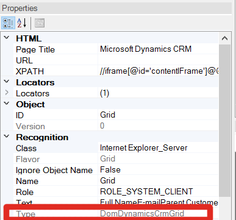
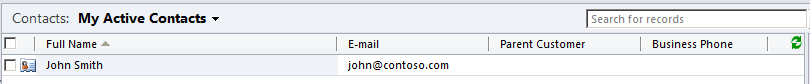
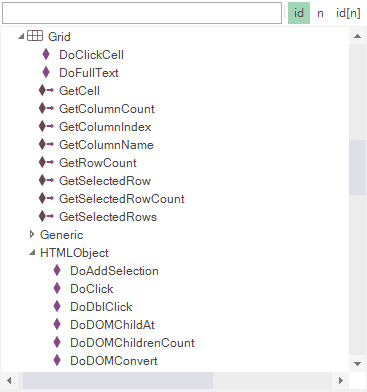

# Dynamics CRM/365 for Sales

## Overview

**Microsoft Dynamics CRM** is a customer relationship management application from Microsoft, that provides sales, service, and marketing capabilities. Microsoft sells Dynamics CRM separately from the ERP products. CRM is available either as on-premises software or as a software-as-a-service offering called **Microsoft Dynamics CRM Online**. Rapise can be used to test installations of Dynamics CRM both on-premise and online.

Latest version of Dynamics CRM is called **Dynamics 365 for Sales**. It is also supported. Rapise can handle both **Web** and **Unified Interface**.

## Dynamics 365 for Sales - Unified Interface



## Legacy

### Dynamics 365 for Sales - Web Interface



### Dynamics CRM On-Premise


### Dynamics CRM Online



## Recording a Test

All  versions of Dynamics CRM are completely web-based and use a web browser to access the user interface. Therefore when recording a test using Rapise, you use the same web browser libraries that you use to record other [web tests](web_testing.md):

- Most of the Dynamics CRM user interface will be tested using the **standard browser library** for your web browser of choice (e.g. Internet Explorer HTML, Firefox HTML, and Chrome HTML).
- In addition, there are special controls inside CRM that Rapise has specialized support for. For that reason you'll also see the **DomDynamicsCrm** library added to your test as well as the browser one. This **DomDynamicsCrm** library adds additional rules that identify certain CRM objects to make testing easier.

When you record your first test, you'll get the following library selection code generated automatically by Rapise:

```javascript
g_load_libraries=["%g_browserLibrary:Chrome HTML%", "DomDynamicsCrm"];
```

If you don’t see the **DomDynamicsCrm** library listed in your test, then you will need to [manually add it](change_the_libraries_being_use.md).

## Recording and Learning Objects

During recording while you interact with Dynamics CRM/365, Rapise captures objects and displays them in the [object tree](object_learning.md):



Some of these objects will be standard HTML DOM objects (e.g. text field):



and others will be specific to Dynamics CRM/365:



## Tips for Interacting with Objects

The following unique objects are available within Dynamics CRM/365 that Rapise has special support for:

### Dynamics CRM/365 Grid

One of the the most important UI elements inside Dynamics CRM/365 is the sortable, filterable grid:



The Dynamics CRM/365 Grid is used in lots of different screens inside Dynamics CRM/365 (e.g. Leads, Accounts, etc.) and it is very common to need to interact with it in test scripts.

When you record operations on such a grid or simply learn the entire grid using `CTRL+2` you will learn the [DomDynamicsCrmGrid](/Libraries/DomDynamicsCrmGrid/) or [DomDynamicsCrmUnifiedInterfaceGrid](/Libraries/DomDynamicsCrmUnifiedInterfaceGrid/) object:



## See Also

- [Microsoft Dynamics](microsoft_dynamics.md)
- [Tips & Tricks for Rapise and Dynamics 365 for Sales (Web Interface)](https://www.inflectra.com/support/knowledgebase/kb277.aspx)
- [KB: How to automate testing of Unified Service Desk for Microsoft Dynamics 365](https://www.inflectra.com/Support/KnowledgeBase/KB362.aspx)
- [Webinar: Testing Dynamics CRM & 365 for Sales using Rapise](https://youtu.be/49DpIhpFLx8)