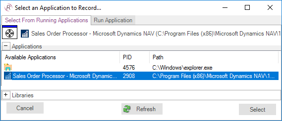
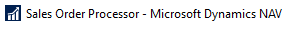
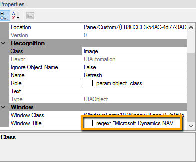
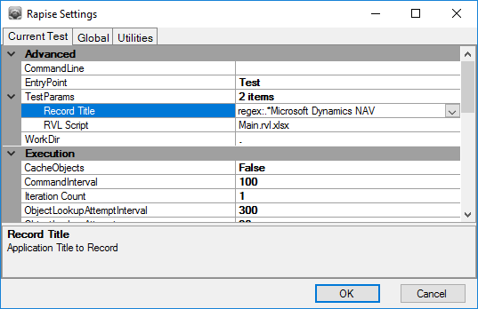
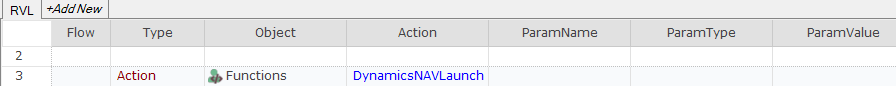
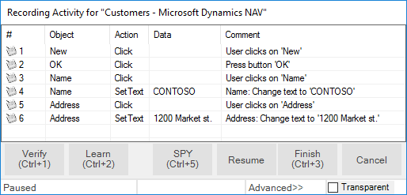
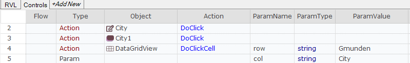
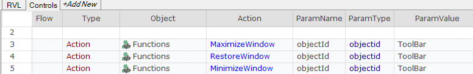
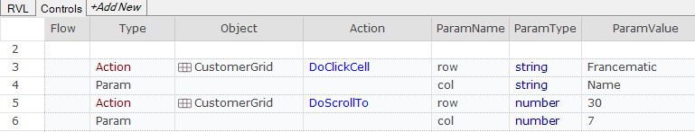

# Dynamics NAV

## Overview

In this guide we describe how to master tests for Dynamics NAV desktop client using Rapise.

**Microsoft Dynamics NAV** is an enterprise resource planning (ERP) software suite for midsize organizations. The system offers specialized functionality for manufacturing, distribution, government, retail, and other industries.

### Dynamics NAV Web Client Testing Note

Dynamics 365 Business Central is a successor of Dynamics NAV 2017 Web Client. Both solutions were built by Microsoft using same technology though they have a few differences. Rapise includes a library [DomDynamicsNAV](/Libraries/ses_lib_dynamicsnav/) which makes test recording and playback of Dynamics NAV web clients a pleasant thing. [From this post](https://www.inflectra.com/Support/KnowledgeBase/KB349.aspx) you will learn basics of recording a reliable test for these solutions as well as test playback troubleshooting methods. We'll use Dynamics 365 Business Central as system under test.

## Start Recording a New Test

First you need to create a new Basic test and start recording session. Choose Dynamics NAV from the list of applications:



Then press `Select` button to start recording. When recording is completed you will see that Rapise automatically attached necessary libraries in the code of `Main.js` file:

```javascript
    g_load_libraries=["UIAutomation", "DynamicsNAV"];
```

- **Microsoft UI Automation** is the new accessibility framework for Microsoft Windows, available on all operating systems that support Windows Presentation Foundation (WPF). UI Automation provides programmatic access to most user interface (UI) elements on the desktop, enabling assistive technology products such as screen readers to provide information about the UI to end users and to manipulate the UI by means other than standard input. UI Automation also allows automated test scripts to interact with the UI. 

- **DynamicsNAV** library supports set of controls specific to Microsoft Dynamics NAV application.

## Automatic Adjustment of `Window Title` Object Property

Main window title of Dynamics NAV is dynamic by nature.



It may contain not only application name but also name of currently active page or information about currently opened record. So it can be different at the time of test recording and test playback. To cope with this problem Rapise automatically replaces actual window title with a regular expression. You can see it in the object tree and properties of captured objects.



Here it is:

        regex:.*Microsoft Dynamics NAV

Also Rapise adjusts `Record Title` in test settings to the same regular expression so you do not need to choose the Dynamics NAV main window during subsequent recording sessions.



### Titles of Child Windows

Child windows of Dynamics NAV also may have dynamic titles.


Rapise tries to generate a regular expression for such titles as well. If it does not do so - write the expression yourself. But the good news is you need to do this for one object only in every such window. For further learned objects Rapise will change the `window title` property automatically. In other words when Rapise learns a new object and it's `window title` is matched by a regular expression of a previously learned object then the title property is automatically replaced by this regular expression.

## How to Launch Dynamics NAV Client

If in your test you want to check that Dynamics NAV application is installed and running place this function into `User.js`:

```javascript
function DynamicsNAVLaunch()
{
    function _NavIsRunning()
    {
        var windows = g_util.FindWindows("regex:.*Microsoft Dynamics NAV", "regex:WindowsForms10.*");
        return windows.length > 0;
    }

    if (_NavIsRunning())
    {
        Tester.Message("Dynamics NAV Client is already running");
        return true;
    }

    var fso = new ActiveXObject("Scripting.FileSystemObject"); 

    var pfFolder = Global.GetSpecialFolderPath("ProgramFilesX86");
    var dynamicsPath = pfFolder + "\\Microsoft Dynamics NAV\\100\\RoleTailored Client\\Microsoft.Dynamics.Nav.Client.exe"
    if(!fso.FileExists(dynamicsPath))
    {
        Tester.Message("Dynamics NAV Client is not installed on this computer");
        return false;
    }

    Global.DoLaunch(dynamicsPath);

    for(var i = 0; i < 60; i++)
    {
        if (_NavIsRunning())
        {
            Tester.Message("Dynamics NAV Client started successfully");
            return true;
        }
        Global.DoSleep(1000);
    }

    Tester.Message("Dynamics NAV Client did not start");
    return false;
}
```

You can now use this function in RVL



and in JavaScript:

```javascript
DynamicsNAVLaunch();
```

## Recording Actions and Learning Objects

During recording while you interact with Dynamics NAV controls Rapise captures actions and displays them in the recording dialog.



After this recording session corresponding UI area looks as follows:


When recording is finished Rapise automatically generates the test.

In [Rapise Visual Language(RVL)](/RVL/Overview/) it looks like


In JavaScript:

```javascript
function Test()
{
    SeS('_New').DoClick();
    SeS('OK').DoAction();
    SeS('Name').DoClick();
    SeS('Name').DoSetText("CONTOSO");
    SeS('Address').DoClick();
    SeS('Address').DoSetText("1200 Market St");
}
```

If Rapise does not capture any interaction or captures it wrongly then try to [learn](object_learning.md) the object. In this case Rapise will add it to the object tree but will not capture the action and you'll add the code to the test manually later. To learn an object during recording session place mouse cursor over it and press `Ctrl+2` shortcut. It makes sense to pause recording before learning objects. This will prevent Rapise from intersecting mouse and keyboard and attempting to record interactions you do. `Pause/Resume` button is located at the right side of the [Recording Activity dialog](recording_activity_dialog.md).

## Tips for Interacting with Objects

## Text Box

To allow Rapise to capture the entered text interact with a text box in two steps:

1. Click into the edit box
2. Type text using keyboard

## ComboBox

Dynamics NAV combo box consists of three elements:

- edit box,
- open button
- and a dropdown table.


For reliable recording of combo box interactions follow these steps:

- click on the edit box,
- click on the open button,
- click on a cell in the table.

Rapise will record this as:

**RVL**



**JavaScript**

```javascript
// Click on the edit box
SeS('City').DoClick);
// Click on the open button
SeS('City1').DoAction();
// Select city in the table, choose "Gmunden" value in the column "City"
SeS('DataGridView').DoClickCell("Gmunden", "City");
```

## Table

Rapise has complete support for Dynamics NAV grids/tables. It recognizes Dynamics NAV grids as [DynamicsNAVTable](/Libraries/DynamicsNAVTable/) object. Rapise can record user clicks on cells and also provides API to get the number of rows, columns, get column name by index.

When you click on a cell in a table Rapise records column name and value in the cell. The generated click step looks like:

**RVL**


**JavaScript**

```javascript
SeS('DataGridView').DoClickCell("Gmunden", "City");
```

Rapise can click cells based on column name and value as well as using column and row indexes. Also Rapise can read column names, column count and row count. Check  [DynamicsNAVTable](/Libraries/DynamicsNAVTable/) for more details.

Here is an example of interacting with a grid.

```javascript
var grid = SeS('DataGridView');

var cell = grid.GetCell(3, "Name");
Tester.Message(cell);

var colValues = grid.GetColumnValues(2, 10);
Tester.Message(colValues.join(','));

grid.DoClickCell("Bilabankinn", "Name");
grid.DoClickColumn(1);
grid.DoClickColumn("Name");

var rowCount = grid.GetRowCount();
Tester.Message(rowCount);

var colCount = grid.GetColumnCount();
Tester.Message(colCount);
for(var i = 0; i < colCount; i++)
{
    var colName = grid.GetColumnName(i);
    Tester.Message("\"" + colName + "\"");
    var colIndex = grid.GetColumnIndex(colName);
    Tester.Message(colIndex);
}
```

## Dynamics NAV Cook Book

## Maximize/Minimize/Restore Window

You can maximize a window using any object inside it as a starting point. In the examples below we will use the object with id `ToolBar`.

First place the following code into your `User.js`:

```javascript
function MaximizeWindow(/**objectId*/ objectId)
{
    SeS(objectId).getDesktopWindow().Maximized = true;
}

function MinimizeWindow(/**objectId*/ objectId)
{
    SeS(objectId).getDesktopWindow().Maximized = false;
}

function RestoreWindow(/**objectId*/ objectId)
{
    SeS(objectId).getDesktopWindow().Iconic = false;
}
```

Now you can use these functions in RVL and JavaScript.

**RVL**



**JavaScript**

```javascript
MaximizeWindow("ToolBar");
RestoreWindow("ToolBar");
MinimizeWindow("ToolBar");
```

## Scroll to a Specific Row of a Grid

Generally Dynamics NAV grids do not allow accessing cells which are not currently visible on screen. Using scrolling it is possible to make a specific row/column of a grid visible. If you perform [DoClickCell](/Libraries/DynamicsNAVTable/#DoClickCell) action Rapise will automatically ensure that the cell is visible on screen. There is also explicit scroll action [DoScrollTo](/Libraries/DynamicsNAVTable/#DoScrollTo).

**RVL**



**JavaScript**

```javascript
SeS('CustomerGrid').DoClickCell("Francematic", "Name");
SeS('CustomerGrid').DoScrollTo(30, 7);
```

## See Also

- [Microsoft Dynamics](microsoft_dynamics.md)
- [KB: How to start Dynamics NAV client](https://www.inflectra.com/Support/KnowledgeBase/KB314.aspx)
- [KB: If recording of actions in Dynamics AX or Dynamics NAV does not work](https://www.inflectra.com/Support/KnowledgeBase/KB411.aspx)
- [KB: How to record entering of data into Dynamics NAV tables](https://www.inflectra.com/Support/KnowledgeBase/KB347.aspx)
- [KB: How to ensure that a Fast Tab is expanded and scrolled into view in Dynamics NAV](https://www.inflectra.com/Support/KnowledgeBase/KB366.aspx)
- [Webinar: Testing Microsoft Dynamics NAV with Rapise](https://youtu.be/IxwxLqJZdCc)
- [Webinar: Testing MS Dynamics NAV & Robotic Process Automation with Rapise](https://youtu.be/71k_w8FU9T8)