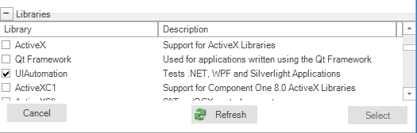
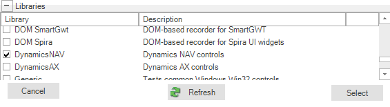
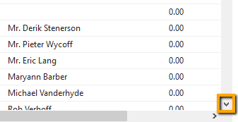
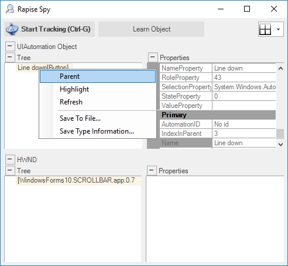
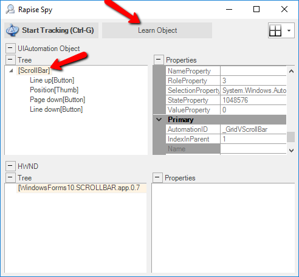
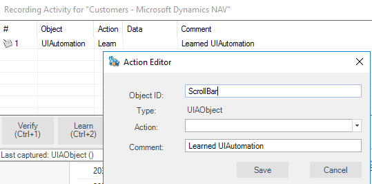

# Dynamics NAV

## Overview

In this guide we describe how to master tests for Dynamics NAV desktop client using Rapise.

**Microsoft Dynamics NAV** is an enterprise resource planning (ERP) software suite for midsize organizations. The system offers specialized functionality for manufacturing, distribution, government, retail, and other industries.

### Dynamics NAV Web Client Testing Note

Dynamics 365 Business Central is a successor of Dynamics NAV 2017 Web Client. Both solutions were built by Microsoft using same technology though they have a few differences. Rapise includes a library **DomDynamicsNAV** which makes test recording and playback of Dynamics NAV web clients a pleasant thing. [From this post](https://www.inflectra.com/Support/KnowledgeBase/KB349.aspx) you will learn basics of recording a reliable test for these solutions as well as test playback troubleshooting methods. We'll use Dynamics 365 Business Central as system under test.

## Start Recording a New Test

First you need to create a new Basic test and start recording session. Choose Dynamics NAV from the list of applications:


Then expand the list of `libraries` and select `UIAutomation` and `DynamicsNAV` libraries.





Then press `Select` button to start recording.

- **Microsoft UI Automation** is the new accessibility framework for Microsoft Windows, available on all operating systems that support Windows Presentation Foundation (WPF). UI Automation provides programmatic access to most user interface (UI) elements on the desktop, enabling assistive technology products such as screen readers to provide information about the UI to end users and to manipulate the UI by means other than standard input. UI Automation also allows automated test scripts to interact with the UI. 

- **DynamicsNAV** library supports set of controls specific to Microsoft Dynamics NAV application. 

When recording is completed you can see attached libraries in the code of `test.js` file:

```javascript
    g_load_libraries=["UIAutomation", "DynamicsNAV"];
```

## Automatic Adjustment of `Window Title` Object Property

Main window title of Dynamics NAV is dynamic by nature.


It may contain not only application name but also name of currently active page or information about currently opened record. So it can be different at the time of test recording and test playback. To cope with this problem replace actual window title with a regular expression in object properties. Here it is:
    
        regex:.*Microsoft Dynamics NAV

So recorded object properties look like this:


Also adjust `Record Title` in test settings to the same regular expression so you do not need to choose the Dynamics NAV main window during subsequent recording sessions.


### Titles of Child Windows

Child windows of Dynamics NAV also may have dynamic titles.


 So for child windows you need to write regular as well. But the good news is you need to do this for one object only in every such window. For further learned objects Rapise will change the `window title` property automatically. In other words when Rapise learns a new object and it's `window title` is matched by a regular expression of a previously learned object then the title property is automatically replaced by this regular expression.

## How to Launch Dynamics NAV Client

If in your test you want to check that Dynamics NAV application is installed and running use the code:

```javascript
var fso = new ActiveXObject("Scripting.FileSystemObject"); 

var pfFolder = Global.GetSpecialFolderPath("ProgramFilesX86");
var dynamicsPath = pfFolder + "\\Microsoft Dynamics NAV\\100\\RoleTailored Client\\Microsoft.Dynamics.Nav.Client.exe"
if(!fso.FileExists(dynamicsPath))
{
    Tester.Message("Dynamics NAV Client is not installed on this computer");
    return;
}

var windows = g_util.FindWindows("regex:.*Microsoft Dynamics NAV", "regex:WindowsForms10.*");
if (windows.length == 0)
{
    Tester.Message("Dynamics NAV Client is not started. Please start it manually and re-run the test.");
    return;
}
```

To start the application use

```javascript
var pfFolder = Global.GetSpecialFolderPath("ProgramFilesX86");
var dynamicsPath = pfFolder + "\\Microsoft Dynamics NAV\\100\\RoleTailored Client\\Microsoft.Dynamics.Nav.Client.exe"

Global.DoLaunch(dynamicsPath);
```

## Recording Actions and Learning Objects

During recording while you interact with Dynamics NAV controls Rapise captures actions and displays them in the recording dialog.


After this recording session corresponding UI area looks as follows:


When recording is finished Rapise automatically generates the test code:

```javascript
function Test()
{
    SeS('_New').DoLClick(9, 27);
    SeS('OK').DoAction();
    SeS('Name').DoLClick(29, 7);
    SeS('Name').DoSetText("CONTOSO");
    SeS('Address').DoLClick(109, 3);
    SeS('Address').DoSetText("1200 Market St");
}
```

If Rapise does not capture any interaction or captures it wrongly then try to learn the object. In this case Rapise will add it to the object tree but will not capture the action and you'll add the code to the test manually later. To learn an object during recording session place mouse cursor over it and press `Ctrl-2` shortcut. It makes sense to pause recording before learning objects. This will prevent Rapise from intersecting mouse and keyboard and attempting to record interactions you do. `Pause/Resume` button is located at the right side of the Recording dialog.

## Tips for Interacting with Objects

### Text Box

To allow Rapise to capture the entered text interact with a text box in two steps:

1. Click into the edit box
2. Type text using keyboard

### ComboBox

Dynamics NAV combo box consists of three elements:

- edit box,
- open button
- and a dropdown table.


For reliable recording of combo box interactions follow these steps:

- click on the edit box,
- click on the open button,
- click on a cell in the table.

Rapise will record this as:

```javascript
// Click on the edit box
SeS('City').DoLClick(115, 10);
// Click on the open button
SeS('City1').DoAction();
// Select city in the table, choose "Gmunden" value in the column 1 (zero-based)
SeS('DataGridView').DoClickCell("Gmunden", 1);
```

### Table

Rapise has complete support for Dynamics NAV grids/tables. It can record user clicks on cells and also provides API to get the number of rows, columns, get column name by index, etc. API reference is available in the Rapise Help file.

Here is an example of interacting with grid.

```javascript
var grid = SeS('DataGridView');

var cell = grid.GetCell(3, "Name");
Tester.Message(cell);

var colValues = grid.GetColumnValues(2, 10);
Tester.Message(colValues.join(','));

grid.DoClickCell("Bilabankinn", "Name");
grid.DoClickColumn(1);
grid.DoClickColumn("Name");

var rowCount = grid.GetRowCount();
Tester.Message(rowCount);

var colCount = grid.GetColumnCount();
Tester.Message(colCount);
for(var i = 0; i < colCount; i++)
{
    var colName = grid.GetColumnName(i);
    Tester.Message("\"" + colName + "\"");
    var colIndex = grid.GetColumnIndex(colName);
    Tester.Message(colIndex);
}
```

## Dynamics NAV Cook Book

### Maximize/Minimize/Restore Window

You can maximize a window using any object inside it as a starting point.

```javascript
    SeS('Refresh').getDesktopWindow().Maximized = true;
```

To minimize use

```javascript
    SeS('Refresh').getDesktopWindow().Maximized = false;
    // or
    SeS('Refresh').getDesktopWindow().Iconic = true;
```

For restoring (to go back to a smaller window from maximized or minimized state) use

```javascript
    SeS('Refresh').getDesktopWindow().Iconic = false;
```

### Scroll to a Specific Row of a Grid

Generally Dynamics NAV grids do not allow accessing cells which are not currently visible on screen. Using scrolling it is possible to make a specific row of a grid visible. This is a multi-step process.

#### Step 1

Scroll to the top of the grid.

```javascript
    // Get a reference to the grid
    var grid = SeS('DataGridView');
    // Send Ctrl+HOME combination to scroll to the top of the grid
    grid.DoSendKeys('^{HOME}');
```

#### Step 2

Scroll line by line to a given row.

'Line down' scroll button is an object with dynamic location.



ilAfter each button click it's location changes. At the beginning it can be (... - means skipped part of the location which is not important for illustration):

```javascript
.../_GridVScrollBar/No id[1]
```

After first click it is:

```javascript
.../_GridVScrollBar/No id[2]
```

So using this button is unreliable since it won't be found second time during test playback.

Instead we suggest to use scroll bar itself and click on it's low end. It is not possible to learn the scroll bar directly because under cursor we always get it's child parts (buttons, slider, etc.). Learn scroll bar using Spy.

Start recording and launch Spy from `Recording Activity Dialog`.


In Spy start tracking by pressing `Ctrl-G`, place mouse over `Line down` button and press `Ctrl-G` again. `Line down` object will be displayed in the UI Automation panel.



Right click on it and choose `Parent`. Then click on `ScrollBar` object and press `Learn Object` button.



 `ScrollBar` will be added to the `Recording Activity Dialog`. Default captured name of the object is `UIAutomation`. Change it to `ScrollBar`.

 

Finish recording and `ScrollBar` will be added to the object tree of the test opened in Rapise.


Now we can write scrolling code.

```javascript
var sb = SeS('ScrollBar');
// We want row 50 to be visible
var scrollToRow = 50;
for(var i = 0; i < scrollToRow; i++)
{
    // Click on the low end of the scroll bar, this is where line down button is located
    // Use underscore in '_DoClick' to exclude this action from report
    sb._DoClick(10, sb.GetHeight() - 10);
}
```

Sometimes it is needed to scroll through all row to the bottom. Here is complete solution.

```javascript
var grid = SeS('DataGridView');
var sb = SeS('ScrollBar');
grid.DoSendKeys('^{HOME}');
var rowCount = 1;
for(var i = 0; i < rowCount; i++)
{
    // Recalculate total number of rows since Dynamics NAV may sometimes report greater number in the beginning and then change its mind
    rowCount = grid.GetRowCount();

    // Scroll one line
    sb._DoClick(10, sb.GetHeight() - 10);
}
```

## See Also

- [Microsoft Dynamics](microsoft_dynamics.md)
- [KB: How to start Dynamics NAV client](https://www.inflectra.com/Support/KnowledgeBase/KB314.aspx)
- [KB: If recording of actions in Dynamics AX or Dynamics NAV does not work](https://www.inflectra.com/Support/KnowledgeBase/KB411.aspx)
- [KB: How to scroll Dynamics NAV table vertically and horizontally](https://www.inflectra.com/Support/KnowledgeBase/KB343.aspx)
- [KB: How to record entering of data into Dynamics NAV tables](https://www.inflectra.com/Support/KnowledgeBase/KB347.aspx)
- [KB: How to ensure that a Fast Tab is expanded and scrolled into view in Dynamics NAV](https://www.inflectra.com/Support/KnowledgeBase/KB366.aspx)
- [Webinar: Testing Microsoft Dynamics NAV with Rapise](https://youtu.be/IxwxLqJZdCc)
- [Webinar: Testing MS Dynamics NAV & Robotic Process Automation with Rapise](https://youtu.be/71k_w8FU9T8)