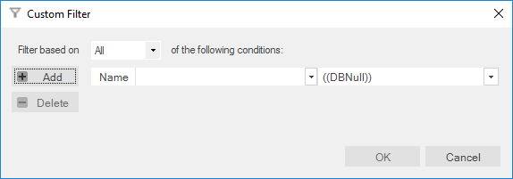
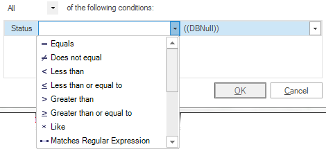
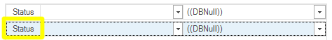

# Enter filter criteria for... Dialog

## Purpose

Allows specifying multiple [filter criteria](report_filtering.md) for the same column.

## How to Open

In the [Report Viewer](report_viewer.md), open the drop-down menu for a [filter cell](report_filtering.md), then select the **Custom** option (as shown below):

## Conditions

You can specify any number of conditions. Each condition has two properties: a **Matching Criteria** on the left and a **filter value** on the right. The **filter value** is a string, and the **matching criteria** specifies what constitutes a match. For more details, refer to [HERE](report_filtering.md).

## Filter Aggregation

You can aggregate or combine filter conditions in two ways:

- **All**: All conditions must be true for a match to occur.
- **Any**: At least one condition must be true for a match to occur.

## Buttons

- **Add**: Adds an extra condition row.
- **Delete**: Deletes the selected condition.

You can select a condition by clicking the field name to the left of the matching criteria:

- **OK**: Closes the dialog and applies the filter.
- **Cancel**: Closes the dialog without applying the filter.