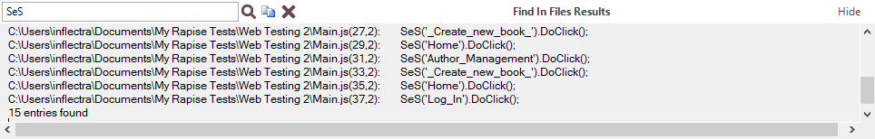

# Find Results View

## Purpose

Displays results for the [Find and Replace Dialog](find_and_replace_dialog.md).

## How to Open

The **Find Results** view is part of the [Default Layout](restoring_the_default_layout.md).

## Messages

Double click on a message to go to the corresponding source line.

## Widgets

From left to right:

- The text box is a search box.
- **Find Next Entry**
- **Copy Selected**
- **Clear All Text**
