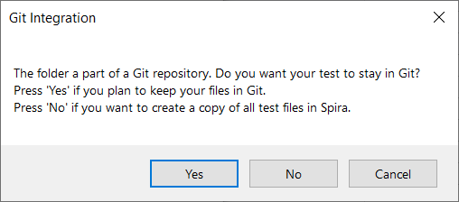
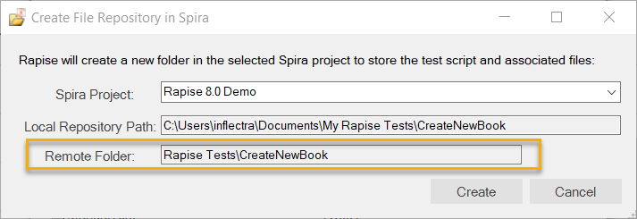

# Rapise and Git Integration

## Purpose

[Git](https://git-scm.com/) has become the de facto standard for code versioning.

[SpiraTest Integration](spiratest_integration.md) built into Rapise addresses the basic needs of distributed development, source control, and file versioning. However, the growth of the team, increasing project complexity, and the introduction of CI/CD and build pipelines make it more natural to use **Git** for test source management.

It is also common practice to store test files alongside source code and documentation, which further supports using a **Git** repository for all assets.

## When to Use

You probably don't need **Git** support if you are developing tests alone or in a small team.

You will, however, benefit from **Git** if it is already used in your project, or if you have a large project containing many dependent tests, shared data, and files.

## Git Repository

Integrating **Git** introduces one more node on the diagram:


In addition to Rapise, used for test development, and SpiraTeam, used for test management, a **Git Repository** is introduced for source version control.

When linking a test case to Spira, Rapise needs to be aware that test sources are managed by Git and do not need to be stored in the Spira repository.

## Usage

### Git Client

In the majority of cases where tests are managed by Git, the source repository contains additional information and files.

A [Git client](https://git-scm.com/download/gui/windows) must be installed.

All standard Git operations, such as **commit**, **fetch**, **pull**, and **push**, are done externally using the Git client.

## Linking New Test to Spira

When the **Save to Spira** button is used, Rapise checks if the current test is stored within the **Git** repository folder structure. If an existing repository is identified, the following prompt is shown:

{width="406px"}

This means that Rapise detected that the folder containing the test is within the `.git` repository structure. It suggests keeping your test files in **Git** and only a link is placed into the Spira Test Case.

### How It is Stored in Spira

When a Test Case is saved to Spira in a **standard** manner, it shows the folder created in Spira Documents:

{width="570px"}

After saving, the folder will contain test file versions:

{width="876px"}

And the test case will refer to an `.sstest` document within this folder:

{width="577px"}

!!! important
    Rapise 7 and lower mirrors the folder structure of a test. If there are sub-tests, corresponding sub-folders are created in Spira's Documents.

    Rapise 8.0+ creates a flat structure. All files are stored within the main folder of a test. This structure increases saving/loading speed.

    {width="525px"}

### How It is Stored in Git

When the test remains in **Git**, a folder is also created in Spira (for Rapise versions prior to 8.0, the root folder is used):

{width="570px"}

The Spira Documents section contains only one item: a link to a local file starting with `%GITROOT%`:

{width="809px"}

And the Test Case references that link:

{width="571px"}

This means that to access this file, an environment variable `%GITROOT%` must exist that points to the root of the local repository containing the test.

## Saving Existing Test and SyncToSpira.cmd

If a test is stored in **Git** and linked to **Spira**, pressing the [Save to Spira](spiratest_integration.md#saving-a-test-to-spiratest) link again will have no visual effect; the test is already linked to the test case, and file versioning should be performed by the user using the installed **Git client**.

Sometimes, it is desirable to sync test files with **Git** every time `Save to Spira` is pressed. It is common practice to perform a **commit**, **pull**, and then **push** every time the button is pressed. This can be achieved by creating a file named `SyncToSpira.cmd`.

This file may be stored in either a common folder:

`c:\Users\Public\Documents\Rapise\SyncToSpira.cmd`

Or in the root of the current [test framework](../Intro/framework.md).

It receives the path to the framework root as its first parameter (%1) and the path to the `.sstest` file as its second parameter (%2).

### Basic SyncToSpira.cmd
The simplest, command-line-only implementation might look like this:

```
@echo Test is being saved to Spira %2
@echo Framework Root: %1
pushd %1

git commit -m "Auto-Save from Rapise"
git pull
git push

popd
```

### Interactive SyncToSpira.cmd

Depending on your preferred Git client, you may specify different implementations for `Save to Spira`. For example, here is an interactive version using [TortoiseGit](https://tortoisegit.org/):

```
@echo ===============================
@echo Test is being saved to Spira %2
@echo Framework Root: %1

@set PATH=%PATH%;"c:\Program Files\TortoiseGit\bin"

pushd %1

tortoisegitproc /command:commit
tortoisegitproc /command:pull
tortoisegitproc /command:push

popd

@echo ===============================
```

## Executing With RapiseLauncher

**RapiseLauncher** may [execute](spiratest_integration.md#executing-the-test-sets) scheduled test sets containing Test Cases linked to **Git** and referencing `%GITROOT%`, just like other test cases. Depending on how you want the source code to be checked out during execution, there are two ways to specify `%GITROOT%`.

### Checkout By RapiseLauncher

There are two ways to tell **RapiseLauncher** the origin from which **Git** should perform a checkout: using Spira custom properties or system environment variables.

#### Using Git Credentials in Spira Dashboard

This is the recommended and most convenient way. It is described in [Spira Dashboard section](spira_dashboard_2.md#git-credentials-storage).

#### Using Test Set Custom Properties in Spira

!!! important "Rapise 8.0+"
    With Rapise 8.0+, you can set Git properties for any test set without creating custom properties. This can be done in [Spira Dashboard](spira_dashboard_2.md) in the Test Sets view:

    {width="832px"}

In this case, you need to add custom fields to the Test Set definition in **Spira**:


- **GitUrl** - Git remote repository URL. E.g., `https://github.com/Inflectra/rapise-samples`.
- **GitUser** - optional. Needed when the repository is protected and requires an authentication.
- **GitPassword** - optional. Username for authentication.
- **GitBranch** - optional. Links the test case to a specific branch instead of the default `master` branch.
- **GitRoot** - optional. Target folder for checkout. If empty or not specified, the default Rapise Launcher temp folder is used.

#### Using System Environment Variables

In this case, only one checkout source can be used for all test sets executed by **RapiseLauncher** on a given host. This is suitable if your host is dedicated to running tests from a specific repository and is slightly easier to set up.

Here, you need to define system variables named exactly the same as the corresponding custom properties described in the previous block: **GitUrl**, **GitUser**, **GitPassword**, **GitBranch**, **GitRoot**. All but **GitUrl** are optional.

When both an Environment Variable and a Spira Custom Property are defined, and the custom property value is non-empty, the Custom Property's value is used.

### Checkout Externally

In CI/CD systems, it is typical for test sources to be checked out before the pipeline execution and already present on the local drive. In this case, there is no need to define custom properties for the Test Set (or, if already defined, leave them empty). The only requirement is the `GITROOT` variable, which should point to the root of the local **Git** repository.

For example, if the pipeline checks out the sources to the `c:\Build` folder from the **Url** `https://github.com/Inflectra/rapise-samples`, then `GITROOT` should be set to `C:\Build` so that the test link `%GITROOT%\CreateNewAuthor.sstest` is correctly resolved to `c:\Build\rapise-samples\CreateNewAuthor\CreateNewAuthor.sstest`.

## See Also

- [Demo of Git Integration (video)](https://www.youtube.com/watch?v=BIgOIxkZ5Hk&t=25s)
- [Frameworks](./Frameworks/frameworks.md)
- [Spira Integration](spiratest_integration.md)