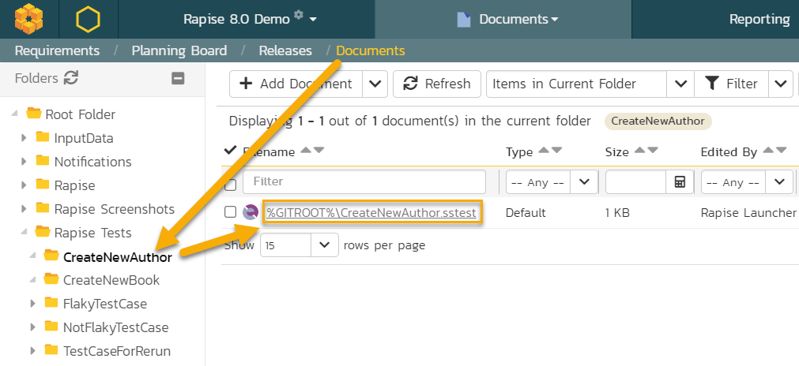

# Rapise and Git Integration

## Purpose

[Git](https://git-scm.com/) has become the de-facto standard for code versioning.

[SpiraTest Integration](spiratest_integration.md) built into Rapise meets basic needs of distributed development, source control and file versioning. However the growth of the team and increasing complexity of project as well as introduction of CI/CD and build pipelines making it more natural to use **Git** for the test source management.

Also it is common practice to store test files together with source code and documentation, and this makes another vote for having it all in **Git** repository.

## When to Use

You probably don't need **Git** support, if you are developing few or many tests alone or in a small team.

And you will benefit from **Git** if it is already used in your project, or you have a large project containing many dependent tests, shared data and files.

## Git Repository

Having **Git** means having one more node on the diagram:


In addition to Rapise used for test development and SpiraTeam used for test management, we have a **Git Repository** used for source version control.

When linking a test case to Spira, Rapise should know that test sources are managed by Git and don't need to be stored into the repository.

## Usage

### Git Client

In the majority of cases when tests are managed by Git, the source repository contains additional information and files.

You need to have a [git client](https://git-scm.com/download/gui/windows) installed.

All standard Git operations, such as **commit**, **fetch**, **pull** and **push** are done externally in the git client.

## Linking New Test to Spira

When using **Save to Spira** button, Rapise checks if current test is stored within the **Git** repository folder structure. And, if existing repository has been identified, the following prompt is shown:


This means that Rapise detected that folder containing the test is within the `.git` repository structure. And it suggests to keep your test files in **Git** and only put a link into the Spira Test Case.

### How It is Stored in Spira

When Test Case is Saved to Spira in a 'standard' manner, it shows the folder that is created in Spira Documents:


After saving, the folder will contain test file versions:


And the test case will refer to an `.sstest` document within this folder:


### How It is Stored in Git

When the test stays in **Git** then Spira Documents section contains only one item - a link to a local file starting with `%GIITROOT%`:



And the Test Case uses that link:


This means that to access this file, there should be an environment variable `%GITROOT%` pointing to the root of the local repository containing the test.

## Saving Existing Test and SyncToSpira.cmd

If Test stored in **Git** and linked to **Spira** then pressing on [Save to Spira](spiratest_integration.md#saving-a-test-to-spiratest) link again have no visual effect - the test is already linked to test case and file versioning should be done by user using the installed **git client**.

Sometimes we want to sync test file with **Git** every time we press `Save to Spira`. It is common practice to do **commit**, **pull** and then **push** every time we press it. This may be achieved by defining a file `SyncToSpira.cmd`.

This file may be stored either common folder:

`c:\Users\Public\Documents\Rapise\SyncToSpira.cmd`

Or in the root of current [test framework](../Intro/framework.md).

It gets path to the framework root as a 1st parameter (%1) and path to `.sstest` as 2nd (%2).

### Basic SyncToSpira.cmd
Simplest, command line only implementation may look like that:

```
@echo Test is being saved to Spira %2
@echo Framework Root: %1
pushd %1

git commit -m "Auto-Save from Rapise"
git pull
git push

popd
```

### Interactive SyncToSpira.cmd

Depending on your preferred git client, you may specify different implementations of `Save to Spira`. For example, here is an interactive verion of it using [TortoiseGit](https://tortoisegit.org/):

```
@echo ===============================
@echo Test is being saved to Spira %2
@echo Framework Root: %1

@set PATH=%PATH%;"c:\Program Files\TortoiseGit\bin"

pushd %1

tortoisegitproc /command:commit
tortoisegitproc /command:pull
tortoisegitproc /command:push

popd

@echo ===============================
```

## Executing With RapiseLauncher

**RapiseLauncher** may [execute](spiratest_integration.md#executing-the-test-sets) scheduled test sets containing Test Cases linked to **Git** and having `%GITROOT%` in the file reference just like other test cases. Depending on how you want the source code to be checked out during execution there are two ways on specifying the `%GITROOT%`.

### Checkout By RapiseLauncher

There are two ways on telling **RapiseLauncher** where the origin from which **Git** is supposed to do a checkout: using Spira custom properties or using system environment variables.

#### Using Spira Custom Properties

In this case, you need to add custom fields to the Test Set definition in **Spira**:


* **GitUrl** - Git remote repository URL. I.e. `https://github.com/Inflectra/rapise-samples`.

* **GitUser** - optional. Needed when repository is protected and requires an authentication.

* **GitPassword** - optional. Username for authentication.

* **GitBranch** - optional. You link test case to specific branch instead of default `master` branch.

* **GitRoot** - optional. Target folder for checkout. If empty or absent, default Rapise Launcher temp folder is used.

#### Using System Environment Variables
In this case you may have only one checkout source for all test sets executed by **RapiseLauncher** on the given host. It is fine if your host is dedicated to run tests from specific repository and is a bit easier to set up. 

In this case you need to define system variables named exactly the same as corresponding custom properties described in the previous block: **GitUrl**, **GitUser**, **GitPassword**, **GitBranch**, **GitRoot**. All but **GitUrl** are optional.

When both Environment Variable and Spira Custom Property are defined and custom property value is non-empty, then Custom Property's value is used.

### Checkout Externally

In CI/CD systems it is typical that test sources are checked out before the pipeline execution and already present on the local drive. In this case no need to define custom properties for Test Set (or, if already defined, leave them empty). The only thing that is required is `GITROOT` variable that should point to the root of the local **Git** repository.

For example, if the pipeline checks the sources to `c:\Build` folder from the **Url** `https://github.com/Inflectra/rapise-samples` the `GITROOT` should be set to `C:\Build` so that the test link `%GITROOT%\rapise-samples\RVLConcatStrings\RVLConcatStrings.sstest` gets correctly resolved to `c:\Build\rapise-samples\RVLConcatStrings\RVLConcatStrings.sstest`.

## See Also

* [Demo of Git Integration (video)](https://www.youtube.com/watch?v=BIgOIxkZ5Hk&t=25s)
* [Framework](..\Intro\framework.md)
* [Spira Integration](spiratest_integration.md)