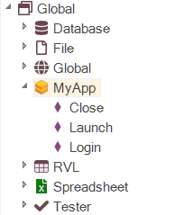

# Defining Global Objects

!!! note
    This feature requires Rapise 6.6+

## Why

If you are building a framework and writing custom functions in JavaScript, you may combine the functions and define a global object. This will make RVL more readable and easier to write.

Compare Variant A and Variant B.


In Variant A, you choose `Functions` as an object and then select the custom function. In Variant B, you choose the global object and then its action. The global object and its actions can be seen in the Object Tree:



## How

Let's see how to define your own global object.

First, you need a JavaScript file where you will define the object's actions and declare the object itself. A good candidate for such a file is the main file of a [user-defined library](tutorial_custom_library.md#2-libuser) or simply `User.js`.

We'll use an example to explain the format of object definition. Here is the definition of a global object `MyApp`.

## Example

```javascript

// MyApp definition
// to generate metadata press Ctrl-Shift-F5

function MyApp_Launch()
{

}

function MyApp_Close()
{

}

function MyApp_Login(/**string*/ username, /**string*/ password)
{
    Tester.Message("Logging as " + username + "/" + password);
}

_paramInfoMyApp_Login = {
    _description: "Logs into the application",
    _type: "boolean",
    _returns: "`true` if login is successful",
    username:
    {
        description: "Name of the user"
    },
    password:
    {
        description: "Password of the user"
    }
}

SeSGlobalObject("MyApp");

```

## Format

Every action of the `MyApp` object is prefixed with `MyApp_`. We have three such actions: `Launch`, `Close`, and `Login`.

```javascript
function MyApp_Launch()
{

}

function MyApp_Close()
{

}

function MyApp_Login(/**string*/ username, /**string*/ password)
{
    Tester.Message("Logging as " + username + "/" + password);
}
```

To declare the object, use the `SeSGlobalObject` call. It must be placed after the definitions of all the actions.

```javascript
SeSGlobalObject("MyApp");
```

You can specify action parameter types through comments `/**<type>*/`.

```javascript
function MyApp_Login(/**string*/ username, /**string*/ password)
```

You can also describe actions and parameters using `paramInfo` objects (which should be named in the format `_paramInfo<action function name>`).

```javascript
_paramInfoMyApp_Login = {
    _description: "Logs into the application",
    _type: "boolean",
    _returns: "`true` if login is successful",
    username:
    {
        description: "Name of the user"
    },
    password:
    {
        description: "Password of the user"
    }
}
```

## Compile Metadata

Once the object is declared, you need to compile the metadata for it. To do this, open the file where you defined the object and press ++ctrl+shift+f5++.

## Object Icons

If you want a specific icon for your object, create two `.png` files with dimensions `16x16` and `32x32`. Name them `<object name>16.png` and `<object name>32.png`, and place them in the same directory as the file where you declared the object.

## Global Object vs Page Object

When comparing a **Global Object** and a [Page Object](./Frameworks/pageobjects.md), the following points should be noted:

1.  The structure of a Global Object is identical to that of a Page Object in JavaScript mode.
2.  However, a Page Object can have its own object repository and use objects from it.
3.  This includes widgets and API entry points that are available to a Page Object.
4.  A Global Object can be defined in a [custom Library](custom_libraries.md).
5.  A Page Object can only be defined as part of a [testing framework](./Frameworks/frameworks.md).
6.  It is not possible to import or move a single Global Object; however, it is possible to copy the entire Library that contains it.
7.  A Page Object can be imported from one testing framework to another.

### See Also

- [How to define a global object (video)](https://www.youtube.com/watch?v=BIgOIxkZ5Hk&t=1408s)