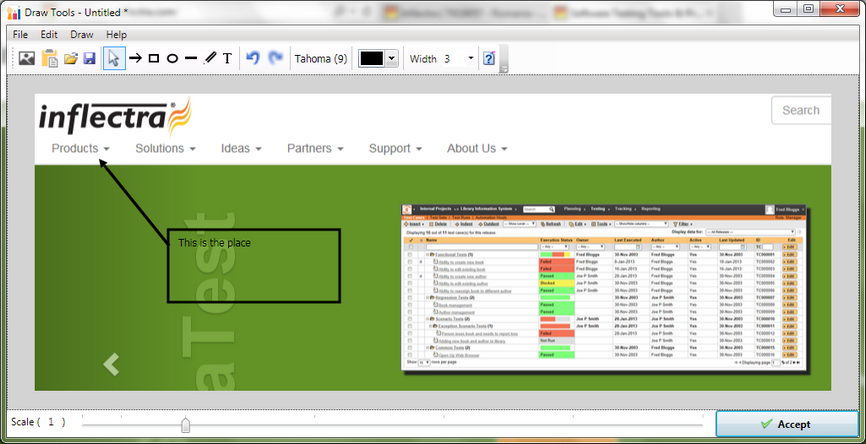
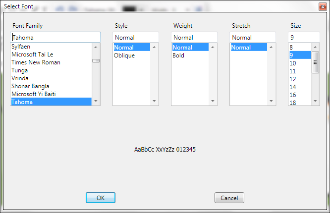

# Image Capture

## Purpose

The **Drawing Tools** image editor lets you capture a section of the current screen or application under test, add annotations to help document the  image and then attach the final result to the [current test case](manual_test_editor.md), test step, or [manual test result](manual_playback.md).

## How to Open

You can open the Drawing Tools dialog box by clicking on the **Image icon** on the various rich text editors in Rapise. When you do that, Rapise will minimize itself and display the following screen:

You now need to draw a rectangle on your screen that tells Rapise which part of the screen you want to capture. Once that is done, the image editor will open with that part of the screen selected. If you click ESC on the keyboard, it will just open the editor with no initial image.

## Image Editor Toolbar

The image editor provides the following tools:

* **Image Capture** - this lets you discard the current image and capture a new screenshot instead
* **Paste From Clipboard** - this lets you paste in an image from the Windows clipboard
* **Open** - this lets you open an existing image saved on your local computer
* **Save** - this lets you save the current image to your local computer
* **Pointer** - this lets you select an annotation to edit (arrow, rectangle, ellipse, line, text, etc.)
* **Arrow** - this lets you draw an arrow in the current color on top of the current image
* **Rectangle** - this lets you draw square / rectangle in the current color on top of the current image
* **Ellipse** - this lets you draw a circle / ellipse in the current color on top of the current image
* **Line** - this lets you draw a straight line in the current color on top of the current image
* **Pencil** - this lets you draw freehand in the current color on top of the current image
* **Text** - this lets you add text in the current color and current font on top of the current image. You will need to draw a rectangle to mark the size of the text box before entering in the text.
* **Undo** - this will undo the last operation
* **Redo** - this will redo the last operation
* **Font Name** - this will let you change the font family and size:

    

* **Color** - This lets you change the current color (used in the various annotations):
    

* **Line Width** - This lets you change the current line width (used in the various annotations)

## Image Editor Footer

The footer of the Drawing Tools provides the following options:
    

* **Scale** - this changes the zoom of the current window, allowing you to more easily view small/large images
* **Accept** - this accepts the current image and inserts it into the **test case**, **test step** or **test run** that was being edited.
