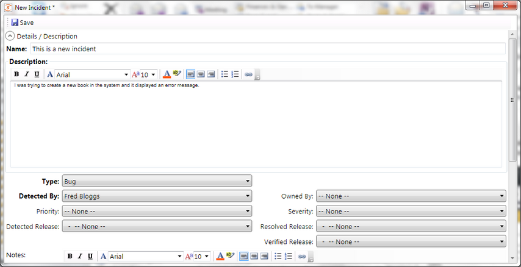
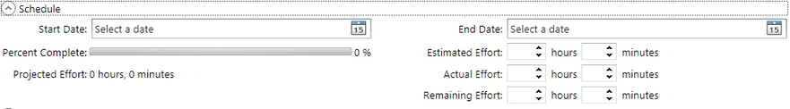

# Incident Logging

## Screenshot

## Purpose

The **New Incident** logging dialog box lets you log a new incident (also known as a bug or defect) into a connected [SpiraTest](spiratest_integration.md) instance. If you logged the new incident during a [manual test execution](manual_playback.md), it will be linked to the current test run.

## How to Open

You can open the **New Incident** using `Tools > New Incident` menu, or by clicking the `Log Incident` button on the [Manual Playback](manual_playback.md) dialog box.

## Details / Description

The **Details/Description** section lets you enter the short name and long description of the new incident as well as the following fields:

* **Type** - the type of the incident (e.g. bug)
* **Detected By** - who found the bug (typically your user)
* **Priority** - how important the bug is
* **Severity** - how critical the bug is
* **Owned By** - who the bug should be assigned to (or left unassigned)
* **Detected Release** - which version of the system was the bug found in
* **Resolved Release** - which version of the system should the bug be fixed in
* **Verified Release** - which version of the system was the bug retested in
* **Custom Fields** - in addition any custom fields created in your Spira instance will be displayed

## Comments

The **Comments** section lets you enter a comment that will be logged with the new incident. The field is a rich text field that can contain formatted text.

## Schedule

The Schedule section lets you enter in schedule/effort related information for the new incident:

* **Start Date** - This is the planned start date of the new incident
* **End Date** - This is the planned completion date of the new incident
* **Estimated Effort** - This is the number of hours the incident is expected to take
* **Actual Effort** - This is the number of hours that were actually expended
* **Remaining Effort** - This is the number of hours remaining to fix the incident
In addition, the following calculated fields will be displayed:
* **Percent Complete** - This is the measure of much of the incident has been completed. It is calculated from 100% - (Remaining Effort / Estimated Effort)
* **Projected Effort** - This the current measure of how long the incident is expected to take based on current information. It is calculated from (Actual Effort + Remaining Effort)

## Attachments

This section displays the list of attachments associated with the new incident. Since Rapise already has a [screenshot capture](image_capture.md) utility built-in, this section is typically not used.
