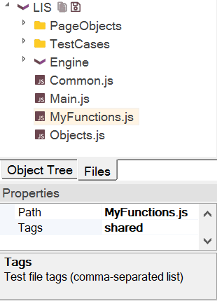

# Including other Files

## Purpose

The `eval` keyword enables you to incorporate external functions and data structures into your test script. (Note: `eval` is a JavaScript reserved word.)

## Usage

See the example below:

```javascript
eval(File.Include("myfunctions.js"));

function Test()
{
    // Use something from myfunction.js
}
```

You can add an include statement by dragging a `.js` file from the [Test Files](test_files_dialog.md) tree and dropping it into your `.js` script.

It is recommended to place common functions and variables into the [Common.js](Frameworks/frameworks.md#managing-common-data) file within your framework. However, if you have other `.js` files, you can add include statements directly into `Common.js`.

Additionally, you can tag your external `.js` file as `shared`. This automatically loads the file for each test run, eliminating the need for an include statement.



## See Also

- [Understanding the Script](understanding_the_script.md)