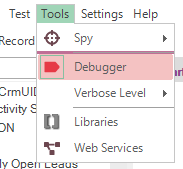

# Internal Debugger

## Purpose

The Internal Debugger provides:

- [Persistent Breakpoints](breakpoints.md)
- [Execution Control](control_execution.md)
- [Watch View](watch_view.md)
- [Variable/Call Stack View](variable_call_stack_view.md)
- [Tooltips](tooltips.md).

## Usage

To enable debugger for a test click  button on the toolbar or use menu `Tools > Debugger`:

Set a [breakpoint](breakpoints.md) on the first line of the `Test` function and click `Play` button on the toolbar.

> If you start debugging for the first time Rapise may prompt you to install **Microsoft Script Debugger**:
>
> 
>
> Follow the prompts. When **Microsoft Script Debugger** is installed click `Play` once again.

Rapise will stop execution at the first line of the test and show debugger controls and views.

In the screenshot above, you can see the [Debugger buttons](menu_and_toolbars.md) available on the toolbar at the top of the screen as well as the [Variables](variable_call_stack_view.md) and [Watch](watch_view.md) sections in the lower pane. Next statement is highlighted in yellow color.
