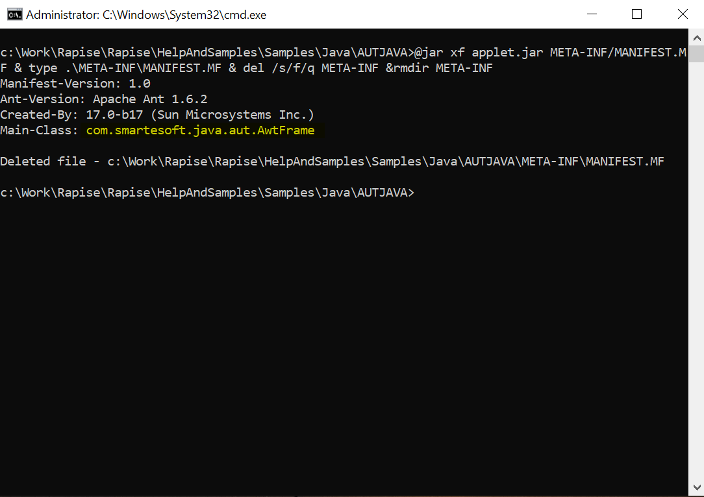
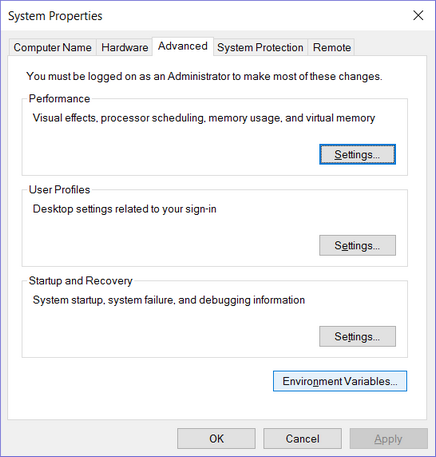
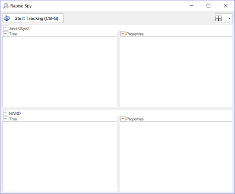
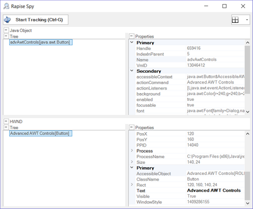
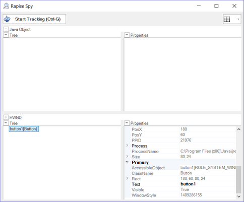
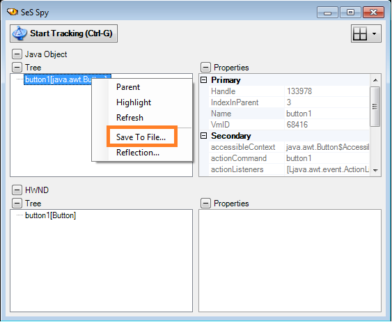
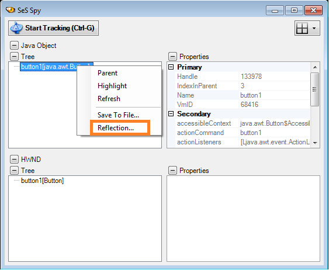

# Java AWT/Swing Testing

## Purpose

Rapise supports the testing of Java applications using either the Abstract Window Toolkit (AWT) or Swing graphical user interface toolkits. For maximum flexibility, Rapise can connect to a JVM of your choice.

## Supported Java Versions

The Rapise Java Bridge is currently compatible with any version of the JRE, from Java 3 to Java 18.

For Java 9 and above, the Rapise Java Bridge works in both Windows Enterprise and non-Enterprise editions when the application runs with a Java JDK. For applications running with a Java JRE, it works only in Windows editions other than Enterprise.

## Java Bridge Installation

The most flexible way to run a Java application with automation enabled is to modify the command line. This can be done using a `.bat` file that contains the necessary changes to the command line or environment variables.

For Java versions 8 or earlier, it is also possible to automatically install the Rapise Java Bridge as an extension. Installing this extension affects all applications launched by this Java instance.

### Manual Installation (all Java versions)

#### Changing the Command Line

If your application is executed explicitly, for example:

```cmd
java -cp . org.sample.MyButton
```

Then you need to add the following values:

```cmd
set RAPISE_PATH=c:\Program Files (x86)\Inflectra\Rapise
set EXT_PATH=%RAPISE_PATH%\Extensions\JavaWrapper
set EXT_JARS=%EXT_PATH%\json.jar;%EXT_PATH%\jaccess.jar;%EXT_PATH%\smartestudio-bridge.jar
set EXT_OPTS=-Djavax.accessibility.assistive_technologies=com.smartesoft.smartestudio.accessibility.AccessBridge

java.exe "%EXT_OPTS%" -cp "%EXT_JARS%";. org.sample.MyButton
```

If your application is executed using a JAR file, for example:

```cmd
java -jar applet.jar
```

Then you need to determine `applet.jar`'s main class and pass it explicitly to the application, ensuring the JAR is part of the classpath, for example:

```cmd
set RAPISE_PATH=c:\Program Files (x86)\Inflectra\Rapise
set EXT_PATH=%RAPISE_PATH%\Extensions\JavaWrapper
set EXT_JARS=%EXT_PATH%\json.jar;%EXT_PATH%\jaccess.jar;%EXT_PATH%\smartestudio-bridge.jar
set EXT_OPTS=-Djavax.accessibility.assistive_technologies=com.smartesoft.smartestudio.accessibility.AccessBridge

java.exe "%EXT_OPTS%" -cp "%EXT_JARS%";applet.jar com.smartesoft.java.aut.AwtFrame
```

Note that we removed the `-jar` switch and added `applet.jar` to the `-cp` input key.

If you have a `.jar` file and need to determine its main class, you can run `cmd.exe` in the folder containing the `.jar` and use a command like this (just replace `applet.jar` appropriately):

```cmd
jar xf applet.jar META-INF/MANIFEST.MF & type .\META-INF\MANIFEST.MF & del /s/f/q META-INF & rmdir META-INF
```

The output should contain 'Main-class' (marked in yellow):



so you can copy it and use it in the modified application launcher.

> **Note:** The sample [Java](sample_tests.md#java) shipped with Rapise contains `x86run.cmd`, which launches `applet.jar` with the Rapise Java Bridge enabled. You can use it as a reference.

### Automatic Installation (Java 3-8)

To use a particular Java Virtual Machine (JVM) with Rapise, you need to install the Java Bridge into it. The installation process consists of several simple steps:

1.  Click the `Settings > Java` button. This will launch the Java Bridge Installation dialog:

    

2.  Choose the target JVM from the list of available Java machines and then press the 'Install' button.

3.  Verify that the installation was successful.

To verify that the bridge installed correctly, check that the following files have been installed inside your Java VM (typically found at `C:\Program Files (x86)\Java\jre1.x.x_xxx`):

*   `lib\accessibility.properties`
*   `lib\ext\jaccess.jar`
*   `lib\ext\smartestudio-bridge.jar`
*   `lib\ext\json.jar`

If you don't see **all three of these files**, it means the bridge was not installed correctly.

## Troubleshooting the Configuration

<!-- /* cSpell:disable */ -->
To help ensure your environment is set up correctly and to assist with trying out Rapise, we provide a sample application called AUTJava (AUT = <b>A</b>pplication <b>U</b>nder <b>T</b>est), which can be found in the folder:
<!-- /* cSpell:enable */ -->

`C:\Users\Public\Documents\Rapise\Samples\Java\AUTJAVA`

To run the application, right-click on the x86run.cmd file and choose **Run as Administrator**.


If the application doesn't appear correctly, you may need to set the `JAVA_HOME` environment variable.

To do this, open the Windows Control Panel and choose `System > Advanced System Settings`:



Click the **Environment Variables** button:


Click the option to add a **System Variable**, and then add the following:

*   Variable: `JAVA_HOME`
*   Value: `C:\Program Files (x86)\Java\jre1.x.x_xxx`

*(You will need to match the location of your actual Java VM.)*

Now you should be able to launch the AUTJava sample application.


To verify that Rapise is configured correctly, click the **Spy** menu in Rapise and choose **Java**.

Then click the main **Spy** icon, and the Java Spy will start:


Click the ++ctrl+g++ button combination to start tracking. Then, move the mouse over one of the buttons in the sample application and click ++ctrl+g++ again.
You should see the following:



This shows that Rapise is able to see the AWT button (in this example) and its properties. However, if you see the following instead:



it means that you didn't run the sample application using **"Run as Administrator"**. Close the application and try again using **"Run as Administrator"**, and you will see:


You are now ready to start testing your real application. Make sure to also launch it using **"Run as Administrator"**.

## Analyzing the Java Application using the Java Spy

With Spy, you can navigate the tree of Java objects in your application.


## Save to File

You can save the Spy data for a particular node and all its descendants to a text file.




## Reflection Information

You can save reflection information for a Java class used to implement a GUI control.



