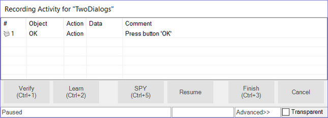
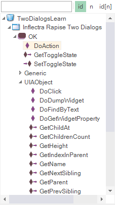
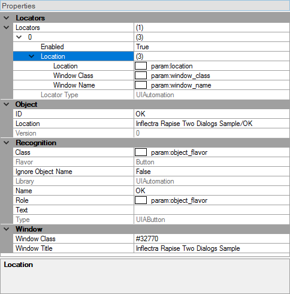

# Learn an Object

To illustrate learning an object, we return to the [TwoDialogs](twodialogs_sample.md) sample.

First, let's learn the `OK` button using recording.  We have done this before in the [TwoDialogs](twodialogs_sample.md) sample.

## RECORD

## Step 1. Run the Application

Run **TwoDialogs** sample application.  By default this will be located in

    C:\Users\Public\Documents\Rapise\Samples\TwoDialogs\TwoDialogs.exe

## Step 2. Create a New Test

Start Rapise and create a new test, choose the **Basic** methodology, and call it `TwoDialogsRecording`. Select `JavaScript` scripting mode when prompted.

## Step 3. Start Recording

Press the **Record** button in the toolbar of Rapise.

## Step 4. Select an Application to Record

When the **Select an Application to Record** dialog is displayed, choose the **TwoDialogs.exe** application and in the library list, select only the top library on the list - **Auto**.  Press the `Select` button.

## Step 5. Do Recording

In the TwoDialogs application, use the mouse to press the `OK` button. Dismiss the alert message box complaining about the empty name.

## Step 6. Observe

Notice that two things will happen.  Firstly, the `OK` button will be surrounded with a red marker, indicating that the OK button has been learned.  Secondly, the action of clicking the `OK` button is recorded in the **Recording Activity** dialog.  That recording has a single entry:



## Step 7. Finish Recording

Press the `Finish` button (or press `Ctrl+3`) to end the recording.

## Step 8. Observe

Rapise will return to be the foreground application, and it will have selected the `Main.js`. Notice that there is a single line or script that has been added to the script file:

```javascript
SeS("OK").DoAction();
```

This line of script has two interesting parts.

The `SeS("OK")` is the identity (not the locator or location) of the `OK` button. This is the object that was learned during recording.

The `DoAction()` is the instruction to the running script to take the action associated with a button.  A normal button has only a single possible action - to be pressed.

The Record/Learn process has taken both steps for you, and joined them together.

Now, let's use (normal) object learning to learn the same OK button and to call a method for the object.

## LEARN

## Step 1. Run the Application

Run **TwoDialogs** sample application.  By default this will be located in

    C:\Users\Public\Documents\Rapise\Samples\TwoDialogs\TwoDialogs.exe

## Step 2. Create a New Test

Start Rapise and create a new test, choose the **Basic** methodology, and call it `TwoDialogsLearn`. Select `JavaScript` scripting mode when prompted.

## Step 3. Start Recording

Press the **Record** button in the toolbar of Rapise.

## Step 4. Select an Application to Record

When the **Select an Application to Record** dialog is displayed, choose the TwoDialogs.exe application.  Leave the library selection in its default state - we will not be using it this time.  Press `Select`. Wait for the **Recording Activity** dialog to appear in the lower-right corner of the screen.

## Step 5. Do Learn

Hover the mouse over the `OK` button of the TwoDialogs AUT but do not press the button.

With the mouse positioned over the `OK` button, press `Ctrl+2` ( the **Learn** command).  You will see the `OK` button surrounded with a red highlight.  You will also see that the **Recording Activity** dialog has been updated with a **Learn** event.


## Step 6. Finish Recording

Press the `Finish` button or `Ctrl+3` to end the recording session.  

## Step 7. Observe

You will now see that Rapise has **learned** about the `OK` button, and the Object Tree in the upper left-hand pane of the Rapise has a new entry called `OK` (shown here expanded).  The list of items contained under the OK button entry in the Object Tree is the set of methods and properties available for the `OK` object.

Actions and properties have different icons. The items are grouped by the library, so the DoAction() method is unique to the `OK` [UIAButton](/Libraries/UIAButton/) object whereas the `DoClick()` method is generic and
available for all Windows objects.

Notice that the `DoAction` is listed and recall in the previous section when we recorded pressing the button, the `DoAction` method was chosen for the button-press action.



While we are looking at this `OK` object, let's make a few observations about it.  These observations will be useful for your later dealings with Rapise and will make the script more informational and relevant as you delve into Rapise.  First, look down at the Properties box that appears under the Object Tree in the bottom left corner of the Rapise screen.  The screenshot below has some of the tree nodes expanded.



> **First**, notice that the `OK` button has a **locator** defined.  When you have Rapise **learn** an object. it must collect data about that object so that it can relocate it even if the application has moved on the screen, and even if the application is in a different state of execution.  In order to accomplish this, Rapise looks for all useful ways to uniquely identify the object.  As bad, or perhaps worse, than not being able to find an object would be to find the wrong object on the AUT.  Every time Rapise is required to locate this object, it will first try to use the first locator.  If it fails to positively and uniquely match with that locator, it will try the second (if defined), and so on. Rapise will not give up and declare failure until it has failed to identify with all available locators.

> **Second**, notice the `ID` entry in the Object section of the pane.  This is the name of the object from Rapise's perspective.  All Rapise objects are available through the `SeS()` function call.  Therefore, if we want to refer to the `OK` object, we will use `SeS("OK")` to refer to it.  Once we have correctly identified the object, all valid methods and properties can be accessed by using that object as the basis.

> **Thirdly**, notice in the main editor window of the Rapise, that no code has been added.  When you identified the `OK` button, all Rapise did was add the new object to the Object Tree.  It did not write any code in the JavaScript file.

## Step 8. Use Learned Object

In the automated (recorded) section above, you saw that when you pressed the OK button on the dialog, Rapise recorded a function like this:

```javascript
SeS("OK").DoAction();
```

This time, you will use the established name of the `OK` button object, but do something a little more interesting than its default action to demonstrate how to use Rapise.

Move the cursor into the editor part of the Rapise and make sure you are editing the file called `Main.js`.  At the moment, this file still looks something like this:

```javasript
//########## Script Steps ##############

function Test(params)
{

}

g_load_libraries=["UIAutomation"];
```

Between the open and close brace, add the following command:

```javascript
SeS("OK").DoClick();
```

Hit the `Play` button and watch what happens.

The click will register as a command to the object and it will perform the action on the object.

While we have the context of this situation, let's complicate it just a little more to illustrate the intricacy as well as the flexibility of Rapise.

There is a method whose name looks interesting: `DoLButtonDown()`.

If we were to invoke `DoLButtonDown()` on the `OK` object, we would expect this would be the same as DoClick().

However, go back to the AUT for a moment.  Using the mouse, press the left mouse button over the `OK` button but don't take your finger off the left mouse button.

What happens is that the button takes its pressed state in appearance, but the button is not clicked.

The reason for this is that the `DoClick()` (or `DoAction()`) events cause the mouse button be clicked as well as released.

Therefore, we would need to have a pair of events:

```javascript
SeS("OK").DoLButtonDown();
SeS("OK").DoLButtonUp();
```

in order to make the "click" happen.

Try this in the test script you have created by adding those two lines of code in place of the `DoClick()` line.

It doesn't work!

Let's play a little with this problem.

When you press the `Play` button, leave the mouse alone.  Just press the left mouse button on the Rapise `Play` button and take your hand away from the mouse.

The script does not press the `OK` button in the TwoDialogs AUT.

Now, press the `Play` button on the Rapise and **quickly** move the mouse to hover over the `OK` button in the TwoDialogs AUT.

Now it works!

What's going on here is that the `DoLButtonDown()` and `DoLButtonUp()` methods are pressing the mouse irrespective of where the mouse cursor is positioned.

The other functions, `DoClick` and `DoAction` are methods that are applied to the button and so they are applied to the button.

Before we can expect `DoLButtonDown()` and `DoLButtonUp()` methods to work, we have to first the mouse cursor to the button.

```javascript
function Test(params)
{
    SeS("OK").DoMouseMove(25, 15);
    SeS("OK").DoLButtonDown();
    SeS("OK").DoLButtonUp();
}
```

will accomplish that.

Notice that Rapise will actually move the mouse to the coordinates (25, 15)  within the `OK` button.  Also notice that if you move the mouse while the test is playing, you will make the test fail.

As a last experiment in this arena, try moving the mouse outside the boundaries of the `OK` button object before calling the `DoLButtonDown()` function.

```javascript
function Test(params)
{
    SeS("OK").DoMouseMove(250, 150);
    SeS("OK").DoLButtonDown();
    SeS("OK").DoLButtonUp();
}
```

Once again, the script will fail.

## See Also

- [How-Tos](howtos.md)