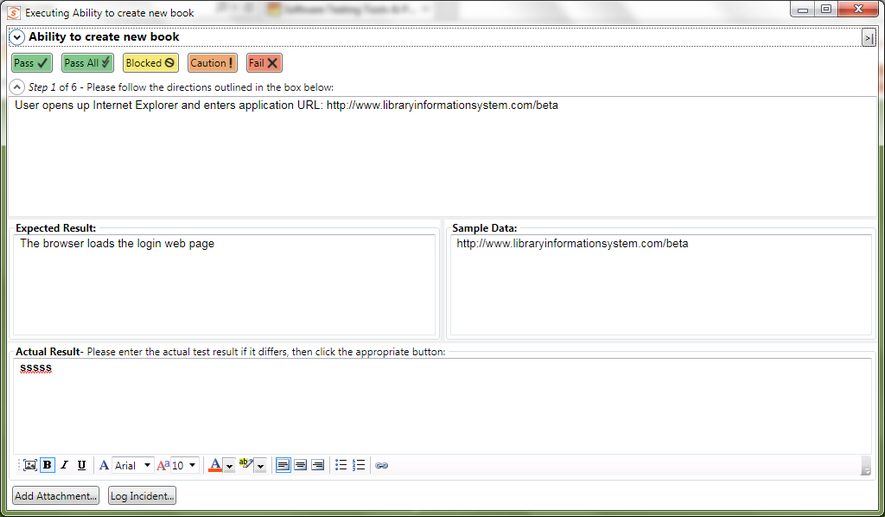

# Manual Playback

## Purpose

The **Manual Playback** dialog box lets you execute a series of manual test cases (including those part of a test set) from within Rapise. The results from the manual test result will be reported back into your connected [Spira](spiratest_integration.md) instance. During the executing of the manual test, you can attach screenshots, files and log incidents related to the test result

## How to Open

You can open the **Manual Playback** dialog box by either doing `Test > Execute Manual` or by playing the whole test via `Test > Play`. 

## Test Case Details & Test Step Selector

The top part of the manual playback screen lets you view the name and description of the test case, **navigate between the test steps** and click one of the result buttons to indicate how the application being tested behaved:

* **Pass** - The current test step was completed successfully and the expected result was observed.
* **Pass All** - All of the steps in the test case could be completed successfully and the expected results were observed in all steps.
* **Blocked** - The current test step could not be performed because something else prevented its completion.
* **Caution** - The current test step could be performed but the actual result only partially matched the expected result (there were minor differences).
* **Fail** - Either the current test step could not be performed successfully or the observed actual result did not match the expected result.

## Test Step Expected & Actual Result

This section displays the details of the current test step and lets you enter in the observed actual result:

* **Description** - This displays the description of the action that the tester should carry out on the application being tested.
* **Expected Result** - This contains a description of the expected result if the application performs as expected
* **Sample Data** - This (optional) field contains any sample data that should be used during testing
* **Actual Result** - This is a formatted text box where the tester should enter in what actually happened during testing. It is required if you Fail, Block or Caution the test step, but is optional for steps that Pass.
In addition, you can click on the picture icon to [add a screenshot](image_capture.md), or use one of the two buttons underneath:
* **Add Attachment** - this lets you choose a file from your local system and attach to the test result.
* **Log Incident** - this lets you log a bug/incident that is connected to the test step (e.g. if it failed) and will display the [New Incident](incident_logging.md) dialog box.

## Minimized Playback Dialog

Sometimes you want to be able to reduce the amount of space taken up by the testing dialog box so that you can view the application and the test steps on the same screen at the same time. To make this easier, if you click on the Minimize ( **<|** ) icon in the top-right of the dialog box it will change the manual playback dialog to the mini version show above. You can click on the icon again to switch back to the standard player.
