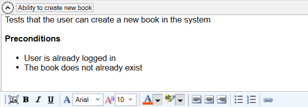

# Manual Test Editor

## Purpose

The **Manual Test Editor** allows you to create and edit manual test cases that are stored in [Spira](spiratest_integration.md). These manual test cases contain a high-level description of the test case, as well as a detailed set of steps and associated expected results that constitute the manual test script. These manual tests can be [executed manually](manual_playback.md) in Rapise (or in Spira) and also serve as the basis for creating a related automated test script. Such automated test scripts can be linked to individual test steps using the [test scenario](scenarios.md) approach.

## How to Open

You can open the **Manual** toolbar by either clicking the **Manual Steps** icon on the main [Main Toolbar](menu_and_toolbars.md#main-toolbar) or clicking the **ManualSteps.rmt** file in the [Files](test_files_dialog.md) tab. The [Manual Toolbar](menu_and_toolbars.md#manual-toolbar) is displayed whenever the Manual Test Editor is open.

## Test Case Name/Description

{width="493px"}

This section allows you to edit the name and long, formatted description of the test case. The rich text editor allows you to choose the font name, font size, text color, highlight color, and style (bold, underline, italic). It also provides an easy way to add links, bullet points, and numbered lists.

Additionally, there is a button that allows you to [add screenshots](image_capture.md).

## Test Step Editor

{width="634px"}

This section allows you to add, edit, and delete test steps from the manual test case. Each test step contains four fields:

*   **Step ID** - This field contains the position number of the test step (e.g., step 1) and the ID of the test step as it exists in Spira. Clicking the [TS:xxx] label automatically copies the ID to the Windows clipboard. This allows you to easily paste the test step's ID into your automated test scripts, enabling Rapise to [report test results back to Spira](spiratest_integration.md) against specific test steps.

*   **Description** - This field describes the test procedure that the tester should perform.

*   **Expected Result** - This field describes the expected outcome if the system under test performs correctly.

*   **Sample Data** - This optional field contains any sample data to be used in the test.

Each of these fields provides a rich text editor that allows you to choose the font name, font size, text color, highlight color, and style (bold, underline, italic). It also provides an easy way to add links, bullet points, and numbered lists. Additionally, there is a button that allows you to [add screenshots](image_capture.md) to the test step.

For ease of editing, you can navigate between rows and columns using the **ALT + Arrow keys** on the keyboard.

## Automating Test Steps

Sometimes, you may have a primarily manual test case where you want to automate certain steps. For example, you might want to automate the setup of test data or the login process to an application before carrying out manual testing. Such a test is called a [semi-manual test](semi_manual_testing.md).

To do this, enter the syntax **@FunctionName();** in the test step's Description box. Then, when you run the test, that step is executed automatically. The **@FunctionName();** refers to a JavaScript [user function](defining_functions.md) named `function FunctionName()` in the `User.js` file.

### Example

