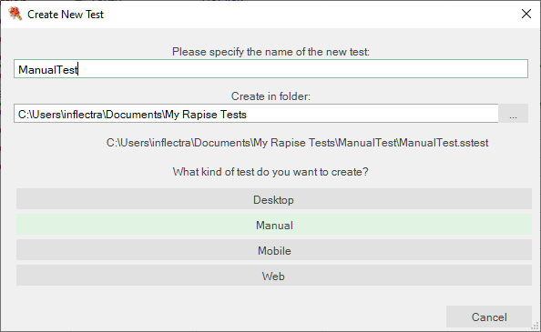
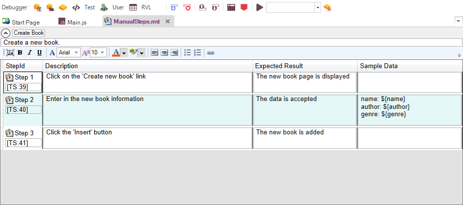
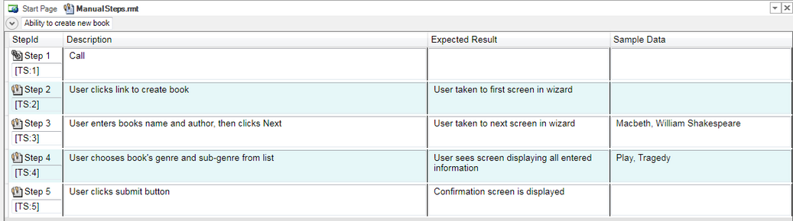

# Manual Testing

## Purpose

Manual testing is used for situations where automated testing does not make sense. This may be due to technical reasons (the application being tested does not have an API that lets tools such as Rapise interact with them) or economic (this part of the application is rarely used and the user interface is changing in each release).

However Rapise can help **accelerate and optimize** your manual testing as well. Rapise lets you rapidly create manual tests 5x faster than creating them by hand. It integrates with Spira for test management, so you still have a central repository of version-controlled test cases, but Rapise allows you to [edit them offline](manual_test_editor.md) when you have no connection to Spira and also to [execute them from within Rapise](manual_playback.md).

## Usage

To start manual testing, simply create your test as normal using the [New Test](create_a_new_test.md) dialog box.

For pure manual test you need to select the manual test methodology:

Then once the test has been created, click on the `Tools > Manual Steps` menu and then you will be taken to the [Manual Editor](manual_test_editor.md) with the [Manual Test Toolbar](menu_and_toolbars.md#manual-toolbar) Visible:

From here you can start creating your new manual test using the [Manual Recorder](manual_testing_recording.md), then edit the created test steps in the [Manual Editor](manual_test_editor.md). Finally you can [save the test to Spira](spiratest_integration.md) and then play it back using the [Manual Playback](manual_playback.md) screen.

In addition to being used for manual testing, the test step editor lets you view the test steps that define the test scenario so that when you automate the test case, you can easily tie back specific [verification points](checkpoints.md) with test steps in [Spira](spiratest_integration.md).

Finally you can also have the best of manual and automated testing in the same test script, using [semi-manual](semi_manual_testing.md) testing. That allows you to automate some of the repetitive tasks in a primarily manual test case.

## Example

For a full tutorial using the manual playback, refer to the [Exploratory Testing](tutorial_exploratory_testing.md) tutorial.

In addition, a working sample of manual testing is available from [Spira](spira_dashboard.md), simply connect to the sample **"Library Information System**" project and open the **'Ability to Create New Book (TC2)'** test case in the "**Functional Tests**" folder of the project. That will then display the sample manual test within Rapise:

## See Also

- [Manual Recording](manual_testing_recording.md)
- [Manual Playback](manual_testing_playback.md)
- [Exploratory Testing Tutorial](tutorial_custom_library.md)
- Dialogs, Views and Menus
    - [Manual Toolbar](menu_and_toolbars.md#manual-toolbar)
    - [Manual Test Editor](manual_test_editor.md)
    - [Manual Playback](manual_playback.md)
